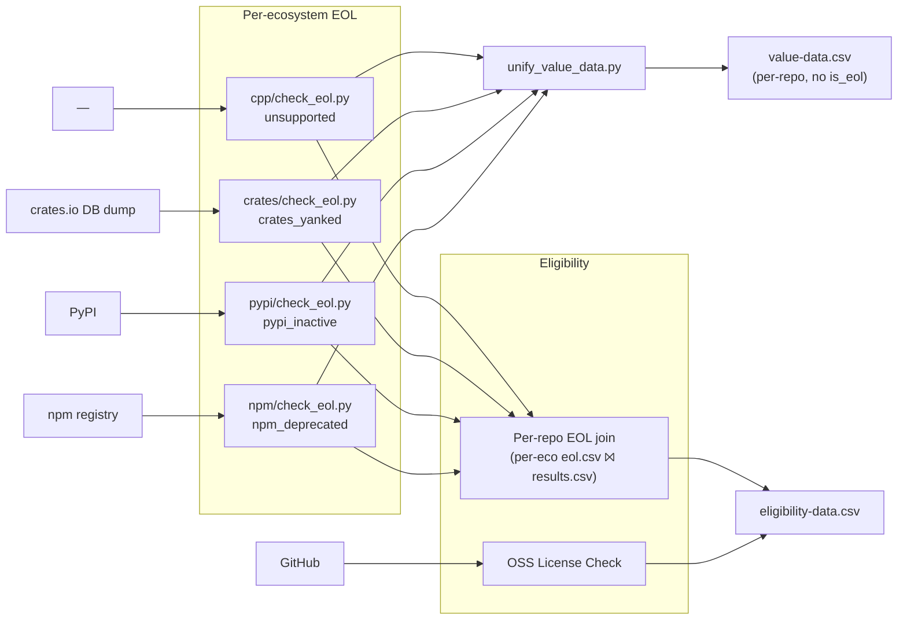

# Eligibility Pipeline

Determines which GitHub repos qualify for funding. Two checks: open-source
license status, and EOL (end-of-life) status.

## How It Works

### Source of truth

Eligibility reads exclusively from `data/github/repos.csv` (populated by
`src.github.fetch_repo_owner_data`). No fallback to discovery data: a repo
must have a fresh GitHub API record to appear in eligibility at all.

Repos that returned HTTP 404 are recorded with `valid=False` in
`repos.csv` and surface in eligibility as `valid_repo=False`,
`is_oss=False`, `eligibility=False`.

### License check

Classifies each repo's `license` (from the GitHub API) against the OSI-approved
license list. 63 licenses are recognized, including MIT, Apache 2.0, GPL (all
versions), BSD variants, MPL, ISC, Unlicense, and others.

### EOL check

EOL is determined per-ecosystem at the **package** level using
maintainer-set, registry-level signals — not GitHub's `archived` flag, which
is unreliable for projects whose canonical repo lives elsewhere (glibc,
Apache, lots of mirrors).

Each ecosystem has its own `check_eol.py` that writes
`data/{ecosystem}/eol.csv`. `eligibility.py` joins each per-eco
`eol.csv` directly with the matching `data/{eco}/results.csv` (for the
`package → github_repo` map) and aggregates: a repo is `is_eol=True`
iff **every** constituent package across all 4 ecosystems is
`is_eol=True` (handles monorepos and cross-ecosystem polyglot projects).
`value-data.csv` deliberately does **not** carry `is_eol` — it's an
eligibility concern, not a value-pipeline one.

| Ecosystem | Signal | `eol_method` | Source |
|---|---|---|---|
| **npm** | latest version's `deprecated` field on the registry | `npm_deprecated` | `registry.npmjs.org` |
| **pypi** | `Development Status :: 7 - Inactive` Trove classifier | `pypi_inactive` | `pypi.org/pypi/<n>/json` |
| **crates** | default version is `yanked` | `crates_yanked` | local crates.io DB dump |
| **cpp** | every Homebrew formula for the project is `disabled` or `deprecated` | `homebrew_disabled` / `homebrew_deprecated` | `formulae.brew.sh/api/formula.json` (one bulk fetch) |
| **cpp** (overlay) | every release cycle's `eol` date is in the past | `endoflife_date` | `endoflife.date/api/<product>.json` (curated whitelist of ~20 well-known products) |

`crates_yanked` has low recall — `cargo yank` is meant for buggy versions,
not deprecation. crates.io has no formal "deprecate" mechanism; the column
is honest about that.

### cpp signal details

A cpp project has at most one Homebrew "EOL" classification: it's only
flagged if **every** Homebrew formula mapped to that project (via
Repology's `repo='homebrew'` rows) is `disabled` or `deprecated`. This
correctly handles versioned formulas — `gcc` has formulas for `gcc`, `gcc@9`,
`gcc@10` etc.; the old version-pinned ones being deprecated doesn't make
gcc itself EOL.

`endoflife_date` is an overlay applied on top of the Homebrew check for a
small whitelist of well-known products (openssl, postgresql, python, ruby,
php, etc.). We model **project-level** EOL, not version-level: a project is
EOL iff `max(eol date across all cycles) < today`. A cycle with
`eol: false` (vendor-declared open-ended support) keeps the project alive
regardless of any past-EOL cycles.

Examples (today = 2026-04-27):

| Product | `max(eol)` | Result |
|---|---|---|
| angularjs | 2021-12-31 | ✅ EOL |
| centos | 2024-06-30 | ✅ EOL |
| openssl | 2030-04-08 (cycle 3.5) | alive |
| python | 2030-10-31 (cycle 3.14) | alive |
| internet-explorer | 2031-10-14 (cycle 11) | alive (MS extended Win10 lifecycle support) |
| redis | one cycle has `eol: false` | alive |

### Why not Debian "removed from current stable"?

Considered and rejected — high false-positive rate. A package can be absent
from current Debian stable for many reasons unrelated to EOL:

- **SONAME bumps** (`libpng12-0` removed; `libpng16-16` is current and alive)
- **python2→3 transitions** (`python-six` removed; `python3-six` alive)
- **Source-package renames** (`nodejs-legacy` folded into `nodejs`)
- **Held during release transitions** (in unstable awaiting unblock)
- **RC-bug or FTBFS removals** — alive upstream, transient Debian state
- **Section reorgs** (non-free / contrib moves)
- **Architecture-specific removals** (only dropped for `armhf` etc.)
- **Hosted entirely outside Debian** (many GNU/sourceware projects)

A cleaner Debian signal would parse `ftp-master.debian.org/removals.txt`
and filter to entries with `Reason:` containing `RoQA`, `Dead upstream`,
`Orphaned and abandoned upstream`, or similar — that's an explicit Debian
FTP-team statement of upstream EOL with very low FP rate. Deferred for now
since it requires parsing an unstructured log.

## Scripts

| Script | Purpose | Command |
|--------|---------|---------|
| `src/{eco}/check_eol.py` | Flag EOL packages → `data/{eco}/eol.csv` | `uv run python -m src.npm.check_eol` |
| `src/unify_value_data.py` | Join per-eco eol → `is_eol` col in `data/value-data.csv` | `uv run python -m src.unify_value_data` |
| `src/eligibility.py` | Final eligibility per repo → `data/eligibility-data.csv` | `uv run python -m src.eligibility` |

Run order: each ecosystem's `check_eol.py` → `unify_value_data.py` → `eligibility.py`.

## Output

### data/{ecosystem}/eol.csv

Per-package EOL details. Same schema for every ecosystem.

| Column | Description |
|--------|-------------|
| `package` | Package name (matches `data/{eco}/results.csv`) |
| `is_eol` | `True` if the registry-level signal indicates EOL |
| `eol_method` | `npm_deprecated`, `pypi_inactive`, `crates_yanked`, or `unsupported` |
| `eol_reason` | Human-readable evidence (deprecation message, classifier name) |
| `source` | `registry`, `db-dump`, `not_found`, `error`, or `unsupported` |
| `eol_checked_at` | ISO 8601 UTC timestamp of when this row's EOL was checked |

### data/value-data.csv

One row per **GitHub repo** (or per orphan package without a github_repo).
See `docs/value.md` for the full schema. Eligibility uses it indirectly:
`src/eligibility.py` reads each ecosystem's `data/{eco}/eol.csv` joined to
`data/{eco}/results.csv` to compute per-repo EOL — `value-data.csv` itself
does **not** carry an `is_eol` column.

### data/eligibility-data.csv

Final per-repo eligibility table. `eligibility = valid_repo AND is_oss AND NOT is_eol`.
Sourced exclusively from `data/github/repos.csv` — no fallbacks.

| Column | Description |
|--------|-------------|
| `repo` | GitHub repo slug (`owner/name`) |
| `repo_id` | GitHub numeric repo ID (empty if `valid_repo=False`) |
| `valid_repo` | `True` if `/repos/{owner}/{repo}` returned 200; `False` if 404 (repo deleted, renamed, or never existed). Repos absent from `data/github/repos.csv` are absent from this table — there is no third state. |
| `user` | Repo owner login (from `repos.csv.owner_login`) |
| `user_id` | Owner numeric ID |
| `user_type` | `User` or `Organization` |
| `license` | License SPDX key (from the GitHub API) |
| `is_oss` | `True` if the license is OSI-approved |
| `is_eol` | `True` if every package mapped to this repo (joined via per-eco `data/{eco}/results.csv` ↔ `data/{eco}/eol.csv`) is `is_eol=True`. Repos with no constituent packages default to `False`. |
| `host` | Slug of FOSS foundation hosting the project: `apache`, `cncf`, `eclipse`, `openjs`, `psf`, `lf`, `numfocus`, `sfc`. Empty if not foundation-hosted. Joined from `data/foundations/host-by-repo.csv`. |
| `repo_url` | Repo's homepage URL from the GitHub API (empty if not set on the repo). |
| `repo_owner` | Owner display name from `data/github/users.csv` (e.g. "The Apache Software Foundation"). Empty if not in users.csv. |
| `repo_owner_url` | Owner's `blog` URL from `data/github/users.csv`. Empty if not set. |
| `repo_owner_type` | TODO — corporate / foundation / individual classification. |
| `tm_owner` | Trademark owner (TODO) |
| `tm_owner_type` | Corporate vs community-held (TODO) |
| `eligibility` | `True` if `valid_repo AND is_oss AND NOT is_eol` |
