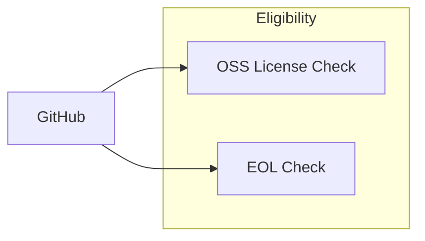

# Eligibility Pipeline

Determines which GitHub repos qualify for funding. Two checks: open-source
license status, and EOL (end-of-life) status.

## How It Works

### License check

Reads repo metadata from `data/github/search/top-repos.csv` and classifies each
repo's license against the OSI-approved license list. A repo is eligible if it
uses a recognized open-source license.

63 licenses are recognized, including MIT, Apache 2.0, GPL (all versions),
BSD variants, MPL, ISC, Unlicense, and others.

### EOL check

Uses GitHub's `archived` flag — the simplest signal with the broadest coverage
across npm/PyPI/crates/cpp libraries. No formal EOL standard exists for
individual libraries, so `archived` is the only explicit cross-ecosystem signal.

Reads `archived` and `pushed_at` from `data/github/search/top-repos.csv` for
~95% of A+B class repos. Repos missing from the cache can be fetched on demand
from the GitHub API (`--fetch-missing`), bringing coverage to ~99.8% of A+B.

`is_eol = archived` only. `pushed_at` (and `days_since_push`) are reported as a
`stale_2y` signal but **not** used as a gate — many mature libraries are stable
without recent commits (e.g. `requests`).

## Scripts

| Script | Purpose | Command |
|--------|---------|---------|
| `src/eligibility.py` | Classify repos by OSS license eligibility | `uv run python -m src.eligibility` |
| `src/check_eol.py` | Flag archived (EOL) repos | `uv run python -m src.check_eol --class AB --fetch-missing` |

## Output

### eligibility.csv

| Column | Description |
|--------|-------------|
| `repo` | GitHub repo slug (`owner/name`) |
| `repo_id` | GitHub numeric repo ID |
| `user` | Repo owner login |
| `user_id` | Owner numeric ID |
| `user_type` | `User` or `Organization` |
| `license` | License SPDX key (e.g. `mit`, `apache-2.0`) |
| `is_oss` | `True` if the license is OSI-approved |
| `tm_owner` | Trademark owner (TODO) |
| `tm_owner_type` | Corporate vs community-held (TODO) |
| `eligibility` | `True` if repo qualifies for funding |

### eol.csv

| Column | Description |
|--------|-------------|
| `repo` | GitHub repo slug (`owner/name`) |
| `value_class` | A / B / C / D from value pipeline |
| `archived` | `True` / `False` from GitHub's `archived` flag |
| `pushed_at` | ISO 8601 timestamp of last push |
| `days_since_push` | Whole days since `pushed_at` |
| `is_eol` | `True` if `archived` (the EOL gate) |
| `source` | `top-repos` (cached), `api` (fetched), or `missing` (404) |
