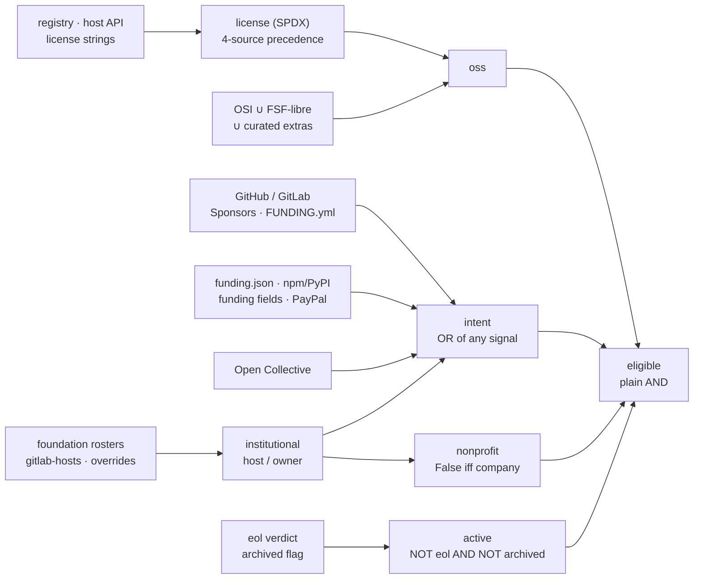

# Eligibility Pipeline

Eligibility asks whether OSE can actually fund a project. Four independent
checks answer it: the project carries an open-source license, it has shown some
intent to be funded, no company is strongly affiliated with it, and it is still
alive. A repo is `eligible` only when all four pass — there are no weights and
no trade-offs, so any single failure is disqualifying.

The stage flags; it never drops. An ineligible repo keeps its row in
`data/eligibility/eligibility.csv`, with `eligible=False` and the failing check
both visible, and `data/preview/repos.csv` holds the same population. Row counts
stay identical across the stages, so filtering is a downstream choice — filter
on `eligible` when you want candidates only.

Every check is automated. A builder computes each one from fetched sources plus
the curated override files in `data/eligibility/`. This is the last stage that
scores anything: `preview` and `health` run afterwards but change no verdict.
The [README](../README.md#data-pipeline) summarizes all three stages in one
table.

## What the stage produces

Four files in `data/eligibility/`, one builder each. Coverage counts live in the
preview pipeline sheet.

| File | Builder | Columns |
|---|---|---|
| `licenses.csv` | `src.eligibility.build_licenses` | `repo, repo_id, license, license_source (override/registry/github/gitlab/""), oss` |
| `funding.csv` | `src.eligibility.build_funding` | the funding signals + `score`, `intent`, `nonprofit` — schema in [components/funding.md](components/funding.md) |
| `active.csv` | `src.eligibility.build_active` | `repo, repo_id, eol, archived, active` |
| `eligibility.csv` | `src.eligibility.build_eligibility` | `repo, repo_id, oss, intent, nonprofit, active, eligible, value_comps, risk_comps, complete` |

### Scope — the top-repo set

Input is the top-repo set — valid class-A repos from `data/value/value.csv`
(`settings.json top_repos`: `classes = ["A"]`, `platforms = ["github",
"gitlab"]`, `git_valid == True`; `risk_input.value_classes` names the same
scope), loaded via `load_top_repos()`. Every stage shares this one scope, and it
**includes archived repos by default**: an archived repo surfaces here as
`active=False` rather than dropping out before the stage runs. This class-A set
is also called the **core** — [value.md](value.md) defines it.

## The four checks

Four independent checks, each one boolean, each built from its own signals.

| Check | True when | Builder |
|---|---|---|
| [`oss`](#oss--an-open-source-license) | the repo carries an open-source license | `build_licenses` |
| [`intent`](#intent--the-project-wants-to-be-funded) | the repo shows *any* intent to be funded | `build_funding` |
| [`nonprofit`](#nonprofit--no-company-is-strongly-affiliated) | no company is strongly affiliated with the project | `build_funding` |
| [`active`](#active--not-eol-not-archived) | `NOT eol AND NOT archived` | `build_active` |



One source feeds two checks: an institutional host or owner both declares
funding intent and decides the `nonprofit` exclusion. Nothing else is shared,
and the four checks never trade off — each one alone can make a repo
ineligible.

### `oss` — an open-source license

`build_licenses` resolves one SPDX string per repo, then classifies it against
the OSS-approved set. Four sources compete, in strict priority order:

| # | Source | Where it comes from |
|---|---|---|
| 1 | manual assertion | `data/eligibility/overrides.csv` `license` — fixes a repo whose LICENSE detection fails upstream |
| 2 | registry license (primary) | each ecosystem's `results.csv` `license` column (npm / PyPI / crates / Homebrew); most common value across the repo's packages, ties alphabetical |
| 3 | GitHub license (fallback) | `data/sources/github/repos.csv` (GitHub Licensee detection) |
| 4 | GitLab license (fallback) | `data/sources/gitlab/repos.csv`, keyed by the `gl/` `repo_id` |

A source claims the slot only with a **meaningful** license: an unknown sentinel
(`noassertion` / `other` / `none`) never shadows a real detection from a later
source. The approved set is `data/sources/osi/oss-licenses.csv` — OSI-approved ∪
FSF-libre software licenses ∪ curated extras, derived from the SPDX License List
and documented in [sources/osi.md](sources/osi.md). An SPDX expression
(`mit or apache-2.0`, `mit/apache-2.0`, `apache-2.0 with llvm-exception`,
`gpl-3.0-or-later`) counts as OSS when ANY component is approved.

**Unknown stays distinguishable.** In `licenses.csv` the flag is ternary — `True`
/ `False` / empty (no license signal at all) — but the rollup treats only
`oss=True` as eligible, so unknown counts as not-OSS there.

### `intent` — the project wants to be funded

OSE supports only those who want to be supported. `intent` is an OR, not a
precedence chain — any one signal sets it True:

| Signal | Where it comes from |
|---|---|
| the owner's GitHub Sponsors listing is enabled | any inbound count implies it |
| a declared channel | a FUNDING.yml link or the file's mere presence, a repo- or org-level funding.json, an npm/PyPI funding field, a real Open Collective, a curated PayPal.me handle — GitHub and GitLab alike |
| a fundable bus factor maintainer | a personal Sponsors listing ∪ the curated `maintainer-overrides.csv` |
| an institutional host or owner | the scraped foundation rosters, `gitlab-hosts.csv`, `overrides.csv` |

Outbound sponsoring is never intent: funding others is no channel for this repo.
Intent **propagates at the owner level** — once any repo an owner has in scope
self-declares a channel, every repo of that owner gets `intent=True`. That
mirrors GitHub's own org-`.github`/personal-Sponsors semantics. The methodology,
the score formula, the worked examples and the limits of what the fetchers can
see are in [components/funding.md](components/funding.md#limitations).

### `nonprofit` — no company is strongly affiliated

OSE supports only nonprofit initiatives. `nonprofit` is an **exclusion rule, not
proof of nonprofit status**. It defaults True and flips False only when a
curated or scraped `company` host or owner backs the repo (`_nonprofit_flag` in
`src/eligibility/build_funding.py`). A True means "no corporate backer found",
never "verified nonprofit". Company-backed repos are already resourced, so they
are ineligible but stay visible in the table.

### `active` — not EOL, not archived

OSE supports only projects that still have work ahead of them.
`active = NOT eol AND NOT archived`. `build_active` combines two signals:

| Signal | Source | Meaning |
|---|---|---|
| `eol` | `data/eligibility/overrides.csv` `eol` | the manual end-of-life verdict — `True` = project declared end-of-life; an explicit `False` pins a repo alive; empty = no verdict → alive |
| `archived` | `data/sources/github/repos.csv` | the GitHub `archived` flag |

The per-ecosystem registry EOL signals (`data/sources/<eco>/eol.csv`, from
`src.sources.<eco>.check_eol`) flag *packages* — deprecations, yanks,
endoflife.date dates — so they only inform the per-repo manual call.

**Archival has no exemption**: an archived repo is inactive, full stop. A
project whose canonical upstream lives off GitHub is repointed at that upstream
in `data/value/overrides.csv`, so it enters the pipeline as the live upstream
rather than as the archived mirror — see [value.md](value.md).

## How the checks combine

`src.eligibility.build_eligibility` joins the four flags into
`data/eligibility/eligibility.csv`. The rollup is a plain AND of four booleans,
no weights:

```
eligible = oss AND intent AND nonprofit AND active
```

### Signal completeness — not part of the verdict

The same builder stamps three **signal-completeness** columns. They report
coverage; they never change the verdict.

| Column | Counts |
|---|---|
| `value_comps` | how many value components (`openssf_crit`, `eco_crit`, `top_eco_pct`) carry a real (non-empty, **non-zero**) value |
| `risk_comps` | the same count over the risk components (`concentration`, `complexity`, `security`, `workload`) |
| `complete` | `value_comps ≥ 2 AND risk_comps = 4` — a repo with full coverage |

Archived repos and empty-tree stubs carry real risk scores, so they can be
`complete`.

## Stage overrides — `data/eligibility/overrides.csv`

One curated row per repo — or per org, when `repo` is an `owner/*` glob. An org
row applies to every in-scope repo under that owner with no per-repo row; a
per-repo row always wins. Three builders share the file:

| Column | Used by | Meaning |
|---|---|---|
| `repo` | all | lowercased `owner/name` key (or `owner/*` org glob) |
| `repo_id` | all | stable GitHub id — the actual join key (rename-proof) |
| `host`, `host_type` | build_funding | legally-stewarding foundation or company, as a **domain** (`rustfoundation.org`), plus `company`/`nonprofit`. Scraped rosters instead emit a roster code (`apache`, `fsf/gnu`) — see [components/funding.md](components/funding.md) |
| `gh_user` | — | GitHub login (informational; no builder reads it) |
| `owner`, `owner_type` | build_funding | entity owning the GitHub org |
| `oc_slug` | build_funding | curated Open Collective slug; empty on a curated row = authoritative "no OC" |
| `license` | build_licenses | manual SPDX assertion (highest priority) when upstream detection fails — GitHub Licensee returns `noassertion` on bundled/dual/stacked LICENSE files, or the repo ships no standard LICENSE (e.g. node=`mit`, cpython=`python-2.0`, linux=`gpl-2.0-only`, icu=`unicode-3.0`) |
| `paypal` | build_funding | curated PayPal.me URL — a declared (unmeasured) funding channel |
| `eol` | build_active | manual end-of-life verdict (True/False/empty) |
| `reason` | — | free-text audit context for the override |

Repo-identity and validity corrections stay in `data/value/overrides.csv`. Two
more curated files sit beside this one — `maintainer-overrides.csv`
(`login,reason`) and `gitlab-hosts.csv` (`gitlab_host,host,host_type,reason`).
Both feed `build_funding`; see [components/funding.md](components/funding.md).

## Running it

`scripts/run-pipeline.sh` is the only supported entry point:

```bash
scripts/run-pipeline.sh --stage eligibility        # this stage alone
scripts/run-pipeline.sh --from-stage eligibility   # eligibility → preview → health
```

Per-step flags pass through to the stage runner
(`src.eligibility.run_eligibility_pipeline`), so `--list`, `--from <step>` and
`--skip-fetch` compose with stage selection.

Every fetcher is incremental / TTL-gated. The stage fetches repo state (the
GitHub repo-owner and GitLab project refreshes — the archived flag plus both
license fallbacks), the license sets (the SPDX list, the derived OSS-approved
set, the per-eco license fetchers), the per-eco EOL signals, and the whole
funding group. `bf-contributors` runs serially ahead of that group, because
`maintainer-sponsors` and `funding-build` both read it; the group's own step
order is in [components/funding.md](components/funding.md#pipeline-order).

Builders then run in order: `licenses` → `active` → `funding-build` →
`aggregate`. The next stage's runner, `src.run_preview_pipeline`, rebuilds every
`data/preview/` deliverable; `scripts/pipeline_health.py` (the `health` stage)
then verifies each stage CSV matches its builder's current output, and
`scripts/stats.py` recomputes the preview pipeline sheet.

## What the model hands over

The pipeline ends at a **ranked shortlist**, never at a funding decision.
`src.build_results` writes `data/preview/repos.csv` with one row per top repo.
Two columns turn that table into a queue:

| Column | Meaning |
|---|---|
| `score` | `sqrt(value_score × risk_score)`, the geometric mean of the value and risk scores, on the same absolute 0–100 scale as its inputs. It is computed for every row carrying both inputs, eligible or not. |
| `priority` | a dense rank (1, 2, 3 …) by `score` descending over eligible scored rows only. It is blank for an ineligible row and for any row with no `score`. The rank runs on the full-precision product, not on the displayed 2-decimal `score`. |

`priority` is the grant-selection queue. Everything after it is **manual and
outside the model**: verify each project's eligibility by hand, contact the
project leaders, then distribute the grants. The model contacts nobody and moves
no money.

Read `eligible` as *provisional*. It is the model's verdict from the signals it
can see, and manual due diligence confirms or overturns it. The README calls the
queue "potentially eligible" for that reason.
