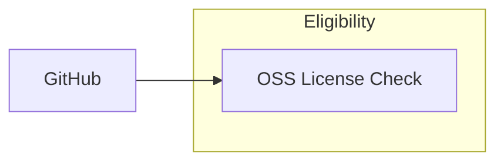

# Eligibility Pipeline

Determines which GitHub repos qualify for funding based on open-source license status.

## How It Works

Reads repo metadata from `data/github/search/top-repos.csv` and classifies each
repo's license against the OSI-approved license list. A repo is eligible if it
uses a recognized open-source license.

63 licenses are recognized, including MIT, Apache 2.0, GPL (all versions),
BSD variants, MPL, ISC, Unlicense, and others.

## Scripts

| Script | Purpose | Command |
|--------|---------|---------|
| `src/eligibility.py` | Classify repos by OSS license eligibility | `uv run python -m src.eligibility` |

## Output

### eligibility.csv

| Column | Description |
|--------|-------------|
| `repo` | GitHub repo slug (`owner/name`) |
| `repo_id` | GitHub numeric repo ID |
| `user` | Repo owner login |
| `user_id` | Owner numeric ID |
| `user_type` | `User` or `Organization` |
| `license` | License SPDX key (e.g. `mit`, `apache-2.0`) |
| `is_oss` | `True` if the license is OSI-approved |
| `tm_owner` | Trademark owner (TODO) |
| `tm_owner_type` | Corporate vs community-held (TODO) |
| `eligibility` | `True` if repo qualifies for funding |
