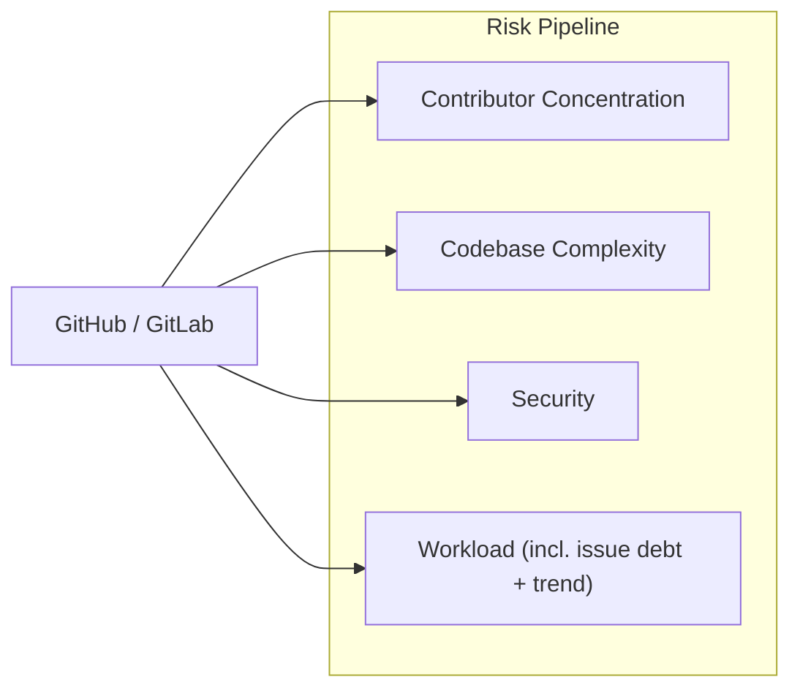

# Risk Pipeline

Measures sustainability risk for the top repos — the valid class-A set across
both platforms (GitHub + GitLab), **including archived repos** — using four
scored dimensions: contributor concentration, codebase complexity, security
posture, and maintainer workload, over the last 5 years. Archived repos are
scored like any other (archival surfaces in eligibility as `active=False`,
not by dropping the repo from risk).

Each scored dimension has its own component doc — how it collects its sources,
derives metrics, and produces the `score` it contributes to `risk.csv`:

| Component | Doc | Score (0–100, higher = riskier) |
|---|---|---|
| Concentration | [components/concentration.md](components/concentration.md) | `sqrt((100 / bf) × (hhi / 100))` — absolute 5y scales |
| Complexity | [components/complexity.md](components/complexity.md) | geom-mean of `loc_eoy_p`, `cyclomatic_max_p` |
| Security | [components/security.md](components/security.md) | `max(openssf_score_p, cve_score)` — worst-of |
| Workload | [components/workload.md](components/workload.md) | geom-mean of `loc_per_ac_p`, `cve_per_ac_p`, `nni_per_ac_p` |

`risk_score` = geometric mean of the four — blank unless all four are present.

## Scope: GitHub and GitLab only

The risk pipeline supports **GitHub and GitLab repos, and nothing else**
(`settings.json` → `top_repos.platforms`). Every dimension leans on a signal
only those hosts serve: per-year commit anchors, an issue-tracker API
(`workload`), and OpenSSF Scorecard (`security`). A repo whose canonical
upstream is a self-hosted git server therefore cannot be scored, and is left
**out of scope** rather than scored on partial data — `platform=custom` rows
never reach this stage.

That is a deliberate boundary, and it excludes real projects: glibc,
binutils-gdb, readline, gettext, libunistring, libgpg-error, qt5, bzip2 and
acl all live on sourceware, GNU Savannah, gnupg.org or code.qt.io. They stay
in `value.csv` (class-A, `git_valid=True`) and are simply not risk-scored.

The rule is about the **canonical upstream**, not convenience: a custom host
that speaks git and validates goes in `git_url` (see
[value.md](value.md#manual-overrides)) even when that costs the repo its place
in scope. Pointing a repo at a GitHub/GitLab *mirror* to keep it scoreable
would mean measuring a copy — which is exactly the bug that once put bzip2's
abandoned GitLab fork at the top of the C/C++ list.

## Running it

The risk stage runs only through the pipeline script; never invoke the stage
runner or a fetcher by hand.

```bash
scripts/run-pipeline.sh --from-stage risk    # risk → eligibility → preview → health
scripts/run-pipeline.sh --stage risk         # risk alone (later stages left stale)
scripts/run-pipeline.sh --stage risk --list  # its steps
scripts/run-pipeline.sh --stage risk --offline   # builders only, from cached data
```

Steps, in order (`src/risk/run_risk_pipeline.py`). Steps sharing a `pgroup`
run **concurrently**:

```
pgroup git-fetch:  commits-years · resolve-head · git-contributors · issues · gitlab-issues
sequential:        gitlab-commits-years
pgroup metrics:    sha-metrics · cves · scorecard · depsdev
builders:          openssf-checks → concentration → complexity → security → workload → aggregate
```

Three properties of that list:

- **Score-forming fetchers only.** `FETCHERS` holds exactly the steps whose
  output feeds a `risk.csv` score column — the model scores nothing it does not
  fetch. A source that would only populate an informational column is not a
  pipeline step.
- **`gitlab-commits-years` sits alone.** GitLab repos need their own per-year
  SHA anchors (the GitHub Commits API cannot anchor a `gl/…` repo), but the
  fetcher merge-writes the *same* `commits-years.csv` that `commits-years` and
  `resolve-head` write. A pgroup runs its members concurrently, so sharing one
  would race that file; its sequential slot sits after the `git-fetch` barrier
  and before `sha-metrics`, which reads the finished anchors.
- **`openssf-checks` runs first among the builders.** Pure transform, no
  fetch: it flattens the `scorecard` step's raw `data.json` into the per-check
  `data/sources/openssf/checks.csv` (Maintained, Code-Review, CI-Tests, …),
  which `build_workload` reads for `openssf_maintained`. It reruns whenever
  `scorecard` does, keeping the per-check table in sync with the raw JSON.

Fetchers are incremental — they skip data already present, so a re-run only
fills gaps. `--offline` drops every fetcher and rebuilds from what is on disk;
`--refresh` forces a refetch past every TTL.

Funding is **not part of the risk stage** — the funding signals and the
`intent` / `nonprofit` flags they feed belong to the Eligibility stage
([eligibility.md](eligibility.md)): the signals build
`data/eligibility/funding.csv` and roll into
`data/eligibility/eligibility.csv`. Methodology stays in
[components/funding.md](components/funding.md).

## Metrics Roadmap

Inputs per dimension, current as of the last pipeline run. Each leaf = one metric, with its data
source and the time period it represents.

> **Note:** `[2025 EOY]` means *as of the last commit to the default (main)
> branch in 2025* — not the calendar year-end snapshot. For repos with no
> 2025 commits, the metric falls back to the most recent prior year.

```
Risk
│
├── Concentration  →  data/risk/concentration.csv
│   ├── total_commits        ← git-clone log                             [lifetime · 2021–2025]
│   ├── active_contributors  ← derived (merged non-bot identities)       [lifetime · 2021–2025]
│   ├── bf_commits           ← derived (bus factor)                      [lifetime · 2021–2025]
│   └── hhi_commits          ← derived (HHI, 0–10000)                    [lifetime · 2021–2025]
│       (every metric derived from the git-clone commit log over two
│        windows — full history and the last 5 complete years — kept as
│        parallel *_git_full / *_git_5y columns)
│
├── Complexity  →  data/risk/complexity.csv
│   ├── loc, sloc                     ← scc (sparse checkout)            [2025 EOY]
│   ├── scc_complexity, scc_density   ← scc cyclomatic total + per-line  [2025 EOY]
│   ├── cyclomatic_{total,avg,max}    ← lizard (sparse checkout)         [2025 EOY]
│   └── cognitive_{total,avg,max}     ← lizard cognitive complexity      [2025 EOY]
│
├── Security  →  data/risk/security.csv
│   ├── openssf_score                 ← OpenSSF Scorecard (deps.dev fb)  [2025 EOY]
│   ├── cve_count_5y                  ← OSV.dev /v1/query                [2021–2025]
│   ├── ossfuzz_enrolled              ← OSS-Fuzz projects index          [most recent]
│   └── bestpractices_badge_id        ← deps.dev (OpenSSF Best Practices) [most recent]
│
└── Workload  →  data/risk/workload.csv
    ├── repo_age_years                ← GitHub /repos created_at        [EOY, last complete yr]
    ├── push_cadence_years            ← commits-years.csv (years w/ commits) [2021–2025]
    ├── openssf_maintained            ← OpenSSF Scorecard "Maintained"   [2025 EOY]
    ├── has_issues                    ← GitHub /repos                   [most recent]
    ├── issues_opened_5y, issues_closed_5y  ← GitHub Search + GitLab issues API [2021–2025]
    ├── issue_close_ratio, net_new_issues_5y  ← derived                 [2021–2025]
    ├── slope_opened, slope_closed, issue_trend_score  ← derived (OLS)   [2021–2025]
    └── loc_per_ac, cve_per_ac, nni_per_ac  ← derived (per active contrib.) [2021–2025]
```

### Collecting `cve_count_5y`

Single source: **OSV.dev** (free, no auth, aggregates GHSA + NVD + ecosystem
advisories).

`POST https://api.osv.dev/v1/query` with
`{"package": {"name": "<pkg>", "ecosystem": "npm|PyPI|crates.io|Debian"}}`,
once per `(ecosystem, package)` tuple mapped to the repo across the
per-ecosystem `results.csv` files (`src/sources/osv/fetch_cves.py`). OSV does
**not** index `pkg:github/*` purls (they return zero results), so there is no
repo-purl fallback; C/C++ packages are queried against OSV's `Debian`
ecosystem (release-suffix-free, aggregating across all Debian releases).

Aggregate the vulns from every package mapped to the repo, filter by
`published` year ∈ 2021–2025, and dedupe by the `{id} ∪ aliases[]` set so a
CVE listed under multiple GHSA/OSV IDs only counts once.



All scoring parameters (windows, weights) are defined in `src/settings.json`.

## How It Works

Four independent scored risk dimensions — **concentration, complexity,
security, workload**. Each dimension takes a designated
subset of its 0–100 risk metrics and emits a single **0–100 `score`** for the
dimension (higher = riskier). Complexity and workload score
percentile-ranked metrics (direction-aware, so a higher percentile always
means *more* risk) composed by **geometric mean**; security composes its
two axes by **max ("worst-of")**, so a bad Scorecard or a
real CVE alone flags the repo without the axes diluting each other;
concentration scores its two metrics on absolute scales
(`100/bf`, `HHI/100`) because a percentile basis collapses the
bus-factor-1 majority into one tie block. The four dimension scores are combined into the
overall `risk.csv` `risk_score` via a geometric mean; the overall score is
blank unless **all four** dimension scores are present (a partial geometric
mean is not comparable across repos). Risk is expressed as
continuous scores end-to-end — there are **no discrete risk classes or
tiers**.

Percentiles are worst-pinned CDF ranks (`risk_percentiles` in
`src/common/stats.py`): for each present value, `100 · #{j : vⱼ ≤ vᵢ} / n`
after orienting the metric, ranked across the risk-scope set. The single
worst value maps to exactly 100 and the best to ≥ 100/n, so every percentile
is in (0, 100] and a geometric mean over them can never collapse to 0.
"Direction-aware" means each metric is
oriented before ranking: a low bus factor, a high HHI, a low OpenSSF score all
map to a *high* risk percentile. The exact percentile(s) that feed each
dimension `score` are listed in the table at the top of this doc and in each
component doc; every `*_p` column and raw metric lives in the per-dimension
`data/risk/<dimension>.csv`.

1. **Concentration risk** -- how dependent is the project on a few contributors?
2. **Complexity risk** -- how large and hard to audit is the codebase?
3. **Security risk** -- how exposed is the project (OpenSSF Scorecard, CVEs)?
4. **Workload risk** -- how much per-contributor burden (code, CVEs, issue backlog)?

### Concentration

Git-clone-derived end to end: one bare treeless clone per repo, `git log
--no-merges`, mailmap applied, identities merged, bots dropped — no host API is
involved, so GitHub and GitLab repos are measured identically. Two windows —
full history (`*_git_full`) and the last `concentration.window_years` complete
years (`*_git_5y`):

- **bus factor** (`bf_commits_*`) — the fewest contributors whose combined
  commits reach `bus_factor_threshold` (0.5 = the people covering 50% of
  commits). Low bus factor → higher risk.
- **HHI** (`hhi_commits_*`, 0–10000) — Herfindahl-Hirschman concentration of
  commit shares. High HHI → higher risk.

The `_5y` axis feeds the
dimension `score`: the geometric mean of the absolute scales `100 /
bf_commits_git_5y` and `hhi_commits_git_5y / 100` (concentration is the one
dimension scored on absolute scales, not percentiles — see
[components/concentration.md](components/concentration.md) for why). All `*_p`
percentiles are computed for context but not scored.

### Complexity

How large and hard to audit is the codebase? Percentile-ranked metrics
(`data/risk/complexity.csv`):

- `loc_eoy` — lines of code (scc, EOY snapshot).
- `scc_complexity_eoy` — scc cyclomatic total; `cyclomatic_max` /
  `cognitive_max` — lizard per-function maxima.

The dimension `score` is the geometric mean of `loc_eoy_p` and
`cyclomatic_max_p`.

### Issue debt

Is the maintainer keeping up with reported issues over 5 years? (Folded into the
**workload** dimension.) `issue_close_ratio` = `closed_5y / opened_5y` (rounded
to 3 dp); a low close ratio means a growing backlog, and its risk percentile is
`issue_close_ratio_p`. Repos with zero opened issues in the window get an
empty signal rather than a division by zero.

### Issue Trend

Independent of the backlog level; captures direction. For each year
`y ∈ 2021..2025`:

```
slope_opened = OLS slope of opened_y vs y
slope_closed = OLS slope of closed_y vs y
trend_score  = (slope_closed - slope_opened) / mean(opened_per_year)
```

Normalising by mean opened-volume makes the score comparable across project
sizes. A positive `issue_trend_score` means the maintainer is closing the gap
(`issue_trend_score_p` is its risk percentile); it is empty when
`mean(opened_per_year) < 1` (fewer than ~1 opened issue per window year).

### Workload

Per-contributor burden, combining codebase size, security debt, and issue
backlog. Three ratios (▴ higher = more workload), each percentile-ranked:

- `loc_per_ac` — lines of code per active contributor.
- `cve_per_ac` — CVEs (5y) per active contributor.
- `nni_per_ac` — net new issues (opened − closed, 5y) per active contributor.

`AC` = `active_contributors_git_5y`, the count of distinct non-bot
contributors who authored a commit in 2021–2025 (git-clone method). A repo
with AC = 0 (dormant / bot-only window) is scored with a notional AC = 1 and
flagged `dormant = 1` rather than left blank.
Each ratio is percentile-ranked across the risk-scope set (worst-pinned CDF,
in (0, 100] — see above) into `loc_per_ac_p` / `cve_per_ac_p` /
`nni_per_ac_p`; the dimension `score` is the geometric mean of the three
percentiles. Issue counts come from two host-specific fetchers writing one
long-format contract — GitHub Search (`github/issues.csv`) and the GitLab
issues API (`gitlab/issues.csv`) — merged by `repo_id`, so both platforms carry
a real issue signal. When a repo's issues were never fetched (issues disabled,
unreachable, or any window year missing), `nni_per_ac_p` is neutral-filled to
**50** so LOC + CVE still produce a score; the score is empty only when the LOC
or CVE input is also missing.

### Security

Combines the OpenSSF-rooted signals and CVE counts. Direction-aware risk
percentiles (▴ higher = worse security):

- `openssf_score_p` — percentile of the OpenSSF Scorecard `openssf_score`,
  **inverted**: a lower Scorecard score ranks as higher risk.
- `cve_score` — neutral-anchored CVE risk score (0–100): a repo with **0 known
  CVEs** scores **50** (a deliberate neutral baseline — "none known" is absence
  of evidence, not proof of safety); a repo with **≥1 CVE** is ranked among the
  non-zero repos only (by worst-pinned CDF) and mapped into **(50, 100]**, so
  more CVEs → strictly higher risk and the single worst maps to 100.

The dimension `score` is the **max ("worst-of")** of `openssf_score_p` and
`cve_score` — either a bad Scorecard *or* real CVEs alone is enough to flag the
repo, and the two axes do not compound or dilute each other (so a repo with real
CVEs is never masked by an otherwise-good Scorecard). Most risk-scope repos have
zero known CVEs and share the same `cve_score = 50` (the neutral baseline), so
for those `score = openssf_score_p` (which clears 50 for most) and is driven by
the OpenSSF Scorecard axis; the CVE axis takes over only for the minority whose
`cve_score` exceeds their openssf axis. When one axis is missing entirely the
other alone scores the repo (`max_composite_any`) — e.g. a GitLab repo with no
Scorecard still gets a security score from the CVE axis. (CVE coverage is in
the preview stats sheet → Risk → Security.)

## Data Sources

Every source below is score-forming — each one feeds a `risk.csv` dimension.

| Source | Fields extracted for Risk |
|---|---|
| **git-clone commit log** (`src/sources/git/contributors.py`, bare treeless clone, `git log --no-merges`) | per-contributor per-year commits → bus factor, HHI, active contributors (the concentration score source + workload divisor). Host-agnostic — GitHub and GitLab go through one code path |
| **GitHub Commits API** (`src/sources/git/commits_years.py`, `resolve_head.py`) | per-(repo, year) `first_sha` / `last_sha` / `commits` → the snapshot anchor every sha-pinned metric keys off |
| **GitLab Commits API** (`src/sources/gitlab/commits_years.py`) | the same per-year SHA anchors for `gl/…` repos, merged into the shared `commits-years.csv` |
| **git tree** (one sparse checkout of the EOY-pinned sha, `fetch_sha_metrics.py`) → [scc](https://github.com/boyter/scc) | lines of code, complexity per language → `data/sources/git/scc.csv` |
| **Lizard** (same single checkout) | per-function McCabe cyclomatic + Sonar cognitive → `data/sources/git/lizard.csv` |
| **GitHub Issues Search API** (`api.github.com/search/issues`) | per-year issue open / close counts → `data/sources/github/issues.csv` |
| **GitLab Issues API** (`/projects/:id/issues`, one exact scan per project) | per-year issue open / close counts for `gl/…` repos → `data/sources/gitlab/issues.csv` (same long schema) |
| **OpenSSF Scorecard** (`src/sources/openssf/scorecard.py`) | security score (0–10) per repo → `data/sources/git/openssf.csv` |
| **deps.dev API** (`api.deps.dev`) | mirrored Scorecard `score` + checks (fallback) → `data/sources/git/depsdev.csv`; Best Practices badge → `data/sources/depsdev/repos.csv` |
| **OSV.dev** (`api.osv.dev/v1/query`) | per-CVE rows → `data/sources/osv/cves.csv` (+ `queried.csv` sidecar, so a true zero is distinguishable from a skipped fetch) |

## Long-format snapshot files (`data/sources/git/`)

All sha-pinned raw metrics share one canonical schema:

```
repo, repo_id, git_url, commit_sha, metric, value, checked_at
```

(`git_url` is the host-agnostic clone URL — how GitLab repos route to their
real host.)

Key = `(repo, commit_sha, metric)`. New runs upsert by key — historical snapshots for prior SHAs are preserved as a time-series. Empty `value` / empty `commit_sha` rows are dropped. Floats are written in shortest round-trip form (`42` not `42.0`, `8.5` not `8.500000000001`).

Files:

| File | Tool | Metrics |
|------|------|---------|
| `data/sources/git/scc.csv` | [scc](https://github.com/boyter/scc) | `loc`, `sloc`, `files`, `uloc`, `complexity`, `complexity_density` |
| `data/sources/git/lizard.csv` | [lizard](https://github.com/terryyin/lizard) | `cyclomatic_*`, `cognitive_*`, `files` |
| `data/sources/git/openssf.csv` | [scorecard CLI](https://github.com/ossf/scorecard) | `score` + 18 individual checks (`maintained`, `code_review`, …) |
| `data/sources/git/depsdev.csv` | [deps.dev](https://api.deps.dev) | mirrored Scorecard `score` + checks |

The canonical writer/reader is `src/sources/git/long_format.py` (`upsert_snapshot`, `upsert_rows`, `read`, `project_to_wide`, `latest_sha_per_repo`).

### Sha-pinning convention

Each repo has per-year `last_sha` resolved into `data/sources/git/commits-years.csv` — by `src/sources/git/commits_years.py` (GitHub Commits API) for `gh/…` repos and by `src/sources/gitlab/commits_years.py` (GitLab Commits API) for `gl/…` repos, which merge-write the same file under one schema. Fetchers walk per-repo years newest → oldest (2025 → 2024 → …, cascading up to 10 years back via `resolve_snapshot_sha`) and pick the most-recent year with a non-empty `last_sha`. For dormant repos with no populated year at all, `src.sources.git.resolve_head` records the latest default-branch commit under its real (dated) year. That sha is the `commit_sha` for every row the fetcher writes — no live-HEAD clone ever persists, and if no usable sha exists anywhere, no row is written for that repo.

### High-level projection (long → wide)

The pipeline stages project the long files into per-repo wide rows for downstream consumers:

- `data/risk/complexity.csv` ← `src.risk.build_complexity` projects `data/sources/git/scc.csv` + `data/sources/git/lizard.csv` using `commits-years.last_sha` — newest → oldest over every available snapshot year (the window, plus any dated pre-window fallback), taking the first sha with `loc > 0`; a repo whose every snapshot reports `loc = 0` is a genuinely code-free tree and scores as a real zero.
- `data/risk/security.csv` ← `src.risk.build_security` projects `data/sources/git/openssf.csv`, `data/sources/git/depsdev.csv` using the same per-year sha priority.
- `data/risk/risk.csv` ← `src.risk.aggregate_risk` (the pipeline's final step) joins the four scored dimensions (concentration · complexity · security · workload) and computes the final `risk_score` as their geometric mean — blank unless all four are present.

## Scripts

| Script | Purpose |
|--------|---------|
| `src/sources/git/commits_years.py` | Per-(repo, year) first/last commit SHA + commit count (GitHub Commits API) — the snapshot anchor |
| `src/sources/gitlab/commits_years.py` | The same per-year SHA anchors for `gl/…` repos, merged into the shared `commits-years.csv` |
| `src/sources/git/resolve_head.py` | Dated snapshot SHA for dormant repos with no in-window commit |
| `src/sources/git/contributors.py` | Per-contributor per-year commits from the bare clone log (feeds bus factor, HHI, active contributors) |
| `src/sources/git/fetch_sha_metrics.py` | Unified SHA-pinned metrics — one sparse checkout → scc + both lizard passes (cyclomatic + cognitive) → `scc.csv` + `lizard.csv` |
| `src/sources/git/fetch_scc.py` | scc code analysis via sparse checkout (standalone `scc` fetcher; helpers reused by `fetch_sha_metrics.py`) |
| `src/sources/github/fetch_issue_metrics.py` | Issue counts per year (GitHub Search API) |
| `src/sources/gitlab/fetch_issue_metrics.py` | Issue counts per year for `gl/…` repos (one exact GitLab-API scan per project) |
| `src/sources/osv/fetch_cves.py` | Distinct CVEs per repo (OSV.dev) + the `queried.csv` sidecar |
| `src/sources/openssf/scorecard.py` | OpenSSF Scorecard score + checks, pinned to the snapshot SHA |
| `src/sources/openssf/extract_checks.py` | Flattens the Scorecard run's `data.json` into the per-check `checks.csv` (Maintained, Code-Review, CI-Tests, …) that `build_workload` reads for `openssf_maintained` |
| `src/sources/depsdev/fetch.py` | deps.dev-mirrored Scorecard (Scorecard fallback) + Best Practices badge |
| `src/risk/aggregate_risk.py` | Aggregate the per-dimension scores into the overall `risk_score` (geometric mean of the four scored dimensions: concentration, complexity, security, workload; blank unless all four are present). **Input scope is `load_top_repos` over `data/value/value.csv` — valid repos with `class ∈ settings.json top_repos.classes` (`["A"]`) and `platform ∈ top_repos.platforms` (`["github", "gitlab"]`), archived included** |

Run them through `scripts/run-pipeline.sh` (see *Running it*), not by hand.
Cognitive complexity comes from the unified sha-metrics/lizard pass, so it has
no standalone fetcher.

## Source-file coverage

Per-source-file coverage across the top repos, the `risk.csv` rollup, and the
per-dimension score distributions all live in the preview stats sheet → Risk
(generated by `scripts/stats.py`, rendered by the `preview` stage — one number,
one place). `risk.csv` holds one row per top repo — four 0–100 dimension scores
plus an overall `risk_score`; the detailed metric and `*_p` percentile columns
live in the per-dimension `data/risk/*.csv` files.

### Why the remaining gaps

Every gap is structural — a signal that genuinely doesn't exist for that repo,
not a data-collection bug:

- **depsdev** — repos that publish only via Debian / Homebrew / vcpkg / source tarballs are absent from deps.dev's index. Not fillable.
- **Scorecard** — Scorecard's GitLab scan is a separate, gated run, and its `Contributors` check hits internal errors on a handful of repos (`isaacs/node-mkdirp`, `gnome/glib`, `rust-lang/rust`). The CVE axis alone still scores those repos (`max_composite_any`).
- **concentration** — the bare treeless clone times out on kernel-scale mirrors (`archlinux/linux`); the status sidecar records the failure and the repo's git columns stay blank. A failed clone is the only unscored concentration case — every successfully-fetched repo scores (see [components/concentration.md](components/concentration.md)).
- **Structurally-sparse columns** — `bestpractices_badge_id` (only CII-enrolled repos), `cognitive_*` (only languages with a Lizard cognitive parser), and `issue_trend_score` (only repos with `mean_opened_per_year ≥ 1`) are sparse by definition. None of them feed a score.

## Output

### risk.csv

One row per risk-scope repo. The four scored-dimension columns are each a
**0–100 risk score** (higher = riskier) — the rollup of that
dimension's scored metrics — and `risk_score` is the geometric mean of those
four scores (blank unless all four are present). Rows are ranked by
`risk_score` descending. The detailed per-dimension metric
and `*_p` percentile columns live in the per-dimension files
(`data/risk/{concentration,complexity,security,workload}.csv`) and are
documented in the component docs linked at the top of this page.

| Column | Description |
|--------|-------------|
| `repo` | GitHub repo slug (`owner/name`) |
| `repo_id` | GitHub numeric repo ID |
| `concentration` | Contributor-concentration risk score (0–100) |
| `complexity` | Codebase-complexity risk score (0–100) |
| `security` | Security risk score (0–100) |
| `workload` | Per-contributor workload risk score (0–100) |
| `risk_score` | Overall risk score (0–100) — geometric mean of the four dimensions; blank when any dimension score is missing |

The `intent` and `nonprofit` flags are part of the Eligibility stage — built into `data/eligibility/funding.csv` and
rolled into `data/eligibility/eligibility.csv` (see [eligibility.md](eligibility.md)).
