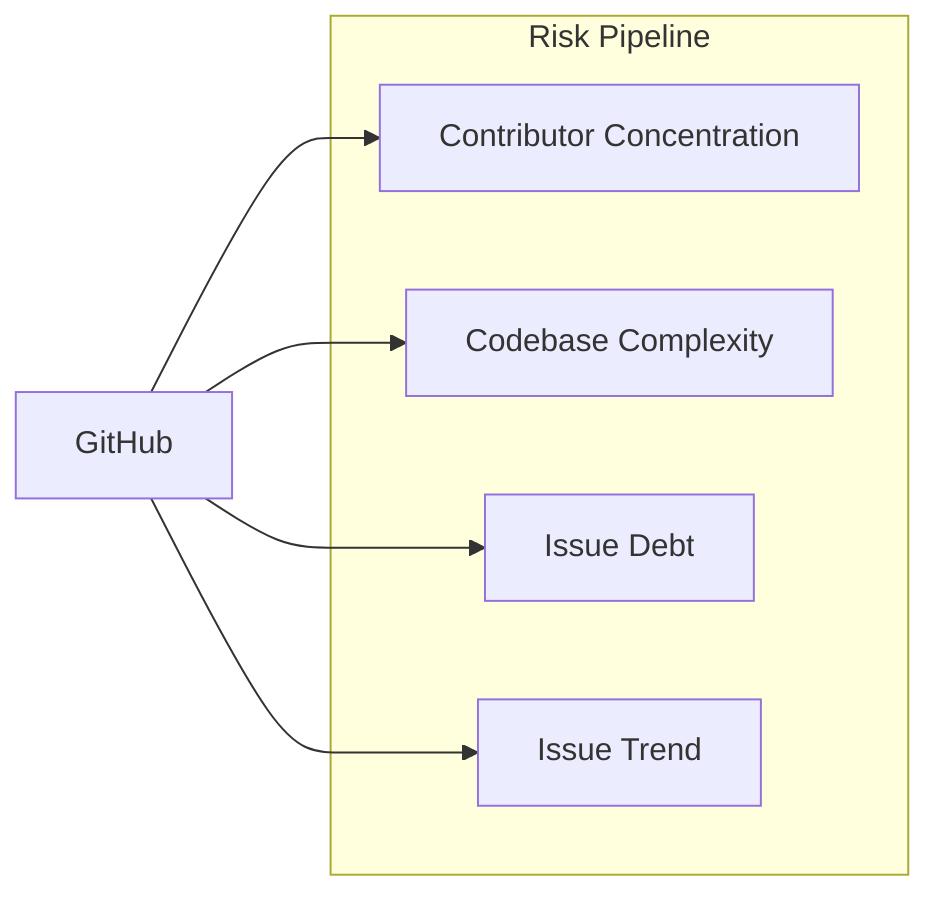

# Risk Pipeline

Measures sustainability risk for GitHub repos using contributor concentration,
codebase complexity, and issue-tracker dynamics over the last 5 years.

## Metrics Roadmap

Inputs per dimension, current as of the last pipeline run. Each leaf = one metric, with its data
source and the time period it represents.

> **Note:** `[2025 EOY]` means *as of the last commit to the default (main)
> branch in 2025* — not the calendar year-end snapshot. For repos with no
> 2025 commits, the metric falls back to the most recent prior year.

```
Risk
│
├── Concentration  →  data/risk/concentration.csv
│   ├── total_commits        ← git-clone log · GitHub /contributors      [lifetime]
│   ├── active_contributors  ← derived (merged non-bot identities)       [lifetime · 2021–2025]
│   ├── bf_commits           ← derived (bus factor)                      [lifetime · 2021–2025]
│   └── hhi_commits          ← derived (HHI, 0–10000)                    [lifetime · 2021–2025]
│       (every metric resolved by two methods — git-clone log and the
│        GitHub /contributors API — kept as parallel *_git / *_github
│        columns; the git method also carries a 2021–2025 window)
│
├── Complexity  →  data/risk/complexity.csv
│   ├── loc, sloc                     ← scc (sparse checkout)            [2025 EOY]
│   ├── scc_complexity, scc_density   ← scc cyclomatic total + per-line  [2025 EOY]
│   ├── cyclomatic_{total,avg,max}    ← lizard (sparse checkout)         [2025 EOY]
│   ├── cognitive_{total,avg,max}     ← lizard cognitive complexity      [2025 EOY]
│   ├── churn_5y_total                ← git churn (bare clone)           [2021–2025]
│   └── hotspot_{raw,log,percentile}  ← derived (churn × complexity)     [2025 EOY]
│
├── Security  →  data/risk/security.csv
│   ├── openssf_score                 ← OpenSSF Scorecard (deps.dev fb)  [2025 EOY]
│   ├── cve_count_5y                  ← OSV.dev /v1/query                [2021–2025]
│   ├── ossfuzz_enrolled              ← OSS-Fuzz projects index          [most recent]
│   ├── sast_findings_{total,error,security}  ← semgrep p/default        [2025 EOY]
│   └── bestpractices_badge_id        ← deps.dev (OpenSSF Best Practices) [most recent]
│
├── Funding  →  data/risk/funding.csv
│   ├── github_sponsors               ← GitHub Sponsors API             [most recent]
│   ├── has_funding_yml, _yml_platforms  ← repo /.github/FUNDING.yml     [most recent]
│   ├── has_funding_json              ← repo /funding.json (FLOSS/fund)  [most recent]
│   └── foundation_host               ← foundation rosters (Apache/CNCF/LF/…) [most recent]
│
├── Visibility  →  data/risk/visibility.csv
│   ├── stars                         ← GitHub /repos                   [most recent]
│   ├── forks                         ← GitHub /repos                   [most recent]
│   └── watchers                      ← GitHub /repos                   [most recent]
│
└── Workload  →  data/risk/workload.csv
    ├── repo_age_years                ← GitHub /repos created_at        [2025 EOY]
    ├── push_cadence_years            ← commits-years.csv (years w/ commits) [2021–2025]
    ├── openssf_maintained            ← OpenSSF Scorecard "Maintained"   [2025 EOY]
    ├── has_issues                    ← GitHub /repos                   [most recent]
    ├── issues_opened_5y, issues_closed_5y  ← GitHub Search API          [2021–2025]
    ├── issue_close_ratio, net_new_issues_5y  ← derived                 [2021–2025]
    ├── slope_opened, slope_closed, issue_trend_score  ← derived (OLS)   [2021–2025]
    └── loc_per_ac, cve_per_ac, nni_per_ac  ← derived (per active contrib.) [2021–2025]
```

### Collecting `cve_count_5y`

Single source: **OSV.dev** (free, no auth, aggregates GHSA + NVD + ecosystem
advisories).

`POST https://api.osv.dev/v1/query` with one of:

- `{"package": {"name": "<pkg>", "ecosystem": "npm|PyPI|crates.io|Go|…"}}` —
  for ecosystem-published packages.
- `{"package": {"purl": "pkg:github/<owner>/<name>"}}` — for repos without
  a published package (uses the GitHub purl form).

Filter the returned `vulns[]` by `published` year ∈ 2021–2025 and dedupe by
the `aliases[]` set so a CVE listed under multiple GHSA/OSV IDs only counts
once.



All thresholds are defined in `src/settings.json`.

## How It Works

Independent risk dimensions, each classified A (highest risk) through D (lowest)
plus a separate trend signal:

1. **Concentration risk** -- how dependent is the project on a few contributors?
2. **Complexity risk** -- how large and hard to audit is the codebase?
3. **Issue debt risk** -- is the maintainer keeping up with reported issues over 5 years?
4. **Issue trend** -- is the closure-vs-opening balance improving or deteriorating?

### Concentration Class

Based on bus factor (BF) and Herfindahl-Hirschman Index (HHI):

| Class | Label | Criteria |
|-------|-------|----------|
| **A** | critical | BF = 1 and HHI >= 8000 |
| **B** | high risk | BF <= 2 and HHI >= 5000 |
| **C** | moderate | BF <= 4 and HHI >= 2500 |
| **D** | healthy | otherwise |

### Complexity Class

Based on scc lines of code:

| Class | Label | Criteria |
|-------|-------|----------|
| **A** | massive | >= 1M LOC |
| **B** | large | 100K -- 1M LOC |
| **C** | moderate | 10K -- 100K LOC |
| **D** | small | < 10K LOC |

### Issue Debt Class

Based on the 5-year close ratio (`closed_5y / opened_5y`) plus a per-class
volume floor so a low-traffic repo isn't flagged as "drowning in backlog"
on the strength of two dropped issues:

| Class | Label | Criteria |
|-------|-------|----------|
| **A** | critical | close_ratio < 0.30 AND opened_5y >= 100 |
| **B** | high risk | close_ratio < 0.60 AND opened_5y >= 30 |
| **C** | moderate | close_ratio < 0.85 AND opened_5y >= 10 |
| **D** | healthy | close_ratio >= 0.85 (and opened_5y >= 10) |
| _empty_ | no signal | opened_5y < 10 (issues disabled / unused) |

### Issue Trend

Independent of debt class; captures direction. For each year `y ∈ 2021..2025`:

```
slope_opened = OLS slope of opened_y vs y
slope_closed = OLS slope of closed_y vs y
trend_score  = (slope_closed - slope_opened) / mean(opened_per_year)
```

Normalising by mean opened-volume makes the score comparable across project sizes.

| Trend | Criteria |
|-------|----------|
| improving | trend_score >= +0.05 |
| stable | -0.05 < trend_score < +0.05 |
| deteriorating | trend_score <= -0.05 |
| _empty_ | opened_5y < 25 OR fewer than 3 years had any issues opened |

A class-A debt repo with `trend=improving` is the strongest "maintainer-rebound"
signal: backlog is high *now* but the slope is closing the gap.

### Workload Class

Per-contributor burden, combining codebase size, security debt, and issue
backlog. For each repo three ratios are formed (▴ higher = more workload):

- `loc_per_ac` — lines of code per active contributor
- `cve_per_ac` — CVEs (5y) per active contributor
- `nni_per_ac` — net new issues (opened − closed, 5y) per active contributor

`AC` = `active_contributors_git_2021_2025`, the count of distinct non-bot
contributors who authored a commit in 2021–2025 (git-clone method).
Each ratio is percentile-ranked across the eligible set (Hazen position
`100·(rank−0.5)/n`, strictly in 0–100); `workload_burden_percentile` is the
geometric mean of the three percentiles. The class is its equal-count quartile:

| Class | Label | Criteria |
|-------|-------|----------|
| **A** | overloaded | top 25% of `workload_burden_percentile` |
| **B** | high | next 25% |
| **C** | moderate | next 25% |
| **D** | comfortable | bottom 25% |
| _empty_ | no signal | LOC, CVE, NNI, or AC missing, or AC = 0 |

### Security Class

Combines the two OpenSSF-rooted security signals into a single A–D tier
using the same method as the workload class. Two risk percentiles are
formed (▴ higher = worse security):

- `openssf_risk_pctl` — percentile of `openssf_score`, **inverted**: a
  lower Scorecard score ranks as higher risk.
- `cve_risk_pctl` — percentile of `cve_count_5y`: more known CVEs ranks
  as higher risk.

Each axis is percentile-ranked across the classified set (Hazen position
`100·(rank−0.5)/n`, strictly in 0–100); `security_risk_percentile` is the
geometric mean of the two — a repo ranks worst when it is high-risk on
**both** axes, while a low-risk score on one axis pulls the composite
down toward the safer quartiles. The class is its equal-count quartile:

| Class | Label | Criteria |
|-------|-------|----------|
| **A** | critical | top 25% of `security_risk_percentile` |
| **B** | high | next 25% |
| **C** | moderate | next 25% |
| **D** | healthy | bottom 25% |
| _empty_ | no signal | `openssf_score` or `cve_count_5y` missing |

~78% of risk-scope repos have zero known CVEs and so share one identical
`cve_risk_pctl`; for those repos the class is effectively driven by the
OpenSSF Scorecard axis, with the CVE axis only re-ranking the minority
that carry CVEs.

## Data Sources

| Source | Fields extracted for Risk |
|---|---|
| **GitHub Contributors stats API** (`api.github.com/repos/.../stats/contributors`) | per-contributor weekly commit history → bus factor, HHI |
| **GitHub git tree** (sparse checkout + [scc](https://github.com/boyter/scc)) | lines of code, complexity per language → `data/sources/git/scc.csv` |
| **Lizard + multimetric** (sparse checkout) | per-function McCabe + Halstead + Sonar cognitive + maintainability index → `data/sources/git/lizard.csv` |
| **Semgrep** (sparse checkout, `p/default` rulepack) | SAST findings → `data/sources/git/semgrep.csv` |
| **GitHub Issues Search API** (`api.github.com/search/issues`) | per-year issue open / close counts |
| **OpenSSF Scorecard API** (`api.securityscorecards.dev`) | security score (0–10) per repo → `data/sources/git/openssf.csv` |
| **deps.dev API** (`api.deps.dev`) | mirrored Scorecard `score` + checks (fallback) → `data/sources/git/depsdev.csv` |

## Long-format snapshot files (`data/sources/git/`)

All sha-pinned raw metrics share one canonical schema:

```
repo, repo_id, commit_sha, metric, value, checked_at
```

Key = `(repo, commit_sha, metric)`. New runs upsert by key — historical snapshots for prior SHAs are preserved as a time-series. Empty `value` / empty `commit_sha` rows are dropped. Floats are written in shortest round-trip form (`42` not `42.0`, `8.5` not `8.500000000001`).

Files:

| File | Tool | Metrics |
|------|------|---------|
| `data/sources/git/scc.csv` | [scc](https://github.com/boyter/scc) | `loc`, `sloc`, `files`, `uloc`, `complexity`, `complexity_density` |
| `data/sources/git/lizard.csv` | [lizard](https://github.com/terryyin/lizard) + [multimetric](https://github.com/priv-kweihmann/multimetric) | `cyclomatic_*`, `halstead_*`, `cognitive_*`, `maintainability_index`, `files` |
| `data/sources/git/semgrep.csv` | [semgrep](https://semgrep.dev) | `<rulepack>.<metric>` (e.g. `p_default.total`, `p_default.error`) |
| `data/sources/git/openssf.csv` | [scorecard CLI](https://github.com/ossf/scorecard) | `score` + 18 individual checks (`maintained`, `code_review`, …) |
| `data/sources/git/depsdev.csv` | [deps.dev](https://api.deps.dev) | mirrored Scorecard `score` + checks |

The canonical writer/reader is `src/sources/git/long_format.py` (`upsert_snapshot`, `upsert_rows`, `read`, `project_to_wide`, `latest_sha_per_repo`).

### Sha-pinning convention

Each repo has per-year `last_sha` resolved by `src/sources/git/commits_years.py` into `data/sources/github/git/commits-years.csv`. Fetchers walk per-repo years 2025 → 2024 → … → 2021 and pick the most-recent year with `commits > 0` and a non-empty `last_sha`. That sha is the `commit_sha` for every row the fetcher writes. No HEAD fallback persists — if no usable year exists for a repo, no row is written for it.

### High-level projection (long → wide)

The pipeline stages project the long files into per-repo wide rows for downstream consumers:

- `data/risk/complexity.csv` ← `src.risk.build_complexity` projects `data/sources/git/scc.csv` + `data/sources/git/lizard.csv` using `commits-years.last_sha` (2025 → 2021 walk; first sha with `loc > 0`). Also folds in the **hotspot** score (Tornhill `churn × complexity`): joins `data/sources/github/git/churn.csv` (`churn_5y_total`) with the EOY-2025 scc complexity snapshot to emit `churn_5y_total`, `hotspot_raw`, `hotspot_log`, `hotspot_percentile`.
- `data/risk/security.csv` ← `src.risk.build_security` projects `data/sources/git/openssf.csv`, `data/sources/git/depsdev.csv`, `data/sources/git/semgrep.csv` using the same per-year sha priority.
- `data/risk/risk.csv` ← `src.risk.run_risk_pipeline` joins complexity + security + concentration + issue-debt and computes the final risk score.

## Scripts

| Script | Purpose |
|--------|---------|
| `src/sources/github/fetch_contributors_metrics.py` | Contributor analysis (bus factor, HHI) |
| `src/sources/github/fetch_git_metrics.py` | scc code analysis via sparse checkout |
| `src/sources/github/fetch_issue_metrics.py` | Issue counts per year (Search API) |
| `src/risk/aggregate_risk.py` | Aggregate into risk classifications. **Input is `data/value/value.csv` — repos with `class ∈ settings.json risk_input.value_classes` (default A/B)** — `uv run python -m src.risk.run_risk_pipeline` |

## Source-file coverage

Snapshot of how complete each source file is across the risk-scope (A/B)
repos. Counts reflect the last pipeline run; refresh with
`uv run python scripts/coverage_report.py`.

| Source | File | Risk-scope covered | Coverage | Notes |
|---|---|---:|---:|---|
| commits-years (foundation) | `data/sources/github/git/commits-years.csv` | 899/899 | **100%** | per-(repo, year) `last_sha`; foundation file |
| scc | `data/sources/git/scc.csv` | 899/899 | **100%** | sparse-checkout per year sha |
| repos | `data/sources/github/repos.csv` | 899/899 | **100%** | stars / forks / watchers / pushed_at |
| openssf | `data/sources/git/openssf.csv` | 895/899 | 99.6% | overall score + 18 checks per sha |
| concentration (git) | `data/sources/git/contributor-commits.csv` | 898/899 | 99.9% | long raw per (repo, author, year) |
| concentration (github) | `data/sources/github/contributor-commits.csv` | 895/899 | 99.6% | long raw `/contributors` payload per (repo, login) |
| lizard | `data/sources/git/lizard.csv` | 894/899 | 99.4% | cognitive + cyclomatic + Halstead per sha |
| semgrep | `data/sources/git/semgrep.csv` | 892/899 | 99.2% | rulepack-prefixed SAST findings per sha |
| cves-queried | `data/sources/osv/queried.csv` | 888/899 | 98.8% | repos OSV was successfully asked about |
| funding | `data/risk/funding-data.csv` | 888/899 | 98.8% | github_sponsors + FUNDING.yml |
| openssf-checks | `data/sources/openssf/checks.csv` | 881/899 | 98.0% | per-check Scorecard scores (used by build_workload) |
| issues | `data/sources/github/issues.csv` | 878/899 | 97.7% | opened/closed per year |
| churn | `data/sources/github/git/churn.csv` | 869/899 | 96.7% | 5y added+deleted lines (heavy bare-clone) |
| depsdev | `data/sources/git/depsdev.csv` | 791/899 | 88.0% | structural — deps.dev only indexes npm / pypi / cargo / maven / go / nuget / rubygems (Debian, cpp, Homebrew unsupported) |

### Why the remaining gaps

- **depsdev (88%)** — repos that publish only via Debian / Homebrew / vcpkg / source tarballs are absent from deps.dev's index. Not fillable.
- **Anything ~99% with 4–6 missing** — a mix of brand-new eligibility additions and scorecard `Contributors`-check internal errors on a handful of repos (`isaacs/node-mkdirp`, `gnome/glib`, `rust-lang/rust`).
- **concentration** — two independent methods, each a long raw per-contributor file under `data/sources/git/` and `data/sources/github/`; `build_concentration` merges identities, drops bots, and computes BF/HHI/AC into the single wide `data/risk/concentration.csv`. The git-clone method times out on Linux-kernel-scale mirrors (`archlinux/linux`); the GitHub `/contributors` API caps the contributor list near 500 and rate-limits a few mega-repos. The `/stats/contributors` per-year breakdown and `data/concentration-data.csv` are retired.
- **churn (96.7%)** — bare-clone timeout on the largest repos (gcc-mirror/gcc, ffmpeg/ffmpeg, microsoft/typescript, etc.). Re-runs with longer timeouts can recover most of these.

### What this rolls up to in `risk-data.csv`

**899 rows × 51 columns · 100% risk-scope (A/B) repos populated · median per-column coverage 98.8%.** Counts refresh on re-run.

Sub-100% columns (every gap is structural, not a data-collection bug):

| Column | Coverage | Why |
|---|---:|---|
| `bestpractices_badge_id` | 2.8% | Only repos enrolled in CII Best Practices have a badge. |
| `foundation_host` | 3.9% | Only 35 repos belong to a FOSS foundation (apache / psf / lf / numfocus / lf/cncf / lf/openjs). |
| `funding_yml_platforms` | 27.3% | Most repos don't have a `.github/FUNDING.yml`. |
| `cognitive_total` / `_avg` / `_max` | 65.1% | Only computed for languages with a Lizard / cognitive-complexity parser. |
| `issue_trend_score` | 67.5% | Formula requires `mean_opened_per_year ≥ 1`; quiet repos correctly omitted. |

## Output

### risk-data.csv

| Column | Description |
|--------|-------------|
| `repo` | GitHub repo slug (`owner/name`) |
| `repo_id` | GitHub numeric repo ID |
| `bf_commits_git` / `hhi_commits_git` | Bus factor / HHI (0--10000) — git-clone method, lifetime |
| `contributors_git` / `total_commits_git` | Merged non-bot contributors / non-merge commits — git, lifetime |
| `bf_commits_git_2021_2025` / `hhi_commits_git_2021_2025` | Bus factor / HHI — git, 2021--2025 window |
| `active_contributors_git_2021_2025` / `commits_git_2021_2025` | Distinct non-bot contributors / commits — git, 2021--2025 window |
| `bf_commits_github` / `hhi_commits_github` | Bus factor / HHI — GitHub `/contributors` method, lifetime (list capped near 500) |
| `total_commits_github` / `total_contributors_github` / `active_contributors_github` | Commit + contributor counts — GitHub method |
| `concentration_class` | A--D from `bf_commits_git` + `hhi_commits_git` |
| `loc` | Lines of code (scc, most recent year) |
| `complexity_class` | A--D |
| `issues_opened_5y` | Sum of issues opened 2021--2025 |
| `issues_closed_5y` | Sum of issues closed 2021--2025 |
| `issue_close_ratio` | `closed_5y / opened_5y`, rounded to 3 decimals |
| `slope_opened` | OLS slope of yearly opened counts (issues/yr) |
| `slope_closed` | OLS slope of yearly closed counts (issues/yr) |
| `issue_trend_score` | Volume-normalised `slope_closed - slope_opened`; signed |
| `issue_trend` | `improving` / `stable` / `deteriorating` / empty |
| `issue_debt_class` | A--D, or empty if `opened_5y < 10` |
| `active_contributors_git_2021_2025` | Distinct non-bot contributors active 2021--2025 — the workload class's AC denominator |
| `net_new_issues_5y` | `issues_opened_5y` − `issues_closed_5y` (5-year issue backlog growth) |
| `loc_per_ac` | Lines of code per active contributor |
| `cve_per_ac` | CVEs (5y) per active contributor |
| `nni_per_ac` | Net new issues (5y) per active contributor |
| `loc_per_ac_pctl` | Hazen percentile (0–100) of `loc_per_ac` across the eligible set |
| `cve_per_ac_pctl` | Hazen percentile (0–100) of `cve_per_ac` |
| `nni_per_ac_pctl` | Hazen percentile (0–100) of `nni_per_ac` |
| `workload_burden_percentile` | Geometric mean of the three `*_pctl` values |
| `workload_class` | A–D equal-count quartile of `workload_burden_percentile` (A = worst); empty when an input is missing |
| `openssf_risk_pctl` | Hazen percentile (0–100) of `openssf_score`, inverted (lower score → higher risk) |
| `cve_risk_pctl` | Hazen percentile (0–100) of `cve_count_5y` (more CVEs → higher risk) |
| `security_risk_percentile` | Geometric mean of `openssf_risk_pctl` and `cve_risk_pctl` |
| `security_class` | A–D equal-count quartile of `security_risk_percentile` (A = worst); empty when `openssf_score` or `cve_count_5y` is missing |
