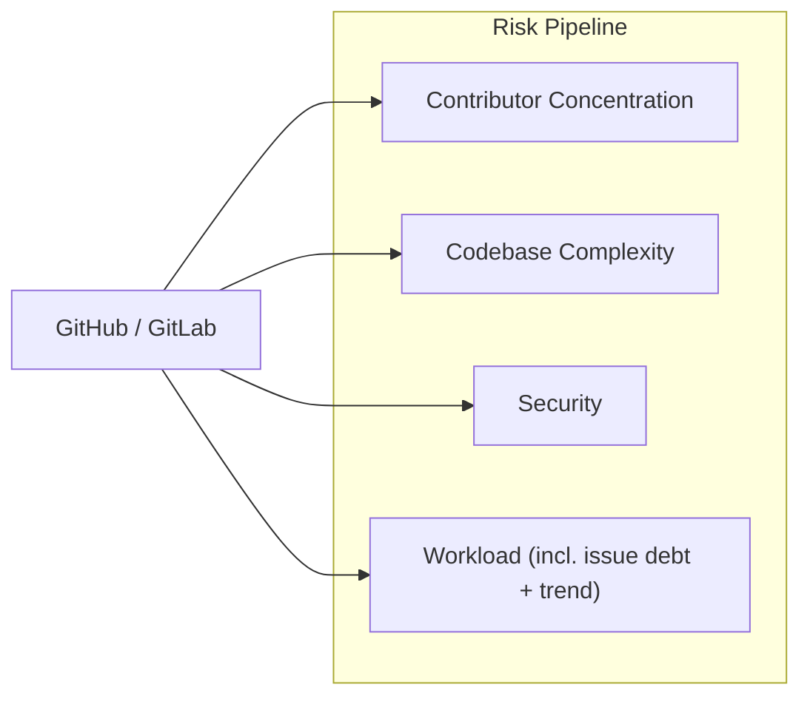

# Risk Pipeline

Scores sustainability risk over the last 5 years for the top repos — the valid
class-A set on GitHub and GitLab, **archived repos included**. Archival surfaces
in eligibility as `active=False`; it never drops a repo from risk.

Four scored dimensions, each with its own component doc:

| Component | Doc | Score (1–100, higher = riskier) |
|---|---|---|
| Concentration | [components/concentration.md](components/concentration.md) | `max(1, √((100 / bf) × (hhi / 100)))` — absolute 5y scales |
| Complexity | [components/complexity.md](components/complexity.md) | geom-mean of `loc_eoy_p`, `cyclomatic_max_p` |
| Security | [components/security.md](components/security.md) | `max(openssf_score_p, cve_score)` — worst-of |
| Workload | [components/workload.md](components/workload.md) | geom-mean of `loc_per_ac_p`, `cve_per_ac_p`, `nni_per_ac_p` |

`risk_score` = geometric mean of the four dimension scores, blank unless all
four are present.

Every dimension `score` and `risk_score` is floored at 1 (`max(1, …)` in
`_concentration_score`, `percentiles.add_percentiles`, and
`aggregate_risk.overall_score`). A clamped `1.00` is the lowest-risk tier, not
"no risk", and the floor keeps the overall geometric mean off 0.

## Scope: GitHub and GitLab only

Risk scores the top-repo set and nothing else — the valid class-A repos, also
called the **core**. [value.md](value.md#pipeline-overview) defines that set.

The risk pipeline scores **GitHub and GitLab repos only** (`settings.json` →
`top_repos.platforms`). Every dimension needs a signal only those hosts serve:
per-year commit anchors, an issue-tracker API (workload), and OpenSSF Scorecard
(security). `load_top_repos` (`src/common/repos.py`) enforces the limit.
`settings.json` may narrow the platform set but never widen it —
`params.SUPPORTED_PLATFORMS` fails the import first, so an unmeasurable host can
never be admitted and then score blank.

### Reaching a self-hosted project through its mirror

Some of the most-depended-on C libraries live on a self-hosted git server —
sourceware, GNU Savannah, gnupg.org, code.qt.io. They enter scope through a
**verified mirror**: `git_url` names the GitHub/GitLab mirror the model scores,
`canonical_url` records the upstream it copies. Both go in
[`data/value/overrides.csv`](value.md#manual-overrides).

Prove the mirror. A name is not evidence: a fork that diverged years ago looks
identical to a mirror in every listing.

| Check | Why |
|---|---|
| `git ls-remote` HEAD sha == upstream's, **now** | proves it is currently in sync, not a snapshot |
| upstream's refs present (tags + branches) | a fork carries a subset; a mirror carries the lot |
| pushed within the upstream's own cadence | a dead mirror still advertises itself as one |
| not a fork, not archived | GitHub's own flags |

Record the evidence in the `comment` column of `overrides.csv`. The `glibc` row
carries the full test result: HEAD identical to sourceware, every upstream ref
present, same-day push, issues disabled.

**A mirror's issue tracker is not the project's.** The bugs live in Bugzilla, in
Jira, or on a mailing list, and the mirror's tracker is switched off or empty.
The Search API reports that as zero issues — the *best possible* workload. So a
repo carrying a `canonical_url` gets a blank (unknown) issue backlog that
neutral-fills, never a fabricated zero. See
[components/workload.md](components/workload.md). Concentration, complexity and
CVEs are measured from code byte-identical to the upstream, so they describe the
project exactly.

## Running it

The risk stage runs only through the pipeline script; never invoke the stage
runner or a fetcher by hand.

```bash
scripts/run-pipeline.sh --from-stage risk    # risk → eligibility → preview → health
scripts/run-pipeline.sh --stage risk         # risk alone (later stages left stale)
scripts/run-pipeline.sh --stage risk --list  # its steps
scripts/run-pipeline.sh --stage risk --offline   # builders only, from cached data
```

`preview` and `health` follow the three scoring stages but score nothing:
`preview` rebuilds the `data/preview/` deliverables, and `health` audits every
stage CSV against its builder.

Steps, in order (`src/risk/run_risk_pipeline.py`). Steps sharing a `pgroup`
run **concurrently**:

```
pgroup git-fetch:  commits-years · resolve-head · git-contributors · issues · gitlab-issues
sequential:        gitlab-commits-years
pgroup metrics:    sha-metrics · cves · scorecard · depsdev
builders:          openssf-checks → concentration → complexity → security → workload → aggregate
```

Three properties of that list:

- **Score-forming fetchers only.** `FETCHERS` holds exactly the steps whose
  output feeds a `risk.csv` score column. A source that would only populate an
  informational column is not a pipeline step.
- **`gitlab-commits-years` sits alone.** The GitHub Commits API cannot anchor a
  `gl/…` repo, so GitLab repos need their own per-year SHA anchors — but the
  fetcher merge-writes the *same* `commits-years.csv` as `commits-years` and
  `resolve-head`. A pgroup runs its members concurrently and would race that
  file. The sequential slot sits after the `git-fetch` barrier and before
  `sha-metrics`, which reads the finished anchors.
- **`openssf-checks` runs first among the builders.** It is a pure transform: it
  flattens the `scorecard` step's `data/sources/openssf/data.json` into the
  per-check `data/sources/openssf/checks.csv` (Maintained, Code-Review,
  CI-Tests, …) that `build_workload` reads for `openssf_maintained`. It reruns
  whenever `scorecard` does.

Fetchers are incremental: a re-run fills gaps and skips data already on disk.
`--offline` drops every fetcher and rebuilds from disk. `--refresh` forces a
refetch past every TTL.

Funding is **not part of the risk stage**. The funding signals and the `intent`
/ `nonprofit` flags build `data/eligibility/funding.csv` and roll into
`data/eligibility/eligibility.csv` — see [eligibility.md](eligibility.md) and
[components/funding.md](components/funding.md).

## Metrics Roadmap

One leaf per column, with its data source and the period it represents.

> **Note:** `[2025 EOY]` means *as of the last commit to the default (main)
> branch in 2025* — not the calendar year-end snapshot. For repos with no
> 2025 commits, the metric falls back to the most recent prior year.

```
Risk
│
├── Concentration  →  data/risk/concentration.csv
│   │   (every metric derived from the git-clone commit log over two windows:
│   │    full history *_git_full and the last 5 complete years *_git_5y)
│   ├── total_commits_git_full · commits_git_5y                          [lifetime · 2021–2025]
│   ├── contributors_git_full · active_contributors_git_5y               [lifetime · 2021–2025]
│   ├── bf_commits_git_full · bf_commits_git_5y      ← bus factor        [lifetime · 2021–2025]
│   └── hhi_commits_git_full · hhi_commits_git_5y    ← HHI, 0–10000      [lifetime · 2021–2025]
│
├── Complexity  →  data/risk/complexity.csv
│   ├── loc_eoy, sloc_eoy                     ← scc (sparse checkout)    [2025 EOY]
│   ├── scc_complexity_eoy, scc_density_eoy   ← scc cyclomatic total + per-line [2025 EOY]
│   ├── cyclomatic_{total,avg,max}            ← lizard (same checkout)   [2025 EOY]
│   └── cognitive_{total,avg,max}             ← lizard cognitive complexity [2025 EOY]
│
├── Security  →  data/risk/security.csv
│   ├── openssf_score                 ← OpenSSF Scorecard (deps.dev fb)  [2025 EOY]
│   ├── cve_count_5y                  ← OSV.dev /v1/query                [2021–2025]
│   ├── ossfuzz_enrolled              ← OSS-Fuzz projects index          [most recent]
│   └── bestpractices_badge_id        ← deps.dev (OpenSSF Best Practices) [most recent]
│
└── Workload  →  data/risk/workload.csv
    ├── repo_age_years                ← GitHub /repos created_at        [EOY, last complete yr]
    ├── push_cadence_years            ← commits-years.csv (years w/ commits) [2021–2025]
    ├── openssf_maintained            ← OpenSSF Scorecard "Maintained"   [most recent]
    ├── has_issues                    ← GitHub /repos                   [most recent]
    ├── issues_opened_5y, issues_closed_5y  ← GitHub Search + GitLab issues API [2021–2025]
    ├── issue_close_ratio, net_new_issues_5y  ← derived                 [2021–2025]
    ├── slope_opened, slope_closed, issue_trend_score  ← derived (OLS)   [2021–2025]
    └── loc_per_ac, cve_per_ac, nni_per_ac  ← derived (per active contrib.) [2021–2025]
```

`openssf_maintained` is `[most recent]`, not year-pinned: `build_workload`
reads it from `data/sources/openssf/checks.csv`, which `extract_checks`
flattens from the newest Scorecard run per repo.

### Collecting `cve_count_5y`

Single source: **OSV.dev** (free, no auth, aggregates GHSA + NVD + ecosystem
advisories).

`POST https://api.osv.dev/v1/query` with
`{"package": {"name": "<pkg>", "ecosystem": "npm|PyPI|crates.io|Debian"}}`,
once per `(ecosystem, package)` tuple mapped to the repo across the
per-ecosystem `results.csv` files (`src/sources/osv/fetch_cves.py`). OSV does
**not** index `pkg:github/*` purls (they return zero results), so there is no
repo-purl fallback; C/C++ packages are queried against OSV's `Debian`
ecosystem (release-suffix-free, aggregating across all Debian releases).

Aggregate the vulns from every package mapped to the repo, filter by
`published` year ∈ 2021–2025, and dedupe by the `{id} ∪ aliases[]` set so a
CVE listed under multiple GHSA/OSV IDs only counts once.



All scoring parameters (windows, weights) are defined in `src/settings.json`.

## How It Works

Each of the four dimensions takes a designated subset of its metrics and emits
one **1–100 `score`** (higher = riskier). The composition differs per dimension:

| Dimension | Question | Composition |
|---|---|---|
| Concentration | How dependent is the project on a few contributors? | geom-mean of two absolute scales (`100/bf`, `HHI/100`) — a percentile basis collapses the bus factor 1 majority into one tie block |
| Complexity | How large and hard to audit is the codebase? | geom-mean of percentiles |
| Security | How exposed is the project? | `max` ("worst-of") of two percentile axes, so a bad Scorecard *or* a real CVE alone flags the repo |
| Workload | How much per-contributor burden? | geom-mean of percentiles |

`aggregate_risk` combines the four into `risk_score` by geometric mean. It
leaves `risk_score` blank unless all four are present — a partial geometric mean
is not comparable across repos. Risk is continuous end to end: there are **no
discrete risk classes or tiers**.

Percentiles are worst-pinned CDF ranks (`risk_percentiles` in
`src/common/stats.py`). For each present value, the rank is
`100 · #{j : vⱼ ≤ vᵢ} / n` after orienting the metric, across the risk-scope
set. The worst value maps to exactly 100 and the best to ≥ 100/n, so every
percentile lands in (0, 100]. "Direction-aware" means the orientation runs
before the ranking: a low bus factor, a high HHI and a low OpenSSF score all map
to a *high* risk percentile. Every `*_p` column and raw metric lives in the
per-dimension `data/risk/<dimension>.csv`.

### Concentration

Git-clone-derived end to end: one bare treeless clone per repo, `git log
--no-merges`, mailmap applied, identities merged, bots dropped. No host API is
involved, so GitHub and GitLab repos are measured identically. Two windows —
full history (`*_git_full`) and the last `concentration.window_years` complete
years (`*_git_5y`):

- **bus factor** (`bf_commits_*`) — the fewest contributors whose combined
  commits reach `bus_factor_threshold` (0.5 = the people covering 50% of
  commits). Low bus factor → higher risk.
- **HHI** (`hhi_commits_*`, 0–10000) — Herfindahl-Hirschman concentration of
  commit shares. High HHI → higher risk.

Only the `_5y` axis feeds the dimension `score`: the geometric mean of the
absolute scales `100 / bf_commits_git_5y` and `hhi_commits_git_5y / 100`. See
[components/concentration.md](components/concentration.md) for why this one
dimension uses absolute scales. The `*_p` percentiles are context only.

### Complexity

Percentile-ranked metrics in `data/risk/complexity.csv`:

- `loc_eoy` — lines of code (scc, EOY snapshot).
- `scc_complexity_eoy` — scc cyclomatic total.
- `cyclomatic_max` / `cognitive_max` — lizard per-function maxima.

The dimension `score` is the geometric mean of `loc_eoy_p` and
`cyclomatic_max_p`.

### Issue debt

Folded into the **workload** dimension. `issue_close_ratio` =
`closed_5y / opened_5y`, rounded to 3 dp; a low ratio means a growing backlog.
Its risk percentile is `issue_close_ratio_p`. A repo with zero opened issues in
the window gets an empty signal, never a division by zero.

### Issue Trend

Captures direction, independent of the backlog level. For each year
`y ∈ 2021..2025`:

```
slope_opened = OLS slope of opened_y vs y
slope_closed = OLS slope of closed_y vs y
trend_score  = (slope_closed - slope_opened) / mean(opened_per_year)
```

Normalising by mean opened-volume makes the score comparable across project
sizes. A positive `issue_trend_score` means the maintainer is closing the gap;
`issue_trend_score_p` is its risk percentile. The score is empty when
`mean(opened_per_year) < 1` — fewer than one opened issue per window year.

### Workload

Per-contributor burden across codebase size, security debt and issue backlog.
Three ratios (▴ higher = more workload), each percentile-ranked:

- `loc_per_ac` — lines of code per active contributor.
- `cve_per_ac` — CVEs (5y) per active contributor.
- `nni_per_ac` — net new issues (opened − closed, 5y) per active contributor.

`AC` = `active_contributors_git_5y`, the count of distinct non-bot contributors
who authored a commit in 2021–2025 (git-clone method). A repo with AC = 0
(dormant or bot-only window) scores with a notional AC = 1 and a `dormant = 1`
flag, rather than staying blank.

Each ratio is percentile-ranked across the risk-scope set into `loc_per_ac_p`,
`cve_per_ac_p` and `nni_per_ac_p`. The dimension `score` is their geometric
mean. Issue counts come from two host-specific fetchers writing one long-format
contract — GitHub Search (`github/issues.csv`) and the GitLab issues API
(`gitlab/issues.csv`) — merged by `repo_id`, so both platforms carry a real
issue signal. When a repo's issues were never fetched (issues disabled,
unreachable, or any window year missing), `nni_per_ac_p` neutral-fills to **50**
so LOC + CVE still produce a score. The score is empty only when the LOC or CVE
input is also missing.

### Security

Two direction-aware axes (▴ higher = worse security):

- `openssf_score_p` — percentile of the OpenSSF Scorecard `openssf_score`,
  **inverted**: a lower Scorecard score ranks as higher risk.
- `cve_score` — neutral-anchored CVE risk score (0–100). A repo with **0 known
  CVEs** scores **50**, a deliberate neutral baseline: "none known" is absence
  of evidence, not proof of safety. A repo with **≥1 CVE** ranks among the
  non-zero repos only (worst-pinned CDF) and maps into **(50, 100]**, so more
  CVEs → strictly higher risk and the worst maps to 100.

The dimension `score` is the **max ("worst-of")** of the two. A bad Scorecard
*or* real CVEs alone flags the repo, and neither axis dilutes the other — real
CVEs are never masked by an otherwise-good Scorecard. Repos with zero known CVEs
sit at the `cve_score = 50` baseline, so for them `score = openssf_score_p`; the
CVE axis takes over only where `cve_score` exceeds the Scorecard axis. When one
axis is missing entirely, `max_composite_any` scores the repo from the other.
(CVE coverage is in the preview pipeline sheet → Risk → Security.)

## Data Sources

Every source below is score-forming — each one feeds a `risk.csv` dimension.

| Source | Fields extracted for Risk |
|---|---|
| **git-clone commit log** (`src/sources/git/contributors.py`, bare treeless clone, `git log --no-merges`) | per-contributor per-year commits → bus factor, HHI, active contributors (the concentration score source + workload divisor). Host-agnostic — GitHub and GitLab go through one code path |
| **GitHub Commits API** (`src/sources/git/commits_years.py`, `resolve_head.py`) | per-(repo, year) `first_sha` / `last_sha` / `commits` → the snapshot anchor every sha-pinned metric keys off |
| **GitLab Commits API** (`src/sources/gitlab/commits_years.py`) | the same per-year SHA anchors for `gl/…` repos, merged into the shared `commits-years.csv` |
| **git tree** (one sparse checkout of the EOY-pinned sha, `fetch_sha_metrics.py`) → [scc](https://github.com/boyter/scc) | lines of code, complexity per language → `data/sources/git/scc.csv` |
| **Lizard** (same single checkout) | per-function McCabe cyclomatic + Sonar cognitive → `data/sources/git/lizard.csv` |
| **GitHub Issues Search API** (`api.github.com/search/issues`) | per-year issue open / close counts → `data/sources/github/issues.csv` |
| **GitLab Issues API** (`/projects/:id/issues`, one exact scan per project) | per-year issue open / close counts for `gl/…` repos → `data/sources/gitlab/issues.csv` (same long schema) |
| **OpenSSF Scorecard** (`src/sources/openssf/scorecard.py`) | security score (0–10) per repo → `data/sources/git/openssf.csv` |
| **deps.dev API** (`api.deps.dev`) | mirrored Scorecard `score` + checks (fallback) → `data/sources/git/depsdev.csv`; Best Practices badge → `data/sources/depsdev/repos.csv` |
| **OSV.dev** (`api.osv.dev/v1/query`) | per-CVE rows → `data/sources/osv/cves.csv` (+ `queried.csv` sidecar, so a true zero is distinguishable from a skipped fetch) |

## Long-format snapshot files (`data/sources/git/`)

All sha-pinned raw metrics share one canonical schema:

```
repo, repo_id, git_url, commit_sha, metric, value, checked_at
```

(`git_url` is the host-agnostic clone URL — how GitLab repos route to their
real host.)

Key = `(repo, commit_sha, metric)`. New runs upsert by key — historical snapshots for prior SHAs are preserved as a time-series. Empty `value` / empty `commit_sha` rows are dropped. Floats are written in shortest round-trip form (`42` not `42.0`, `8.5` not `8.500000000001`).

Files:

| File | Tool | Metrics |
|------|------|---------|
| `data/sources/git/scc.csv` | [scc](https://github.com/boyter/scc) | `loc`, `sloc`, `files`, `uloc`, `complexity`, `complexity_density` |
| `data/sources/git/lizard.csv` | [lizard](https://github.com/terryyin/lizard) | `cyclomatic_{total,avg,max}`, `cognitive_{total,avg,max}`, `files`, `halstead_{bugs,difficulty,effort,volume}`, `maintainability_index` |
| `data/sources/git/openssf.csv` | [scorecard CLI](https://github.com/ossf/scorecard) | `score` + 18 individual checks (`maintained`, `code_review`, …) + `scan_error` (the tombstone written when a scan returns nothing, `commit_sha = unscanned`) |
| `data/sources/git/depsdev.csv` | [deps.dev](https://api.deps.dev) | mirrored Scorecard `score` + checks |

The canonical writer/reader is `src/sources/git/long_format.py` (`upsert_snapshot`, `upsert_rows`, `read`, `project_to_wide`, `latest_sha_per_repo`).

### Sha-pinning convention

Each repo has a per-year `last_sha` in `data/sources/git/commits-years.csv`.
`src/sources/git/commits_years.py` (GitHub Commits API) resolves it for `gh/…`
repos and `src/sources/gitlab/commits_years.py` (GitLab Commits API) for `gl/…`
repos; both merge-write the same file under one schema.

`resolve_snapshot_sha` walks per-repo years newest → oldest (2025 → 2024 → …)
and picks the most-recent year with a non-empty `last_sha`. The walk is capped
at `SNAPSHOT_WALKBACK_YEARS = 30` (`src/sources/git/commits_years.py`) — a fixed
cheap range, wide enough to reach the oldest dormant-repo fallback year in the
dataset. For a dormant repo with no populated window year,
`src.sources.git.resolve_head` records the latest default-branch commit under
its real (dated) year. That sha becomes the `commit_sha` of every row the
fetcher writes. No live-HEAD clone ever persists, and a repo with no usable sha
anywhere gets no row at all.

### High-level projection (long → wide)

The pipeline stages project the long files into per-repo wide rows for downstream consumers:

- `data/risk/complexity.csv` ← `src.risk.build_complexity` projects `data/sources/git/scc.csv` + `data/sources/git/lizard.csv` using `commits-years.last_sha` — newest → oldest over every available snapshot year (the window, plus any dated pre-window fallback), taking the first sha with `loc > 0`; a repo whose every snapshot reports `loc = 0` is a genuinely code-free tree and scores as a real zero.
- `data/risk/security.csv` ← `src.risk.build_security` projects `data/sources/git/openssf.csv`, `data/sources/git/depsdev.csv` using the same per-year sha priority.
- `data/risk/risk.csv` ← `src.risk.aggregate_risk` (the pipeline's final step) joins the four scored dimensions (concentration · complexity · security · workload) and computes the final `risk_score` as their geometric mean — blank unless all four are present.

## Scripts

| Script | Purpose |
|--------|---------|
| `src/sources/git/commits_years.py` | Per-(repo, year) first/last commit SHA + commit count (GitHub Commits API) — the snapshot anchor |
| `src/sources/gitlab/commits_years.py` | The same per-year SHA anchors for `gl/…` repos, merged into the shared `commits-years.csv` |
| `src/sources/git/resolve_head.py` | Dated snapshot SHA for dormant repos with no in-window commit |
| `src/sources/git/contributors.py` | Per-contributor per-year commits from the bare clone log (feeds bus factor, HHI, active contributors) |
| `src/sources/git/fetch_sha_metrics.py` | Unified SHA-pinned metrics — one sparse checkout → scc + both lizard passes (cyclomatic + cognitive) → `scc.csv` + `lizard.csv` |
| `src/sources/git/fetch_scc.py` | scc code analysis via sparse checkout (standalone `scc` fetcher; helpers reused by `fetch_sha_metrics.py`) |
| `src/sources/github/fetch_issue_metrics.py` | Issue counts per year (GitHub Search API) |
| `src/sources/gitlab/fetch_issue_metrics.py` | Issue counts per year for `gl/…` repos (one exact GitLab-API scan per project) |
| `src/sources/osv/fetch_cves.py` | Distinct CVEs per repo (OSV.dev) + the `queried.csv` sidecar |
| `src/sources/openssf/scorecard.py` | OpenSSF Scorecard score + checks, pinned to the snapshot SHA |
| `src/sources/openssf/extract_checks.py` | Flattens the Scorecard run's `data.json` into the per-check `checks.csv` (Maintained, Code-Review, CI-Tests, …) that `build_workload` reads for `openssf_maintained` |
| `src/sources/depsdev/fetch.py` | deps.dev-mirrored Scorecard (Scorecard fallback) + Best Practices badge |
| `src/risk/aggregate_risk.py` | Aggregate the per-dimension scores into the overall `risk_score` (geometric mean of the four scored dimensions: concentration, complexity, security, workload; blank unless all four are present). **Input scope is `load_top_repos` over `data/value/value.csv` — valid repos with `class ∈ settings.json top_repos.classes` (`["A"]`) and `platform ∈ top_repos.platforms` (`["github", "gitlab"]`), archived included** |

Run them through `scripts/run-pipeline.sh` (see *Running it*), not by hand.
Cognitive complexity comes from the unified sha-metrics/lizard pass, so it has
no standalone fetcher.

## Source-file coverage

Per-source-file coverage across the top repos, the `risk.csv` rollup, and the
per-dimension score distributions all live in the preview pipeline sheet → Risk.
`scripts/stats.py` generates them and the `preview` stage renders them — one
number, one place.

### Why the remaining gaps

Every gap below is structural — a signal that genuinely does not exist for that
repo, not a data-collection bug. None of these columns feeds a score.

| Column(s) | Blank for | Why |
|---|---|---|
| `bestpractices_badge_id` | repos with no CII badge | deps.dev returns a badge id only for repos enrolled in OpenSSF Best Practices |
| `issue_trend_score` | repos below the volume floor | `build_workload` emits it only when `mean(opened_per_year) ≥ 1`; below that the OLS slope is noise |
| `repo_age_years`, `has_issues`, `pushed_at` | every `gl/…` repo | `build_workload` reads all three from `data/sources/github/repos.csv`, which has no GitLab rows |
| `openssf_maintained` | every `gl/…` repo | the GitLab Scorecard run keys `data.json` by host path (`gitlab.gnome.org/gnome/glib`), which `extract_checks` cannot resolve to a `repo_id`, so those `checks.csv` rows carry a blank id and never join |

Two source-level limits that do **not** leave a score blank:

- **deps.dev indexes GitHub only.** `src/sources/depsdev/fetch.py` queries
  `github.com/{repo}`, so no `gl/…` repo has a deps.dev mirror row. It is a
  fallback, not a primary: `openssf_score` comes from the local Scorecard run.
- **A failed Scorecard scan writes a tombstone, not a blank.** An empty scan
  result upserts a `scan_error` row with `commit_sha = unscanned`;
  `build_security` then falls back to the deps.dev-mirrored `score`
  (`openssf_score_source = depsdev` records the substitution).

## Output

### risk.csv

One row per risk-scope repo, ranked by `risk_score` descending. Each of the four
scored-dimension columns is a **1–100 risk score** (higher = riskier; floored at
1). The per-dimension metric and `*_p` percentile columns stay in
`data/risk/{concentration,complexity,security,workload}.csv`, documented in the
component docs linked at the top of this page.

| Column | Description |
|--------|-------------|
| `repo` | Host project path (`owner/name` on GitHub, `namespace/project` on GitLab) |
| `repo_id` | Host-namespaced repo id — `gh/<github-numeric-id>` (e.g. `gh/3611422`), or `gl/<host-nickname>-<project-id>` for GitLab (e.g. `gl/gnome-1665`; bare `gl/<project-id>` for gitlab.com). The join key for every stage |
| `concentration` | Contributor-concentration risk score (1–100) |
| `complexity` | Codebase-complexity risk score (1–100) |
| `security` | Security risk score (1–100) |
| `workload` | Per-contributor workload risk score (1–100) |
| `risk_score` | Overall risk score (1–100) — geometric mean of the four dimensions; blank when any dimension score is missing |

The `intent` and `nonprofit` flags are part of the Eligibility stage — built into `data/eligibility/funding.csv` and
rolled into `data/eligibility/eligibility.csv` (see [eligibility.md](eligibility.md)).
