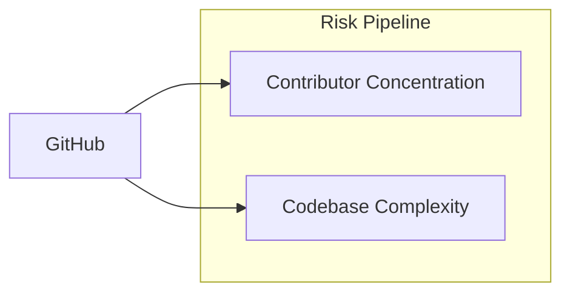

# Risk Pipeline

Measures sustainability risk for GitHub repos using contributor concentration
and codebase complexity.

All thresholds are defined in `src/params.json`.

## How It Works

Two independent risk dimensions, each classified A (highest risk) through D (lowest):

1. **Concentration risk** -- how dependent is the project on a few contributors?
2. **Complexity risk** -- how large and hard to audit is the codebase?

### Concentration Class

Based on bus factor (BF) and Herfindahl-Hirschman Index (HHI):

| Class | Label | Criteria |
|-------|-------|----------|
| **A** | critical | BF = 1 and HHI >= 8000 |
| **B** | high risk | BF <= 2 and HHI >= 5000 |
| **C** | moderate | BF <= 4 and HHI >= 2500 |
| **D** | healthy | otherwise |

### Complexity Class

Based on scc lines of code:

| Class | Label | Criteria |
|-------|-------|----------|
| **A** | massive | >= 1M LOC |
| **B** | large | 100K -- 1M LOC |
| **C** | moderate | 10K -- 100K LOC |
| **D** | small | < 10K LOC |

## Data Sources

All data comes from [GitHub](sources/github.md):
- Contributor stats API -- per-contributor weekly commit history
- scc code analysis -- lines of code, complexity via sparse checkout

## Scripts

| Script | Purpose |
|--------|---------|
| `src/github/fetch_contributors_metrics.py` | Contributor analysis (bus factor, HHI) |
| `src/github/fetch_git_metrics.py` | scc code analysis via sparse checkout |
| `src/classify_risk.py` | Aggregate into risk classifications |

## Output

### risk-metrics.csv

| Column | Description |
|--------|-------------|
| `repo` | GitHub repo slug (`owner/name`) |
| `repo_id` | GitHub numeric repo ID |
| `active_contributors` | Contributors with commits in 2021--2025 |
| `hhi_commits` | Herfindahl-Hirschman Index (0--10000) |
| `bus_factor_commits` | Min contributors for 50% of commits |
| `loc` | Lines of code (scc, most recent year) |
| `concentration_class` | A--D |
| `complexity_class` | A--D |
