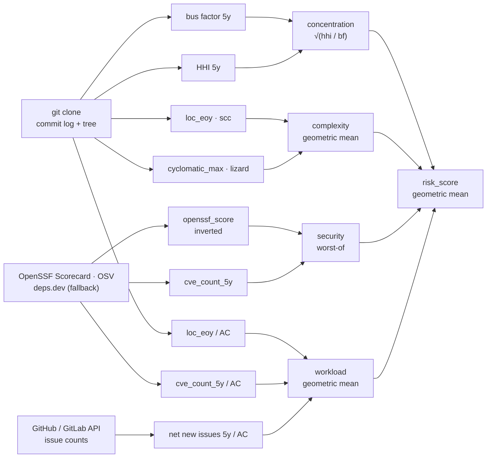

# Risk Pipeline

Risk asks how likely a project is to fail the people who depend on it — through
a maintainer walking away, a codebase nobody can audit, an unpatched
vulnerability, or a backlog that outgrows the contributors. Four dimensions
measure those failure modes separately, and their geometric mean is the repo's
`risk_score`, from 0–100, where higher means riskier.

Every measurement covers the last 5 years, so a score describes where a project
is heading rather than what it once was. Risk scores only the core — the
class-A repos [Value](value.md) selected — and it writes one row per repo to
`data/risk/risk.csv`. The [README](../README.md#what-each-score-is-made-of)
summarizes all three stages in one table.

| File the stage writes | What it holds |
|---|---|
| `data/risk/risk.csv` | One row per in-scope repo: the four dimension scores plus `risk_score`, ranked by `risk_score` descending. See [Output: risk.csv](#output-riskcsv) |
| `data/risk/{concentration,complexity,security,workload}.csv` | The raw metrics and `*_p` percentile columns behind each dimension score |

## The four dimensions

Each dimension takes a designated subset of its metrics and emits one **1–100
`score`** (higher = riskier). The composition differs per dimension:

| Dimension | Question it answers | Dimension `score` | Deep detail |
|---|---|---|---|
| `concentration` | How dependent is the project on a few contributors? | `max(1, √((100 / bf) × (hhi / 100)))` — absolute 5y scales | [components/concentration.md](components/concentration.md) |
| `complexity` | How large and hard to audit is the codebase? | geometric mean of `loc_eoy_p`, `cyclomatic_max_p` | [components/complexity.md](components/complexity.md) |
| `security` | How exposed is the project? | `max(openssf_score_p, cve_score)` — worst-of | [components/security.md](components/security.md) |
| `workload` | How much per-contributor burden does it carry? | geometric mean of `loc_per_ac_p`, `cve_per_ac_p`, `nni_per_ac_p` | [components/workload.md](components/workload.md) |

Each dimension draws on a different kind of evidence, and only `workload` mixes them:



Only the metrics that **score** appear above. Each build collects more —
`scc_complexity_eoy`, `cognitive_max`, `ossfuzz_enrolled`,
`bestpractices_badge_id`, `issue_close_ratio`, `issue_trend_score` — and each
lands in its dimension CSV as context, outside the score.

Two things the diagram compresses. `AC` is `active_contributors_git_5y`, which
the clone also supplies, so every workload ratio depends on it. And `workload`
reuses the same `loc_eoy` and `cve_count_5y` that `complexity` and `security`
score — per contributor rather than absolute. `complexity` and `security` also
read the host Commits API for their year anchor, which is not a measurement —
see [sources/git.md](sources/git.md#sha-anchoring).

### Concentration

How unevenly is authorship spread? One bare treeless clone per repo yields every
metric — `git log --no-merges`, mailmap applied, identities merged, bots dropped
— so both hosts are measured identically, over two windows: full history
(`*_git_full`) and the last `concentration.window_years` complete years
(`*_git_5y`).

| Metric | What it measures | Direction |
|---|---|---|
| `bf_commits_*` (bus factor) | The fewest contributors whose combined commits reach `bus_factor_threshold` (0.5 = the people covering 50% of commits) | low bus factor → higher risk |
| `hhi_commits_*` (0–10000) | Herfindahl-Hirschman concentration of commit shares | high HHI → higher risk |

Only the `_5y` axis scores: the geometric mean of the absolute scales
`100 / bf_commits_git_5y` and `hhi_commits_git_5y / 100`. Absolute, not
percentile, because a percentile basis collapses the bus-factor-1 majority into
one tie block; the `*_p` columns are context only. Full argument and edge cases:
[components/concentration.md](components/concentration.md).

### Complexity

How large and intricate is the code at a year-pinned snapshot? scc measures the
tree, lizard measures each function.

| Metric | What it measures |
|---|---|
| `loc_eoy` | Lines of code (scc, EOY snapshot) |
| `scc_complexity_eoy` | scc cyclomatic total |
| `cyclomatic_max` / `cognitive_max` | lizard per-function maxima |

The dimension `score` is the geometric mean of `loc_eoy_p` and
`cyclomatic_max_p`. Snapshot selection, the mainline-sha correction and the
empty-tree fallback: [components/complexity.md](components/complexity.md).

### Security

Two direction-aware axes (▴ higher = worse security):

| Axis | What it measures |
|---|---|
| `openssf_score_p` | Percentile of the OpenSSF Scorecard `openssf_score`, **inverted**: a lower Scorecard score ranks as higher risk |
| `cve_score` | Neutral-anchored CVE risk score. **0 known CVEs → 50**, because "none known" is absence of evidence, not proof of safety. **≥1 CVE** ranks among the non-zero repos only and maps into **(50, 100]** |

The dimension `score` is the **max ("worst-of")** of the two, so a bad Scorecard
*or* real CVEs alone flags the repo and neither axis dilutes the other. Most
repos sit at the `cve_score = 50` baseline, so for them `score =
openssf_score_p`. When one axis is missing, `max_composite_any` scores from the
other. See [components/security.md](components/security.md).

### Workload

Per-contributor burden across codebase size, security debt and issue backlog.
Three ratios (▴ higher = more workload), each percentile-ranked across the
risk-scope set into `loc_per_ac_p`, `cve_per_ac_p` and `nni_per_ac_p`:

| Ratio | What it measures |
|---|---|
| `loc_per_ac` | Lines of code per active contributor |
| `cve_per_ac` | CVEs (5y) per active contributor |
| `nni_per_ac` | Net new issues (opened − closed, 5y) per active contributor |

`AC` = `active_contributors_git_5y`, the distinct non-bot contributors who
authored a commit in 2021–2025; a repo with AC = 0 scores on a notional AC = 1
and a `dormant = 1` flag rather than staying blank. The dimension `score` is the
geometric mean of the three percentiles, and a repo whose issues were never
fetched neutral-fills `nni_per_ac_p` to **50** so LOC + CVE still score it. The
build also derives `issue_close_ratio` and `issue_trend_score`; both describe the
backlog, neither scores. See [components/workload.md](components/workload.md).

## How the dimensions combine

`aggregate_risk` combines the four dimension scores into `risk_score` by
geometric mean, and leaves `risk_score` blank unless all four are present — a
partial geometric mean is not comparable across repos. Risk is continuous end to
end: there are **no discrete risk classes or tiers**. The final `score` pairs
Risk with Value as `sqrt(value_score × risk_score)`, described in the
[README](../README.md#data-pipeline).

Every dimension `score` and `risk_score` is floored at 1 (`max(1, …)` in
`_concentration_score`, `percentiles.add_percentiles`, and
`aggregate_risk.overall_score`). A clamped `1.00` is the lowest-risk tier, not
"no risk", and the floor keeps the overall geometric mean off 0.

Every `*_p` column is a worst-pinned CDF rank (`risk_percentiles` in
`src/common/stats.py`): `100 · #{j : vⱼ ≤ vᵢ} / n` across the risk-scope set,
after orienting the metric. Orienting *before* ranking is what makes a low bus
factor, a high HHI and a low OpenSSF score all rank as *high* risk, and the worst
value maps to exactly 100, so every percentile lands in (0, 100]. Windows and
weights live in `src/settings.json`. Funding is **not** part of this stage — see
[eligibility.md](eligibility.md).

## Scope

Risk scores the top-repo set and nothing else — the valid class-A repos, also
called the **core**, with **archived repos included** (archival surfaces in
eligibility as `active=False`, and never drops a repo from risk).
[value.md](value.md#pipeline-overview) defines that set; `load_top_repos`
(`src/common/repos.py`) reads it from `data/value/value.csv` and enforces it.

| Filter | Rule | Source |
|---|---|---|
| Validity | valid repos only | `data/value/value.csv` |
| Class | `class ∈ top_repos.classes` (`["A"]`) | `src/settings.json` |
| Platform | `platform ∈ top_repos.platforms` (`["github", "gitlab"]`) | `src/settings.json` |
| Archived | included | — |

Every dimension needs a signal only GitHub and GitLab serve: per-year commit
anchors, an issue-tracker API, and OpenSSF Scorecard. `settings.json` may narrow
the platform set but never widen it — `params.SUPPORTED_PLATFORMS` fails the
import first, so an unmeasurable host can never be admitted and then score blank.

### Reaching a self-hosted project through its mirror

Some of the most-depended-on C libraries live on a self-hosted git server
(sourceware, GNU Savannah, gnupg.org, code.qt.io). They enter scope through a
**verified mirror**: in [`data/value/overrides.csv`](value.md#manual-overrides),
`git_url` names the GitHub/GitLab mirror the model scores, `canonical_url`
records the upstream it copies, and `reason` records the evidence. Prove it — a
fork that diverged years ago looks identical to a mirror in every listing:

| Check | Why |
|---|---|
| `git ls-remote` HEAD sha == upstream's, **now** | proves it is currently in sync, not a snapshot |
| upstream's refs present (tags + branches) | a fork carries a subset; a mirror carries the lot |
| pushed within the upstream's own cadence | a dead mirror still advertises itself as one |
| not a fork, not archived | GitHub's own flags |

**A mirror's issue tracker is not the project's** — the bugs live in Bugzilla,
in Jira, or on a mailing list, and an empty tracker reports zero issues, the
*best possible* workload. So a `canonical_url` row gets a blank (unknown) issue
backlog that neutral-fills, never a fabricated zero
([components/workload.md](components/workload.md)). Its code is byte-identical
to the upstream, so concentration, complexity and CVEs still describe the
project exactly.

## Running it

The risk stage runs only through the pipeline script; never invoke the stage
runner or a fetcher by hand. Fetchers are incremental — a re-run fills gaps and
skips data already on disk.

```bash
scripts/run-pipeline.sh --from-stage risk    # risk → eligibility → preview → health
scripts/run-pipeline.sh --stage risk         # risk alone (later stages left stale)
scripts/run-pipeline.sh --stage risk --list  # its steps
scripts/run-pipeline.sh --stage risk --refresh   # refetch past every TTL
```

The steps run in this order (`src/risk/run_risk_pipeline.py`):

| Phase | Steps | Concurrency |
|---|---|---|
| pgroup `git-fetch` | `commits-years` · `resolve-head` · `git-contributors` · `issues` · `gitlab-issues` | concurrent |
| sequential | `gitlab-commits-years` | alone |
| pgroup `metrics` | `sha-metrics` · `cves` · `scorecard` · `depsdev` | concurrent |
| builders | `openssf-checks` → `concentration` → `complexity` → `security` → `workload` → `aggregate` | in order |

| Why the order is what it is | |
|---|---|
| Score-forming fetchers only | `FETCHERS` holds exactly the steps whose output feeds a `risk.csv` score column. A step that only populates an informational column does not belong |
| `gitlab-commits-years` runs alone | The GitHub Commits API cannot anchor a `gl/…` repo, but the GitLab fetcher merge-writes the *same* `commits-years.csv`, which a pgroup would race. Its slot sits after the `git-fetch` barrier and before `sha-metrics`, which reads the finished anchors |
| `openssf-checks` leads the builders | A pure transform of the `scorecard` step's `data/sources/openssf/data.json` into the per-check `data/sources/openssf/checks.csv` behind `openssf_maintained`. It reruns whenever `scorecard` does |

## Data sources and scripts

Every source is score-forming — each one feeds a `risk.csv` dimension. Each
component page lists the exact files its build reads.

| Source | Script | What Risk takes from it |
|---|---|---|
| git-clone commit log (bare treeless clone, `git log --no-merges`) | `src/sources/git/contributors.py` | per-contributor per-year commits → bus factor, HHI, and the active-contributor divisor. Host-agnostic: one code path for both hosts |
| Commits API, GitHub + GitLab | `src/sources/git/commits_years.py` · `resolve_head.py` · `src/sources/gitlab/commits_years.py` | per-(repo, year) `first_sha` / `last_sha` / `commits` → the anchor every sha-pinned metric keys off. Both hosts merge-write one `commits-years.csv`; `resolve_head` dates a dormant repo with no in-window commit |
| git tree → [scc](https://github.com/boyter/scc) + [lizard](https://github.com/terryyin/lizard) | `src/sources/git/fetch_sha_metrics.py` (scc helpers in `fetch_scc.py`) | one sparse checkout of the EOY-pinned sha → lines of code and complexity per language, plus per-function McCabe and Sonar cognitive metrics |
| Issue trackers: GitHub Search (`/search/issues`) + GitLab (`/projects/:id/issues`, one exact scan per project) | `src/sources/github/fetch_issue_metrics.py` · `src/sources/gitlab/fetch_issue_metrics.py` | per-year issue open / close counts, one long schema over disjoint repo sets |
| OpenSSF Scorecard | `src/sources/openssf/scorecard.py` · `extract_checks.py` | security score (0–10) per repo; `extract_checks` flattens the run's `data.json` into the per-check `checks.csv` behind `openssf_maintained` |
| deps.dev API (`api.deps.dev`) | `src/sources/depsdev/fetch.py` | mirrored Scorecard `score` + checks (Scorecard fallback) and the OpenSSF Best Practices badge |
| OSV.dev (`api.osv.dev/v1/query`) | `src/sources/osv/fetch_cves.py` | per-CVE rows plus a `queried.csv` sidecar that tells a true zero from a skipped fetch. Package mapping and dedupe: [sources/osv.md](sources/osv.md) |
| *(builder, no fetch)* | `src/risk/aggregate_risk.py` | joins the four dimension scores into `risk_score`. Input scope is `load_top_repos` — see [Scope](#scope) |

The sha-pinned raw files (`scc.csv`, `lizard.csv`, `openssf.csv`, `depsdev.csv`)
share one long schema — `repo, repo_id, git_url, commit_sha, metric, value,
checked_at` — keyed by `(repo, commit_sha, metric)`, so older snapshots survive
as a time-series. `src/sources/git/long_format.py` is the only writer and reader;
[sources/git.md](sources/git.md) documents the format and the sha-anchoring walk.

## Output: risk.csv

One row per risk-scope repo, ranked by `risk_score` descending. Each dimension
column is a **1–100 risk score** (higher = riskier, floored at 1); the raw
metrics and `*_p` columns behind it stay in the per-dimension CSV, documented on
the pages linked from [The four dimensions](#the-four-dimensions).

| Column | Description |
|--------|-------------|
| `repo` | Host project path (`owner/name` on GitHub, `namespace/project` on GitLab) |
| `repo_id` | Host-namespaced repo id — `gh/<github-numeric-id>` (e.g. `gh/3611422`), or `gl/<host-nickname>-<project-id>` for GitLab (e.g. `gl/gnome-1665`; bare `gl/<project-id>` for gitlab.com). The join key for every stage |
| `concentration` | Contributor-concentration risk score (1–100) |
| `complexity` | Codebase-complexity risk score (1–100) |
| `security` | Security risk score (1–100) |
| `workload` | Per-contributor workload risk score (1–100) |
| `risk_score` | Overall risk score (1–100) — geometric mean of the four dimensions; blank when any dimension score is missing |

## Known gaps and limitations

Coverage, funnel counts and the score distributions live in the preview pipeline
sheet → Risk. Every gap below is structural: a signal that genuinely does not
exist for that repo, not a collection bug. None of these columns feeds a score.

| Column(s) | Blank for | Why |
|---|---|---|
| `bestpractices_badge_id` | repos with no CII badge | deps.dev returns a badge id only for repos enrolled in OpenSSF Best Practices |
| `issue_trend_score` | repos below the volume floor | `build_workload` emits it only when `mean(opened_per_year) ≥ 1`; below that the OLS slope is noise |
| `repo_age_years`, `has_issues`, `pushed_at` | every `gl/…` repo | `build_workload` reads all three from `data/sources/github/repos.csv`, which has no GitLab rows |
| `openssf_maintained` | every `gl/…` repo | the GitLab Scorecard run keys `data.json` by host path (`gitlab.gnome.org/gnome/glib`), which `extract_checks` cannot resolve to a `repo_id`, so those `checks.csv` rows carry a blank id and never join |

Two source-level limits that do **not** leave a score blank:

- **deps.dev indexes GitHub only** (`fetch.py` queries `github.com/{repo}`), so
  no `gl/…` repo has a mirror row. It is a fallback: `openssf_score` comes from
  the local Scorecard run.
- **A failed Scorecard scan writes a tombstone, not a blank** — a `scan_error`
  row with `commit_sha = unscanned`. `build_security` then falls back to the
  deps.dev-mirrored `score` (`openssf_score_source = depsdev` records it).
