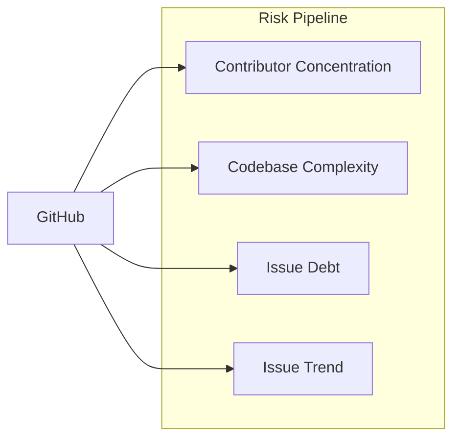

# Risk Pipeline

Measures sustainability risk for GitHub repos using contributor concentration,
codebase complexity, and issue-tracker dynamics over the last 5 years.



All thresholds are defined in `src/pipeline/params.json`.

## How It Works

Independent risk dimensions, each classified A (highest risk) through D (lowest)
plus a separate trend signal:

1. **Concentration risk** -- how dependent is the project on a few contributors?
2. **Complexity risk** -- how large and hard to audit is the codebase?
3. **Issue debt risk** -- is the maintainer keeping up with reported issues over 5 years?
4. **Issue trend** -- is the closure-vs-opening balance improving or deteriorating?

### Concentration Class

Based on bus factor (BF) and Herfindahl-Hirschman Index (HHI):

| Class | Label | Criteria |
|-------|-------|----------|
| **A** | critical | BF = 1 and HHI >= 8000 |
| **B** | high risk | BF <= 2 and HHI >= 5000 |
| **C** | moderate | BF <= 4 and HHI >= 2500 |
| **D** | healthy | otherwise |

### Complexity Class

Based on scc lines of code:

| Class | Label | Criteria |
|-------|-------|----------|
| **A** | massive | >= 1M LOC |
| **B** | large | 100K -- 1M LOC |
| **C** | moderate | 10K -- 100K LOC |
| **D** | small | < 10K LOC |

### Issue Debt Class

Based on the 5-year close ratio (`closed_5y / opened_5y`) plus a per-class
volume floor so a low-traffic repo isn't flagged as "drowning in backlog"
on the strength of two dropped issues:

| Class | Label | Criteria |
|-------|-------|----------|
| **A** | critical | close_ratio < 0.30 AND opened_5y >= 100 |
| **B** | high risk | close_ratio < 0.60 AND opened_5y >= 30 |
| **C** | moderate | close_ratio < 0.85 AND opened_5y >= 10 |
| **D** | healthy | close_ratio >= 0.85 (and opened_5y >= 10) |
| _empty_ | no signal | opened_5y < 10 (issues disabled / unused) |

### Issue Trend

Independent of debt class; captures direction. For each year `y ∈ 2021..2025`:

```
slope_opened = OLS slope of opened_y vs y
slope_closed = OLS slope of closed_y vs y
trend_score  = (slope_closed - slope_opened) / mean(opened_per_year)
```

Normalising by mean opened-volume makes the score comparable across project sizes.

| Trend | Criteria |
|-------|----------|
| improving | trend_score >= +0.05 |
| stable | -0.05 < trend_score < +0.05 |
| deteriorating | trend_score <= -0.05 |
| _empty_ | opened_5y < 25 OR fewer than 3 years had any issues opened |

A class-A debt repo with `trend=improving` is the strongest "maintainer-rebound"
signal: backlog is high *now* but the slope is closing the gap.

## Data Sources

All data comes from [GitHub](sources/github.md):
- Contributor stats API -- per-contributor weekly commit history
- scc code analysis -- lines of code, complexity via sparse checkout
- Search API -- per-repo per-year issue counts (opened, closed)

## Scripts

| Script | Purpose |
|--------|---------|
| `src/github/fetch_contributors_metrics.py` | Contributor analysis (bus factor, HHI) |
| `src/github/fetch_git_metrics.py` | scc code analysis via sparse checkout |
| `src/github/fetch_issue_metrics.py` | Issue counts per year (Search API) |
| `src/pipeline/risk.py` | Aggregate into risk classifications. **Input is `eligibility-data.csv` (eligible repos only)** — `uv run python -m src.pipeline.risk` |

## Output

### risk-data.csv

| Column | Description |
|--------|-------------|
| `repo` | GitHub repo slug (`owner/name`) |
| `repo_id` | GitHub numeric repo ID |
| `active_contributors` | Contributors with commits in 2021--2025 |
| `hhi_commits` | Herfindahl-Hirschman Index (0--10000) |
| `bus_factor_commits` | Min contributors for 50% of commits |
| `concentration_class` | A--D |
| `loc` | Lines of code (scc, most recent year) |
| `complexity_class` | A--D |
| `issues_opened_5y` | Sum of issues opened 2021--2025 |
| `issues_closed_5y` | Sum of issues closed 2021--2025 |
| `issue_close_ratio` | `closed_5y / opened_5y`, rounded to 3 decimals |
| `slope_opened` | OLS slope of yearly opened counts (issues/yr) |
| `slope_closed` | OLS slope of yearly closed counts (issues/yr) |
| `issue_trend_score` | Volume-normalised `slope_closed - slope_opened`; signed |
| `issue_trend` | `improving` / `stable` / `deteriorating` / empty |
| `issue_debt_class` | A--D, or empty if `opened_5y < 10` |
