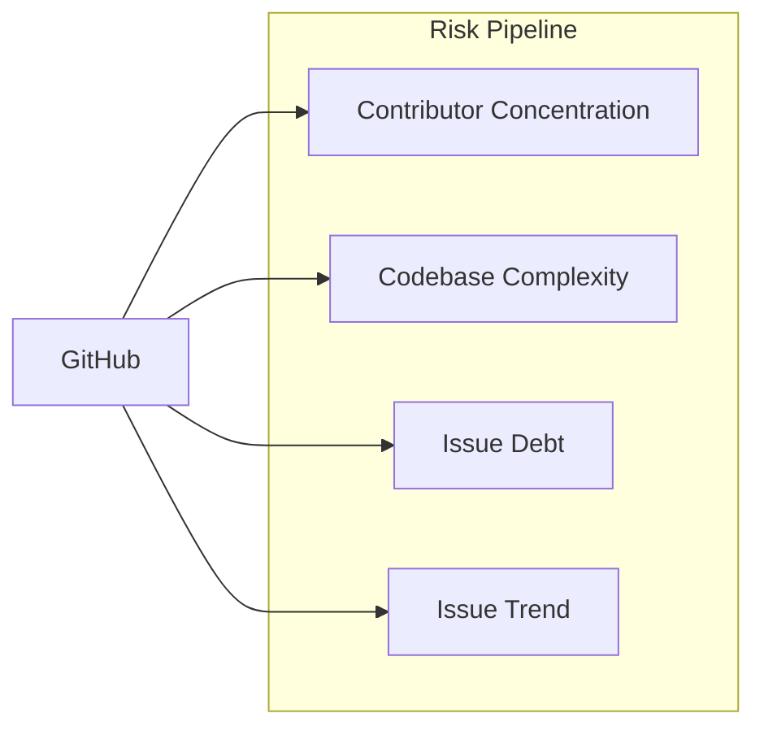

# Risk Pipeline

Measures sustainability risk for GitHub repos using contributor concentration,
codebase complexity, and issue-tracker dynamics over the last 5 years.

## Metrics Roadmap

Target shape of inputs per dimension. Each leaf = one metric, with its data
source and the time period it represents.

> **Note:** `[2025 EOY]` means *as of the last commit to the default (main)
> branch in 2025* — not the calendar year-end snapshot. For repos with no
> 2025 commits, the metric falls back to the most recent prior year.

```
Risk
│
├── Concentration
│   ├── total_commits         ← GitHub /commits Link header           [2025 EOY]
│   ├── total_contributors    ← GitHub /contributors?anon=true        [2025 EOY]
│   ├── hhi_commits           ← GitHub /contributors (weekly)         [2021–2025]
│   └── bf_commits            ← GitHub /contributors (weekly)         [2021–2025]
│
├── Complexity
│   ├── loc                   ← scc (sparse checkout)                 [2025 EOY]
│   ├── sloc                  ← scc (no comments/blank)               [2025 EOY]
│   ├── scc_complexity        ← scc cyclomatic complexity total       [2025 EOY]
│   └── scc_density           ← scc complexity per line               [2025 EOY]
│
├── Security
│   ├── openssf_score         ← OpenSSF Scorecard                     [2025 EOY]
│   ├── cve_count_5y          ← OSV.dev /v1/query                     [2021–2025]
│   └── ossfuzz_enrolled      ← oss-fuzz projects index               [most recent]
│
├── Funding
│   ├── github_sponsors       ← GitHub Sponsors API                   [most recent]
│   ├── funding.yml data      ← repo /.github/FUNDING.yml             [most recent]
│   ├── funding.json data     ← repo /funding.json (FLOSS/fund spec)  [most recent]
│   └── foundation_host       ← data/foundations/ (Apache/CNCF/…)     [most recent]
│
├── Visibility
│   ├── stars                 ← GitHub /repos                         [most recent]
│   └── forks                 ← GitHub /repos                         [most recent]
│
└── Maintainer workload
    ├── repo_age              ← GitHub /repos created_at              [2025 EOY]
    ├── active_maintainers    ← GitHub /contributors (weekly)         [2021–2025]
    ├── openssf_maintained    ← OpenSSF Scorecard "Maintained" check  [2025 EOY]
    ├── has_issues            ← GitHub /repos has_issues              [most recent]
    ├── push_cadence          ← derived from commits-years.csv        [2021–2025]
    ├── issues_opened_5y      ← GitHub Search API                     [2021–2025]
    ├── issues_closed_5y      ← GitHub Search API                     [2021–2025]
    ├── issue_close_ratio     ← derived (closed_5y / opened_5y)       [2021–2025]
    ├── slope_opened          ← OLS over GitHub Search yearly         [2021–2025]
    ├── slope_closed          ← OLS over GitHub Search yearly         [2021–2025]
    └── issue_trend_score     ← derived (vol-normalised gap)          [2021–2025]
```

### Collecting `cve_count_5y`

Single source: **OSV.dev** (free, no auth, aggregates GHSA + NVD + ecosystem
advisories).

`POST https://api.osv.dev/v1/query` with one of:

- `{"package": {"name": "<pkg>", "ecosystem": "npm|PyPI|crates.io|Go|…"}}` —
  for ecosystem-published packages.
- `{"package": {"purl": "pkg:github/<owner>/<name>"}}` — for repos without
  a published package (uses the GitHub purl form).

Filter the returned `vulns[]` by `published` year ∈ 2021–2025 and dedupe by
the `aliases[]` set so a CVE listed under multiple GHSA/OSV IDs only counts
once.



All thresholds are defined in `src/pipeline/settings.json`.

## How It Works

Independent risk dimensions, each classified A (highest risk) through D (lowest)
plus a separate trend signal:

1. **Concentration risk** -- how dependent is the project on a few contributors?
2. **Complexity risk** -- how large and hard to audit is the codebase?
3. **Issue debt risk** -- is the maintainer keeping up with reported issues over 5 years?
4. **Issue trend** -- is the closure-vs-opening balance improving or deteriorating?

### Concentration Class

Based on bus factor (BF) and Herfindahl-Hirschman Index (HHI):

| Class | Label | Criteria |
|-------|-------|----------|
| **A** | critical | BF = 1 and HHI >= 8000 |
| **B** | high risk | BF <= 2 and HHI >= 5000 |
| **C** | moderate | BF <= 4 and HHI >= 2500 |
| **D** | healthy | otherwise |

### Complexity Class

Based on scc lines of code:

| Class | Label | Criteria |
|-------|-------|----------|
| **A** | massive | >= 1M LOC |
| **B** | large | 100K -- 1M LOC |
| **C** | moderate | 10K -- 100K LOC |
| **D** | small | < 10K LOC |

### Issue Debt Class

Based on the 5-year close ratio (`closed_5y / opened_5y`) plus a per-class
volume floor so a low-traffic repo isn't flagged as "drowning in backlog"
on the strength of two dropped issues:

| Class | Label | Criteria |
|-------|-------|----------|
| **A** | critical | close_ratio < 0.30 AND opened_5y >= 100 |
| **B** | high risk | close_ratio < 0.60 AND opened_5y >= 30 |
| **C** | moderate | close_ratio < 0.85 AND opened_5y >= 10 |
| **D** | healthy | close_ratio >= 0.85 (and opened_5y >= 10) |
| _empty_ | no signal | opened_5y < 10 (issues disabled / unused) |

### Issue Trend

Independent of debt class; captures direction. For each year `y ∈ 2021..2025`:

```
slope_opened = OLS slope of opened_y vs y
slope_closed = OLS slope of closed_y vs y
trend_score  = (slope_closed - slope_opened) / mean(opened_per_year)
```

Normalising by mean opened-volume makes the score comparable across project sizes.

| Trend | Criteria |
|-------|----------|
| improving | trend_score >= +0.05 |
| stable | -0.05 < trend_score < +0.05 |
| deteriorating | trend_score <= -0.05 |
| _empty_ | opened_5y < 25 OR fewer than 3 years had any issues opened |

A class-A debt repo with `trend=improving` is the strongest "maintainer-rebound"
signal: backlog is high *now* but the slope is closing the gap.

## Data Sources

All data comes from [GitHub](sources/github.md):
- Contributor stats API -- per-contributor weekly commit history
- scc code analysis -- lines of code, complexity via sparse checkout
- Search API -- per-repo per-year issue counts (opened, closed)

## Scripts

| Script | Purpose |
|--------|---------|
| `src/github/fetch_contributors_metrics.py` | Contributor analysis (bus factor, HHI) |
| `src/github/fetch_git_metrics.py` | scc code analysis via sparse checkout |
| `src/github/fetch_issue_metrics.py` | Issue counts per year (Search API) |
| `src/pipeline/risk.py` | Aggregate into risk classifications. **Input is `data/value-data.csv` — repos with `class ∈ settings.json risk_input.value_classes` (default A/B)** — `uv run python -m src.pipeline.risk` |

## Source-file coverage

Snapshot of how complete each source file is across the risk-scope (A/B)
repos. Counts reflect the last pipeline run; refresh with
`uv run python scripts/coverage_report.py`.

| Source | File | Risk-scope covered | Coverage | Notes |
|---|---|---:|---:|---|
| commits-years (foundation) | `data/github/git/commits-years.csv` | 899/899 | **100%** | per-(repo, year) `last_sha`; foundation file |
| scc | `data/git/scc.csv` | 899/899 | **100%** | sparse-checkout per year sha |
| repos | `data/github/repos.csv` | 899/899 | **100%** | stars / forks / watchers / pushed_at |
| contributors | `data/github/contributors/contributors.csv` | 896/899 | 99.7% | per-repo lifetime contributor list |
| openssf | `data/git/openssf.csv` | 895/899 | 99.6% | overall score + 18 checks per sha |
| concentration | `data/concentration-data.csv` | 894/899 | 99.4% | lifetime BF / HHI / commits |
| lizard | `data/git/lizard.csv` | 894/899 | 99.4% | cognitive + cyclomatic + Halstead per sha |
| semgrep | `data/git/semgrep.csv` | 892/899 | 99.2% | rulepack-prefixed SAST findings per sha |
| cves-queried | `data/osv/queried.csv` | 888/899 | 98.8% | repos OSV was successfully asked about |
| funding | `data/funding-data.csv` | 888/899 | 98.8% | github_sponsors + FUNDING.yml |
| openssf-checks | `data/openssf/checks.csv` | 881/899 | 98.0% | per-check Scorecard scores (used by build_workload) |
| issues | `data/github/issues.csv` | 878/899 | 97.7% | opened/closed per year |
| commits-wide | `data/github/contributors/commits.csv` | 876/899 | 97.4% | per-year commits |
| hhi | `data/github/contributors/hhi.csv` | 876/899 | 97.4% | per-year HHI |
| bus-factor | `data/github/contributors/bus-factor.csv` | 876/899 | 97.4% | per-year bus factor |
| churn | `data/github/git/churn.csv` | 869/899 | 96.7% | 5y added+deleted lines (heavy bare-clone) |
| depsdev | `data/git/depsdev.csv` | 791/899 | 88.0% | structural — deps.dev only indexes npm / pypi / cargo / maven / go / nuget / rubygems (Debian, cpp, Homebrew unsupported) |

### Why the remaining gaps

- **depsdev (88%)** — repos that publish only via Debian / Homebrew / vcpkg / source tarballs are absent from deps.dev's index. Not fillable.
- **Anything ~99% with 4–6 missing** — a mix of brand-new eligibility additions and scorecard `Contributors`-check internal errors on a handful of repos (`isaacs/node-mkdirp`, `gnome/glib`, `rust-lang/rust`).
- **commits-wide / hhi / bus-factor (97.4%)** — `fetch_contributors_metrics` skips repos with > 5000 total contributors (GitHub's `/contributors` API caps results there), so a handful of mega-projects (kubernetes, ansible, llvm-project, etc.) are absent by design.
- **churn (96.7%)** — bare-clone timeout on the largest repos (gcc-mirror/gcc, ffmpeg/ffmpeg, microsoft/typescript, etc.). Re-runs with longer timeouts can recover most of these.

### What this rolls up to in `risk-data.csv`

**899 rows × 51 columns · 100% risk-scope (A/B) repos populated · median per-column coverage 98.8%.** Counts refresh on re-run.

Sub-100% columns (every gap is structural, not a data-collection bug):

| Column | Coverage | Why |
|---|---:|---|
| `bestpractices_badge_id` | 2.8% | Only repos enrolled in CII Best Practices have a badge. |
| `foundation_host` | 3.9% | Only 35 repos belong to a FOSS foundation (apache / psf / lf / numfocus / lf/cncf / lf/openjs). |
| `funding_yml_platforms` | 27.3% | Most repos don't have a `.github/FUNDING.yml`. |
| `cognitive_total` / `_avg` / `_max` | 65.1% | Only computed for languages with a Lizard / cognitive-complexity parser. |
| `issue_trend_score` | 67.5% | Formula requires `mean_opened_per_year ≥ 1`; quiet repos correctly omitted. |

## Output

### risk-data.csv

| Column | Description |
|--------|-------------|
| `repo` | GitHub repo slug (`owner/name`) |
| `repo_id` | GitHub numeric repo ID |
| `total_commits` | Lifetime total commits on the default branch (from `/commits` Link header) |
| `total_contributors` | Lifetime total contributors incl. anonymous (from `/contributors?anon=true` Link header) |
| `hhi_commits` | Herfindahl-Hirschman Index (0--10000), computed against `total_commits` |
| `bf_commits` | Min contributors covering 50% of `total_commits` |
| `concentration_class` | A--D |
| `loc` | Lines of code (scc, most recent year) |
| `complexity_class` | A--D |
| `issues_opened_5y` | Sum of issues opened 2021--2025 |
| `issues_closed_5y` | Sum of issues closed 2021--2025 |
| `issue_close_ratio` | `closed_5y / opened_5y`, rounded to 3 decimals |
| `slope_opened` | OLS slope of yearly opened counts (issues/yr) |
| `slope_closed` | OLS slope of yearly closed counts (issues/yr) |
| `issue_trend_score` | Volume-normalised `slope_closed - slope_opened`; signed |
| `issue_trend` | `improving` / `stable` / `deteriorating` / empty |
| `issue_debt_class` | A--D, or empty if `opened_5y < 10` |
