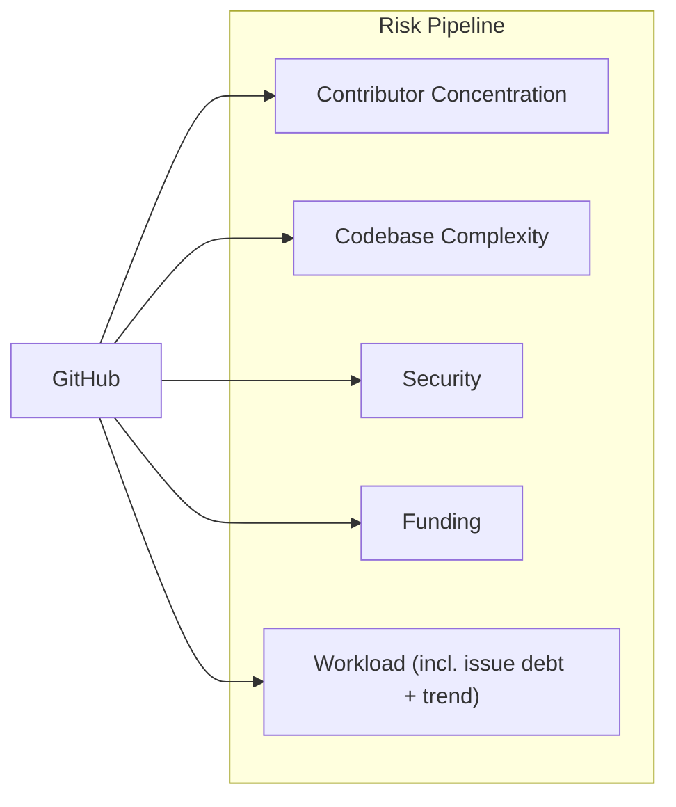

# Risk Pipeline

Measures sustainability risk for GitHub repos using contributor concentration,
codebase complexity, security posture, funding, and maintainer workload over
the last 5 years.

Each of the five dimensions has its own component doc — how it collects its
sources, derives metrics, and produces the `score` it contributes to
`risk.csv`:

| Component | Doc | Score (0–100, higher = riskier) |
|---|---|---|
| Concentration | [components/concentration.md](components/concentration.md) | geom-mean of 5y bus-factor + HHI percentiles |
| Complexity | [components/complexity.md](components/complexity.md) | geom-mean of LOC + cyclomatic-max percentiles |
| Security | [components/security.md](components/security.md) | geom-mean of OpenSSF-score + CVE-count percentiles |
| Funding | [components/funding.md](components/funding.md) | geom-mean of GitHub-sponsorship + OpenCollective percentiles |
| Workload | [components/workload.md](components/workload.md) | geom-mean of LOC/CVE/net-issues-per-contributor percentiles |

## Metrics Roadmap

Inputs per dimension, current as of the last pipeline run. Each leaf = one metric, with its data
source and the time period it represents.

> **Note:** `[2025 EOY]` means *as of the last commit to the default (main)
> branch in 2025* — not the calendar year-end snapshot. For repos with no
> 2025 commits, the metric falls back to the most recent prior year.

```
Risk
│
├── Concentration  →  data/risk/concentration.csv
│   ├── total_commits        ← git-clone log · GitHub /contributors      [lifetime]
│   ├── active_contributors  ← derived (merged non-bot identities)       [lifetime · 2021–2025]
│   ├── bf_commits           ← derived (bus factor)                      [lifetime · 2021–2025]
│   └── hhi_commits          ← derived (HHI, 0–10000)                    [lifetime · 2021–2025]
│       (every metric resolved by two methods — git-clone log and the
│        GitHub /contributors API — kept as parallel *_git / *_github
│        columns; the git method also carries a 2021–2025 window)
│
├── Complexity  →  data/risk/complexity.csv
│   ├── loc, sloc                     ← scc (sparse checkout)            [2025 EOY]
│   ├── scc_complexity, scc_density   ← scc cyclomatic total + per-line  [2025 EOY]
│   ├── cyclomatic_{total,avg,max}    ← lizard (sparse checkout)         [2025 EOY]
│   ├── cognitive_{total,avg,max}     ← lizard cognitive complexity      [2025 EOY]
│   ├── churn_5y_total                ← git churn (bare clone)           [2021–2025]
│   └── hotspot_{raw,log,percentile}  ← derived (churn × complexity)     [2025 EOY]
│
├── Security  →  data/risk/security.csv
│   ├── openssf_score                 ← OpenSSF Scorecard (deps.dev fb)  [2025 EOY]
│   ├── cve_count_5y                  ← OSV.dev /v1/query                [2021–2025]
│   ├── ossfuzz_enrolled              ← OSS-Fuzz projects index          [most recent]
│   ├── sast_findings_{total,error,security}  ← semgrep p/default        [2025 EOY]
│   └── bestpractices_badge_id        ← deps.dev (OpenSSF Best Practices) [most recent]
│
├── Funding  →  data/risk/funding.csv
│   ├── github_sponsors               ← GitHub Sponsors API             [most recent]
│   ├── has_funding_yml, _yml_platforms  ← repo /.github/FUNDING.yml     [most recent]
│   ├── has_funding_json              ← repo /funding.json (FLOSS/fund)  [most recent]
│   └── foundation_host               ← foundation rosters (Apache/CNCF/LF/…) [most recent]
│
└── Workload  →  data/risk/workload.csv
    ├── repo_age_years                ← GitHub /repos created_at        [EOY, last complete yr]
    ├── push_cadence_years            ← commits-years.csv (years w/ commits) [2021–2025]
    ├── openssf_maintained            ← OpenSSF Scorecard "Maintained"   [2025 EOY]
    ├── has_issues                    ← GitHub /repos                   [most recent]
    ├── issues_opened_5y, issues_closed_5y  ← GitHub Search API          [2021–2025]
    ├── issue_close_ratio, net_new_issues_5y  ← derived                 [2021–2025]
    ├── slope_opened, slope_closed, issue_trend_score  ← derived (OLS)   [2021–2025]
    └── loc_per_ac, cve_per_ac, nni_per_ac  ← derived (per active contrib.) [2021–2025]
```

### Collecting `cve_count_5y`

Single source: **OSV.dev** (free, no auth, aggregates GHSA + NVD + ecosystem
advisories).

`POST https://api.osv.dev/v1/query` with one of:

- `{"package": {"name": "<pkg>", "ecosystem": "npm|PyPI|crates.io|Go|…"}}` —
  for ecosystem-published packages.
- `{"package": {"purl": "pkg:github/<owner>/<name>"}}` — for repos without
  a published package (uses the GitHub purl form).

Filter the returned `vulns[]` by `published` year ∈ 2021–2025 and dedupe by
the `aliases[]` set so a CVE listed under multiple GHSA/OSV IDs only counts
once.



All scoring parameters (windows, weights) are defined in `src/settings.json`.

## How It Works

Five independent risk dimensions — **concentration, complexity, security,
funding, workload**. Each dimension percentile-ranks its raw metrics
(direction-aware, so a higher percentile always means *more* risk), takes the
geometric mean of a designated subset of those percentiles, and emits a single
**0–100 `score`** for the dimension (higher = riskier). The five dimension
scores are combined into the overall `risk.csv` `score`. Risk is expressed as
continuous scores and percentiles end-to-end — there are **no discrete risk
classes or tiers**.

Percentiles use the Hazen position `100·(rank−0.5)/n`, ranked across the
risk-scope set, strictly within 0–100. "Direction-aware" means each metric is
oriented before ranking: a low bus factor, a high HHI, a low OpenSSF score all
map to a *high* risk percentile. The exact percentile(s) that feed each
dimension `score` are listed in the table at the top of this doc and in each
component doc; every `*_p` column and raw metric lives in the per-dimension
`data/risk/<dimension>.csv`.

1. **Concentration risk** -- how dependent is the project on a few contributors?
2. **Complexity risk** -- how large and hard to audit is the codebase?
3. **Security risk** -- how exposed is the project (OpenSSF Scorecard, CVEs, SAST)?
4. **Funding risk** -- how well-resourced is the project (sponsorships, foundations)?
5. **Workload risk** -- how much per-contributor burden (code, CVEs, issue backlog)?

### Concentration

Built from two metrics, each resolved by two methods (git-clone log + GitHub
`/contributors`):

- **bus factor** (`bf_commits_*`) — the fewest contributors whose combined
  commits reach `bus_factor_threshold` (0.5 = the people covering 50% of
  commits). Low bus factor → higher risk.
- **HHI** (`hhi_commits_*`, 0–10000) — Herfindahl-Hirschman concentration of
  commit shares. High HHI → higher risk.

The `_5y` git axis (last `concentration.window_years` complete years) feeds the
dimension `score`: `bf_commits_git_5y_p` and `hhi_commits_git_5y_p` are
geometric-meaned. The `_full` / `_gh_alltime` percentiles are computed for
context but not scored.

### Complexity

How large and hard to audit is the codebase? Percentile-ranked metrics
(`data/risk/complexity.csv`):

- `loc_eoy` — lines of code (scc, EOY snapshot).
- `scc_complexity_eoy` — scc cyclomatic total; `cyclomatic_max` /
  `cognitive_max` — lizard per-function maxima.
- `churn_5y_total` — added + deleted lines over 2021–2025 (git churn).
- `hotspot_log` — Tornhill `churn × complexity` hotspot, log-scaled.

### Issue debt

Is the maintainer keeping up with reported issues over 5 years? (Folded into the
**workload** dimension.) `issue_close_ratio` = `closed_5y / opened_5y` (rounded
to 3 dp); a low close ratio means a growing backlog, and its risk percentile is
`issue_close_ratio_p`. Repos with too few issues (`opened_5y` below the volume
floor) get an empty signal rather than a misleading ratio off two dropped
issues.

### Issue Trend

Independent of the backlog level; captures direction. For each year
`y ∈ 2021..2025`:

```
slope_opened = OLS slope of opened_y vs y
slope_closed = OLS slope of closed_y vs y
trend_score  = (slope_closed - slope_opened) / mean(opened_per_year)
```

Normalising by mean opened-volume makes the score comparable across project
sizes. A positive `issue_trend_score` means the maintainer is closing the gap
(`issue_trend_score_p` is its risk percentile); it is empty when `opened_5y` is
too small or fewer than three years had any issues opened.

### Workload

Per-contributor burden, combining codebase size, security debt, and issue
backlog. Three ratios (▴ higher = more workload), each percentile-ranked:

- `loc_per_ac` — lines of code per active contributor.
- `cve_per_ac` — CVEs (5y) per active contributor.
- `nni_per_ac` — net new issues (opened − closed, 5y) per active contributor.

`AC` = `active_contributors_git_5y`, the count of distinct non-bot
contributors who authored a commit in 2021–2025 (git-clone method).
Each ratio is percentile-ranked across the risk-scope set (Hazen position
`100·(rank−0.5)/n`, strictly in 0–100) into `loc_per_ac_p` / `cve_per_ac_p` /
`nni_per_ac_p`; the dimension `score` is the geometric mean of the three
percentiles, empty when an input is missing or AC = 0.

### Security

Combines the OpenSSF-rooted signals and SAST findings. Direction-aware risk
percentiles (▴ higher = worse security):

- `openssf_score_p` — percentile of the OpenSSF Scorecard `openssf_score`,
  **inverted**: a lower Scorecard score ranks as higher risk.
- `cve_score` — neutral-anchored CVE risk score (0–100): a repo with **0 known
  CVEs** scores **50** (a deliberate neutral baseline — "none known" is absence
  of evidence, not proof of safety); a repo with **≥1 CVE** is ranked among the
  non-zero repos only (by worst-pinned CDF) and mapped into **(50, 100]**, so
  more CVEs → strictly higher risk and the single worst maps to 100.
- `sast_findings_{total,error,security}_p` — percentiles of semgrep
  `p/default` findings (informational).

The dimension `score` is the geometric mean of `openssf_score_p` and
`cve_score` — a repo ranks worst when it is high-risk on both axes. Most
risk-scope repos have zero known CVEs and share the same `cve_score = 50` (the
neutral baseline), so for those the score is effectively driven by the OpenSSF
Scorecard axis; CVEs only re-rank the minority that carry them, above the neutral
50. (CVE coverage is in [stats.md → Risk → Security](stats.md#security).)

## Data Sources

| Source | Fields extracted for Risk |
|---|---|
| **GitHub Contributors stats API** (`api.github.com/repos/.../stats/contributors`) | per-contributor weekly commit history → bus factor, HHI |
| **GitHub git tree** (sparse checkout + [scc](https://github.com/boyter/scc)) | lines of code, complexity per language → `data/sources/git/scc.csv` |
| **Lizard + multimetric** (sparse checkout) | per-function McCabe + Halstead + Sonar cognitive + maintainability index → `data/sources/git/lizard.csv` |
| **Semgrep** (sparse checkout, `p/default` rulepack) | SAST findings → `data/sources/git/semgrep.csv` |
| **GitHub Issues Search API** (`api.github.com/search/issues`) | per-year issue open / close counts |
| **OpenSSF Scorecard API** (`api.securityscorecards.dev`) | security score (0–10) per repo → `data/sources/git/openssf.csv` |
| **deps.dev API** (`api.deps.dev`) | mirrored Scorecard `score` + checks (fallback) → `data/sources/git/depsdev.csv` |

## Long-format snapshot files (`data/sources/git/`)

All sha-pinned raw metrics share one canonical schema:

```
repo, repo_id, commit_sha, metric, value, checked_at
```

Key = `(repo, commit_sha, metric)`. New runs upsert by key — historical snapshots for prior SHAs are preserved as a time-series. Empty `value` / empty `commit_sha` rows are dropped. Floats are written in shortest round-trip form (`42` not `42.0`, `8.5` not `8.500000000001`).

Files:

| File | Tool | Metrics |
|------|------|---------|
| `data/sources/git/scc.csv` | [scc](https://github.com/boyter/scc) | `loc`, `sloc`, `files`, `uloc`, `complexity`, `complexity_density` |
| `data/sources/git/lizard.csv` | [lizard](https://github.com/terryyin/lizard) + [multimetric](https://github.com/priv-kweihmann/multimetric) | `cyclomatic_*`, `halstead_*`, `cognitive_*`, `maintainability_index`, `files` |
| `data/sources/git/semgrep.csv` | [semgrep](https://semgrep.dev) | `<rulepack>.<metric>` (e.g. `p_default.total`, `p_default.error`) |
| `data/sources/git/openssf.csv` | [scorecard CLI](https://github.com/ossf/scorecard) | `score` + 18 individual checks (`maintained`, `code_review`, …) |
| `data/sources/git/depsdev.csv` | [deps.dev](https://api.deps.dev) | mirrored Scorecard `score` + checks |

The canonical writer/reader is `src/sources/git/long_format.py` (`upsert_snapshot`, `upsert_rows`, `read`, `project_to_wide`, `latest_sha_per_repo`).

### Sha-pinning convention

Each repo has per-year `last_sha` resolved by `src/sources/git/commits_years.py` into `data/sources/github/git/commits-years.csv`. Fetchers walk per-repo years 2025 → 2024 → … → 2021 and pick the most-recent year with `commits > 0` and a non-empty `last_sha`. That sha is the `commit_sha` for every row the fetcher writes. No HEAD fallback persists — if no usable year exists for a repo, no row is written for it.

### High-level projection (long → wide)

The pipeline stages project the long files into per-repo wide rows for downstream consumers:

- `data/risk/complexity.csv` ← `src.risk.build_complexity` projects `data/sources/git/scc.csv` + `data/sources/git/lizard.csv` using `commits-years.last_sha` (2025 → 2021 walk; first sha with `loc > 0`). Also folds in the **hotspot** score (Tornhill `churn × complexity`): joins `data/sources/github/git/churn.csv` (`churn_5y_total`) with the EOY-2025 scc complexity snapshot to emit `churn_5y_total`, `hotspot_raw`, `hotspot_log`, `hotspot_percentile`.
- `data/risk/security.csv` ← `src.risk.build_security` projects `data/sources/git/openssf.csv`, `data/sources/git/depsdev.csv`, `data/sources/git/semgrep.csv` using the same per-year sha priority.
- `data/risk/risk.csv` ← `src.risk.run_risk_pipeline` joins complexity + security + concentration + issue-debt and computes the final risk score.

## Scripts

| Script | Purpose |
|--------|---------|
| `src/sources/github/fetch_contributors_metrics.py` | Contributor analysis (bus factor, HHI) |
| `src/sources/git/fetch_scc.py` | scc code analysis via sparse checkout (the `scc` fetcher) |
| `src/sources/github/fetch_issue_metrics.py` | Issue counts per year (Search API) |
| `src/risk/aggregate_risk.py` | Aggregate the per-dimension scores into the overall risk `score`. **Input is `data/value/value.csv` — valid repos with `class ∈ settings.json risk_input.value_classes` (default `["A"]`)** — `uv run python -m src.risk.run_risk_pipeline`. The runner **fetches missing data by default** (incremental — fetchers skip data already in files), then runs the dimension builders + aggregate; pass `--skip-fetch` to rebuild from existing data only. |

## Source-file coverage

Per-source-file coverage across the top repos, the `risk.csv` rollup, and the
sub-100% per-dimension columns all live in
[docs/stats.md → Risk](stats.md#risk). Refresh them with
`uv run python scripts/coverage_report.py`. `risk.csv` holds one row per top repo
— five 0–100 dimension scores plus an overall `score`; the detailed metric and
`*_p` percentile columns live in the per-dimension `data/risk/*.csv` files.

### Why the remaining gaps

Every sub-100% gap is structural — a signal that genuinely doesn't exist for that
repo, not a data-collection bug:

- **depsdev** — repos that publish only via Debian / Homebrew / vcpkg / source tarballs are absent from deps.dev's index. Not fillable.
- **Scorecard files (~99%)** — a mix of brand-new risk-scope additions and scorecard `Contributors`-check internal errors on a handful of repos (`isaacs/node-mkdirp`, `gnome/glib`, `rust-lang/rust`).
- **concentration** — two independent methods, each a long raw per-contributor file under `data/sources/git/` and `data/sources/github/`; `build_concentration` merges identities, drops bots, and computes BF/HHI/AC into the single wide `data/risk/concentration.csv`. The git-clone method times out on Linux-kernel-scale mirrors (`archlinux/linux`); the GitHub `/contributors` API caps the contributor list near 500 and rate-limits a few mega-repos. The `/stats/contributors` per-year breakdown and `data/concentration-data.csv` are retired.
- **churn** — bare-clone timeout on the largest repos (gcc-mirror/gcc, ffmpeg/ffmpeg, microsoft/typescript, etc.). Re-runs with longer timeouts can recover most of these.
- **Structurally-sparse columns** — `bestpractices_badge_id` (only CII-enrolled repos), `foundation_host` (only FOSS-foundation members), `funding_yml_platforms` (only repos with a `.github/FUNDING.yml`), `cognitive_*` (only languages with a Lizard cognitive parser), and `issue_trend_score` (only repos with `mean_opened_per_year ≥ 1`) are sparse by definition. Their coverage is in [stats.md](stats.md#risk).

## Output

### risk.csv

One row per risk-scope repo. The five dimension columns are each a **0–100 risk
score** (higher = riskier) — the geometric-mean rollup of that dimension's
scored percentiles — and `score` is the overall risk score across the five
dimensions. The detailed per-dimension metric and `*_p` percentile columns live
in the per-dimension files
(`data/risk/{concentration,complexity,security,funding,workload}.csv`) and are
documented in the component docs linked at the top of this page.

| Column | Description |
|--------|-------------|
| `repo` | GitHub repo slug (`owner/name`) |
| `repo_id` | GitHub numeric repo ID |
| `concentration` | Contributor-concentration risk score (0–100) |
| `complexity` | Codebase-complexity risk score (0–100) |
| `security` | Security risk score (0–100) |
| `funding` | Funding risk score (0–100) |
| `workload` | Per-contributor workload risk score (0–100) |
| `score` | Overall risk score (0–100) across the five dimensions |
