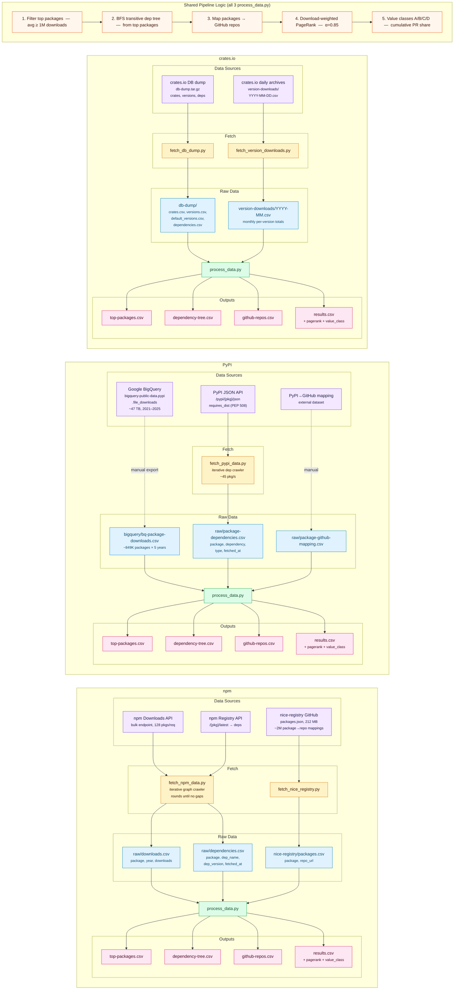

```mermaid
graph LR
    %% ════════════════════════════════════════════════════════
    %% npm ecosystem
    %% ════════════════════════════════════════════════════════
    subgraph npm_zone ["npm"]
        direction TB

        subgraph npm_sources ["Data Sources"]
            npm_api["npm Downloads API<br/><small>bulk endpoint, 128 pkgs/req</small>"]
            npm_reg["npm Registry API<br/><small>/{pkg}/latest → deps</small>"]
            nice_reg["nice-registry GitHub<br/><small>packages.json, 212 MB<br/>~2M package→repo mappings</small>"]
        end

        subgraph npm_fetch ["Fetch"]
            f_nice["fetch_nice_registry.py"]
            f_npm["fetch_npm_data.py<br/><small>iterative graph crawler<br/>rounds until no gaps</small>"]
        end

        subgraph npm_raw ["Raw Data"]
            npm_dl_csv["raw/downloads.csv<br/><small>package, year, downloads</small>"]
            npm_dep_csv["raw/dependencies.csv<br/><small>package, dep_name,<br/>dep_version, fetched_at</small>"]
            npm_nice_csv["nice-registry/packages.csv<br/><small>package, repo_url</small>"]
        end

        npm_proc["process_data.py"]

        subgraph npm_out ["Outputs"]
            npm_top["top-packages.csv"]
            npm_tree["dependency-tree.csv"]
            npm_gh["github-repos.csv"]
            npm_res["results.csv<br/><small>+ pagerank + value_class</small>"]
        end

        npm_api --> f_npm
        npm_reg --> f_npm
        nice_reg --> f_nice

        f_npm --> npm_dl_csv
        f_npm --> npm_dep_csv
        f_nice --> npm_nice_csv

        npm_dl_csv --> npm_proc
        npm_dep_csv --> npm_proc
        npm_nice_csv --> npm_proc

        npm_proc --> npm_top
        npm_proc --> npm_tree
        npm_proc --> npm_gh
        npm_proc --> npm_res
    end

    %% ════════════════════════════════════════════════════════
    %% PyPI ecosystem
    %% ════════════════════════════════════════════════════════
    subgraph pypi_zone ["PyPI"]
        direction TB

        subgraph pypi_sources ["Data Sources"]
            bq["Google BigQuery<br/><small>bigquery-public-data.pypi<br/>.file_downloads<br/>~47 TB, 2021–2025</small>"]
            pypi_api["PyPI JSON API<br/><small>/pypi/{pkg}/json<br/>requires_dist (PEP 508)</small>"]
            pypi_gh_src["PyPI→GitHub mapping<br/><small>external dataset</small>"]
        end

        subgraph pypi_fetch ["Fetch"]
            f_pypi["fetch_pypi_data.py<br/><small>iterative dep crawler<br/>~45 pkg/s</small>"]
        end

        subgraph pypi_raw ["Raw Data"]
            bq_csv["bigquery/bq-package-downloads.csv<br/><small>~849K packages × 5 years</small>"]
            pypi_dep_csv["raw/package-dependencies.csv<br/><small>package, dependency,<br/>type, fetched_at</small>"]
            pypi_gh_csv["raw/package-github-mapping.csv"]
        end

        pypi_proc["process_data.py"]

        subgraph pypi_out ["Outputs"]
            pypi_top["top-packages.csv"]
            pypi_tree["dependency-tree.csv"]
            pypi_gh["github-repos.csv"]
            pypi_res["results.csv<br/><small>+ pagerank + value_class</small>"]
        end

        bq -.->|"manual export"| bq_csv
        pypi_api --> f_pypi
        pypi_gh_src -.->|"manual"| pypi_gh_csv

        f_pypi --> pypi_dep_csv

        bq_csv --> pypi_proc
        pypi_dep_csv --> pypi_proc
        pypi_gh_csv --> pypi_proc

        pypi_proc --> pypi_top
        pypi_proc --> pypi_tree
        pypi_proc --> pypi_gh
        pypi_proc --> pypi_res
    end

    %% ════════════════════════════════════════════════════════
    %% crates.io ecosystem
    %% ════════════════════════════════════════════════════════
    subgraph crates_zone ["crates.io"]
        direction TB

        subgraph crates_sources ["Data Sources"]
            crates_dump_src["crates.io DB dump<br/><small>db-dump.tar.gz<br/>crates, versions, deps</small>"]
            crates_dl_src["crates.io daily archives<br/><small>version-downloads/<br/>YYYY-MM-DD.csv</small>"]
        end

        subgraph crates_fetch ["Fetch"]
            f_dump["fetch_db_dump.py"]
            f_vdl["fetch_version_downloads.py"]
        end

        subgraph crates_raw ["Raw Data"]
            dump_dir["db-dump/<br/><small>crates.csv, versions.csv,<br/>default_versions.csv,<br/>dependencies.csv</small>"]
            monthly_csv["version-downloads/YYYY-MM.csv<br/><small>monthly per-version totals</small>"]
        end

        crates_proc["process_data.py"]

        subgraph crates_out ["Outputs"]
            crates_top["top-packages.csv"]
            crates_tree["dependency-tree.csv"]
            crates_gh["github-repos.csv"]
            crates_res["results.csv<br/><small>+ pagerank + value_class</small>"]
        end

        crates_dump_src --> f_dump
        crates_dl_src --> f_vdl

        f_dump --> dump_dir
        f_vdl --> monthly_csv

        dump_dir --> crates_proc
        monthly_csv --> crates_proc

        crates_proc --> crates_top
        crates_proc --> crates_tree
        crates_proc --> crates_gh
        crates_proc --> crates_res
    end

    %% ════════════════════════════════════════════════════════
    %% Shared pipeline logic (annotation)
    %% ════════════════════════════════════════════════════════
    subgraph shared ["Shared Pipeline Logic (all 3 process_data.py)"]
        direction LR
        s1["1. Filter top packages  —  avg ≥ 1M downloads"]
        s2["2. BFS transitive dep tree  —  from top packages"]
        s3["3. Map packages → GitHub repos"]
        s4["4. Download-weighted PageRank  —  α=0.85"]
        s5["5. Value classes A/B/C/D  —  cumulative PR share"]
        s1 --> s2 --> s3 --> s4 --> s5
    end

    %% ── Styling ────────────────────────────────────────────
    classDef source fill:#f3e8ff,stroke:#7c3aed,color:#1e1b4b
    classDef fetch fill:#fef3c7,stroke:#d97706,color:#451a03
    classDef raw fill:#e0f2fe,stroke:#0284c7,color:#0c4a6e
    classDef proc fill:#dcfce7,stroke:#16a34a,color:#14532d
    classDef step fill:#fff7ed,stroke:#ea580c,color:#431407
    classDef output fill:#fce7f3,stroke:#db2777,color:#500724

    class npm_api,npm_reg,nice_reg,bq,pypi_api,pypi_gh_src,crates_dump_src,crates_dl_src source
    class f_nice,f_npm,f_pypi,f_dump,f_vdl fetch
    class npm_dl_csv,npm_dep_csv,npm_nice_csv,bq_csv,pypi_dep_csv,pypi_gh_csv,dump_dir,monthly_csv raw
    class npm_proc,pypi_proc,crates_proc proc
    class s1,s2,s3,s4,s5 step
    class npm_top,npm_tree,npm_gh,npm_res,pypi_top,pypi_tree,pypi_gh,pypi_res,crates_top,crates_tree,crates_gh,crates_res output
```
