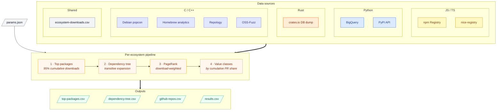

# Value Pipeline

Identifies the most important open-source packages across ecosystems by combining
download volume with dependency graph analysis (PageRank).



## How It Works

1. **Top packages** -- select packages covering 95% of ecosystem-wide cumulative downloads
2. **Dependency tree** -- follow transitive dependencies from top packages
3. **Scoring** -- download-weighted PageRank over the dep graph, then classify A/B/C/D

### Top Package Selection

Packages sorted by avg annual downloads (descending). Walking down the list,
accumulate downloads until the running total reaches 95% of the **ecosystem-wide
total** (from `data/ecosystem-downloads.csv`). Every package above that cutoff is "top".

### PageRank

Directed dependency graph where A->B means "A depends on B". Personalized PageRank
with alpha=0.85, biased toward high-download packages.

### Value Classes

Packages sorted by PageRank descending. Cumulative PageRank share determines class:

| Class | Cumulative Share | Meaning |
|-------|-----------------|---------|
| **A** | 0--50% | Critical infrastructure |
| **B** | 50--75% | Important, widely depended on |
| **C** | 75--90% | Useful but not load-bearing |
| **D** | 90--100% | Long tail |

> See [Current Limitations](#current-limitations) for known scope gaps
> (cpp runtime-only deps, GitHub-only project identity, etc.).

### Funnel

Packages remaining after each pipeline stage, plus the share with a known
upstream repo at the end. *GH %* counts only github.com; *Git %* also
counts gitlab, bitbucket, sourcehut, codeberg, and `custom` hosts
(savannah, sourceware, kernel.org, etc.) -- see [Unified output](#unified-output).

| Ecosystem | Top packages | After dep tree | Results | With GitHub | GH % | Git % |
|-----------|-------------:|---------------:|--------:|------------:|-----:|------:|
| npm       | 5,765 | 6,370  | 6,370  | 6,281  | 99% | 99% |
| PyPI      | 2,460 | 3,139  | 3,139  | 1,728  | 55% | 55% |
| crates.io | 3,719 | 6,218  | 6,218  | 5,967  | 96% | 99% |
| C/C++     | 1,643 | 2,648  | 2,648  | 484    | 18% | 24% |
| **Total** | **13,587** | **18,375** | **18,375** | **14,460** | **79%** | **80%** |

*Top packages* covers 95% of cumulative downloads. *After dep tree* is
`|top ∪ transitive deps|` -- the universe analysed for PageRank. *Results*
keeps every node from that universe (top packages with no edges still get
a row, with PageRank = 0). PyPI is stuck at 55% because the BigQuery
extract was github-only at fetch time.

### Value class distribution

Per-ecosystem and combined counts of A/B/C/D classes in `value-data.csv`.

| Ecosystem | A | B | C | D | Total | A+B GH | A+B Git |
|-----------|--:|--:|--:|--:|------:|-------:|--------:|
| npm       | 331 | 748   | 1,183 | 4,108  | 6,370 | 100% | 100% |
| PyPI      | 54  | 157   | 414   | 2,514  | 3,139 | 76%  | 76%  |
| crates.io | 49  | 197   | 449   | 5,523  | 6,218 | 99%  | 100% |
| C/C++     | 11  | 84    | 324   | 2,229  | 2,648 | 27%  | 27%  |
| **Total** | **445** | **1,186** | **2,370** | **14,374** | **18,375** | **93%** | **93%** |

*A+B GH* and *A+B Git* are the share of A and B class packages with a
known GitHub repo and any Git URL respectively -- the load-bearing tail
that risk + eligibility downstream both rely on. Non-GitHub upstreams
are concentrated in C/D classes, so the A+B numbers barely move.

## Ecosystems

### npm

**Data sources:**
- [npm downloads API](https://api.npmjs.org/downloads/point) -- downloads per package
- [npm registry](https://registry.npmjs.org) -- dependencies
- [nice-registry](https://github.com/nice-registry/all-the-package-repos) -- package-to-repo mapping

**Raw data** (`data/npm/raw/`):
- `downloads.csv` -- package, year, downloads
- `dependencies.csv` -- package, dep_name, dep_version, fetched_at

**Scripts:**

| Script | Purpose |
|--------|---------|
| `src/npm/fetch_npm_data.py` | Iterative crawler (downloads + deps) |
| `src/npm/fetch_npm_stats.py` | Ecosystem-wide annual totals |
| `src/npm/fetch_nice_registry.py` | Package-to-repo mappings |
| `src/npm/process_data.py` | Build outputs |

See [sources/npm.md](sources/npm.md) for details.

### PyPI

**Data sources:**
- [BigQuery PyPI dataset](https://console.cloud.google.com/marketplace/product/gcp-public-data-pypi/pypi) -- downloads (manual export, ~$235)
- [PyPI JSON API](https://pypi.org/pypi/{package}/json) -- dependencies

**Raw data** (`data/pypi/`):
- `bigquery/bq-package-downloads.csv` -- ~849K packages x 5 years
- `raw/package-dependencies.csv` -- package, dependency, type, fetched_at
- `raw/package-github-mapping.csv` -- package-to-GitHub URL

**Scripts:**

| Script | Purpose |
|--------|---------|
| `src/pypi/fetch_pypi_data.py` | Iterative dep crawler |
| `src/pypi/process_data.py` | Build outputs |

See [sources/pypi.md](sources/pypi.md) for details.

### crates.io

**Data sources:**
- [crates.io DB dump](https://static.crates.io/db-dump.tar.gz) -- crate/version mappings + deps
- [crates.io daily archives](https://static.crates.io/archive/version-downloads/) -- per-version download counts

**Raw data** (`data/crates/`):
- `db-dump/` -- crates.csv, versions.csv, default_versions.csv, dependencies.csv
- `version-downloads/YYYY-MM.csv` -- monthly per-version totals

**Scripts:**

| Script | Purpose |
|--------|---------|
| `src/crates/fetch_db_dump.py` | Download + extract DB dump |
| `src/crates/fetch_version_downloads.py` | Download monthly archives |
| `src/crates/process_data.py` | Build outputs (~20s) |

See [sources/crates.md](sources/crates.md) for details.

### Debian

**Data sources:**
- [Debian UDD](https://udd.debian.org) -- C/C++ package list (debtags + section heuristics)
- [Debian popcon](https://popcon.debian.org) -- install counts (via Wayback Machine)
- [Packages.xz](https://deb.debian.org/debian/dists/stable/main/binary-amd64/Packages.xz) -- dependencies + metadata

**Raw data** (`data/debian/raw/`):
- `cpp-packages.csv` -- C/C++ package universe (from UDD debtags)
- `downloads.csv` -- package, year, downloads (from popcon snapshots)
- `dependencies.csv` -- package, dep_name, dep_version, fetched_at
- `package-metadata.csv` -- package, source, homepage, vcs_browser, section
- `aliases.csv` -- t64 transition name mappings

**Scripts:**

| Script | Purpose |
|--------|---------|
| `src/debian/fetch_debian_data.py` | Fetch packages, popcon, deps |
| `src/debian/process_data.py` | Build outputs |

**Limitations:**
- **Popcon is opt-in** -- only ~250K Debian machines participate, so numbers
  are a sample of installed base, not total downloads
- **Sparse Wayback coverage** -- only 11 snapshots available across 2021--2025,
  with some years having only 1 snapshot (2023: Jul 2 only). Currently each
  year picks the snapshot closest to Dec 31, but this is a rough proxy
- **Not comparable to package manager downloads** -- popcon measures "machines
  with package installed", not download events

Available Wayback snapshots for `popcon.debian.org/by_inst.gz` (2021--2025):
```
2021: Sep 28, Oct 22
2022: Sep 04, Sep 21, Sep 29, Dec 25
2023: Jul 02
2024: Jan 06, Dec 31
2025: Sep 15, Nov 17
```

### Homebrew

**Data sources:**
- [Homebrew formula API](https://formulae.brew.sh/api/formula.json) -- formula list + deps
- [Homebrew analytics](https://formulae.brew.sh/api/analytics/install/365d.json) -- 365-day rolling
  install counts (via Wayback Machine)

**Raw data** (`data/homebrew/raw/`):
- `formulas.csv` -- name, desc, homepage, source_url, license, tap, language
- `dependencies.csv` -- formula, dep_name, dep_type, fetched_at
- `downloads.csv` -- formula, year, downloads

**Scripts:**

| Script | Purpose |
|--------|---------|
| `src/homebrew/fetch_homebrew_data.py` | Fetch formulas, analytics |
| `src/homebrew/process_data.py` | Build outputs |

**Limitations:**
- **Opt-in analytics** -- users can disable with `brew analytics off`; numbers
  are a fraction of actual installs
- **Rolling 365-day windows** -- each snapshot represents "installs in the 365
  days ending at snapshot date", not a calendar year. A May 2023 snapshot is
  used as proxy for "2022" but actually covers Jun 2022 -- May 2023
- **Sparse + truncated snapshots** -- Wayback coverage is thin; some captures
  are truncated at exactly 1 MB (only the high-install head is recoverable
  via regex parsing). No usable 2021 snapshot exists
- **Not comparable to npm/PyPI/crates** -- represents macOS install events,
  not cross-platform package downloads

Available Wayback snapshots for `analytics/install/365d.json` (2023--2026):
```
2023: May 09, May 31, Sep 30
2024: May 22, Oct 07
2025: Jan 21, Apr 27, Sep 11, Dec 05
2026: Mar 06
```
No snapshots before 2023. No `install-on-request` snapshots before Sep 2022.

### Other C/C++ sources

- [Repology](https://repology.org) -- cross-ecosystem name mapping
- [OSS-Fuzz](https://github.com/google/oss-fuzz) -- fuzz testing coverage

**Additional raw data:**
- `data/repology/packages.csv` -- project name mappings
- `data/ossfuzz/projects.csv` -- C/C++ fuzz targets

See [sources/cpp.md](sources/cpp.md), [sources/debian.md](sources/debian.md), [sources/homebrew.md](sources/homebrew.md), [sources/repology.md](sources/repology.md) for details.

## Output Files

Each ecosystem produces four files in `data/{ecosystem}/`:

### top-packages.csv

Packages covering 95% of ecosystem downloads.

| Column | Description |
|--------|-------------|
| `package` | Package name |
| `avg_downloads` | Average annual downloads (2021--2025) |
| `avg_downloads_share` | Fraction of ecosystem-wide total downloads |
| `2021`--`2025` | Downloads per year |

### dependency-tree.csv

Transitive dependency edges from top packages.

| Column | Description |
|--------|-------------|
| `package` | Dependent package |
| `dependency` | Dependency package |
| `type` | `declared` (npm/pypi), `normal`/`build`/`dev` (crates) |

### github-repos.csv

Package-to-GitHub-repo mappings for all dep-tree packages.

| Column | Description |
|--------|-------------|
| `package` | Package name |
| `github_repo` | `owner/repo` slug |

### results.csv

All dep-tree packages with downloads, PageRank, and value class.

| Column | Description |
|--------|-------------|
| `package` | Package name |
| `github_repo` | `owner/repo` slug |
| `avg_downloads` | Average annual downloads |
| `2021`--`2025` | Downloads per year |
| `top` | `True` if package is in the 95% cumulative set |
| `pagerank` | Download-weighted PageRank score |
| `value_class` | A/B/C/D (see [Value Classes](#value-classes)) |

## Unified output

`data/value-data.csv` -- all ecosystems concatenated into one table, produced
by `uv run -m src.unify_value_data`.

| Column | Description |
|--------|-------------|
| `package` | Package name |
| `ecosystem` | `npm` / `pypi` / `crates` / `cpp` |
| `github_repo` | Lowercase `owner/repo` slug (empty if unknown) |
| `pagerank` | Download-weighted PageRank score |
| `value_class` | A/B/C/D (see [Value Classes](#value-classes)) |

## Per-repo aggregation

`data/value-by-repo.csv` collapses `value-data.csv` from per-package to
per-repo. Produced by `uv run -m src.aggregate_by_repo`. The same script
also writes a denormalized `top_eco_pct` column back into
`data/value-data.csv` so per-package rows carry the importance score of
their parent repo group.

**Pipeline order**: each ecosystem's `check_eol.py` → `unify_value_data.py`
→ `aggregate_by_repo.py`. Re-running `unify_value_data.py` overwrites
`value-data.csv` without `top_eco_pct`; re-run `aggregate_by_repo.py`
afterwards to restore it.

**Grouping**: rows sharing a non-empty `github_repo` are merged into one
group; rows with an empty `github_repo` (e.g. cpp packages like `glibc`,
`gcc`) are kept as their own one-package groups so nothing is dropped.
Sequential `id` is the unique row identifier.

**Per-ecosystem class**: within each ecosystem, the group's PR is the
**sum** of its packages' PR. Groups (with at least one package in that
ecosystem) are sorted by that sum desc, the cumulative share is
computed, and `class_<eco>` is assigned via the same A/B/C/D cutoffs
as the package-level value pipeline (≤50%, ≤75%, ≤90%, rest). Empty
when the group has no package in that ecosystem.

A repo's overall strength is `min(class_<eco>)` across non-empty values
(A < B < C < D). It's not stored as a separate column — easy to derive
on read.

This avoids comparing PR magnitudes across ecosystems (which aren't
comparable — each ecosystem's PR mass sums to 1 within its own graph).
Recomputing PageRank on a repo-level dep graph was considered and
skipped because cross-ecosystem deps don't exist in our data; the repo
graph is still four disconnected subgraphs.

### data/value-by-repo.csv

| Column | Description |
|--------|-------------|
| `id` | Sequential numeric id (sorted by `top_eco_pct` desc) |
| `github_repo` | Lowercase `owner/repo` slug; empty for orphans |
| `ecosystems` | Comma-separated list of ecosystems where the group has at least one package (e.g. `crates,npm`) |
| `packages` | Total package count in the group |
| `top_eco` | Ecosystem where this group is highest-ranked (max PR percentile). `npm` / `pypi` / `crates` / `cpp`. |
| `top_eco_pkg` | Highest-PR package in `top_eco` (e.g. `@babel/helper-plugin-utils` for babel/babel) |
| `top_eco_pct` | PR percentile in `top_eco` (`100 − pr_cum_pct`). 0–100, **higher = better**. babel/babel sits at 92.25; tail packages near 0. |
| `class` | Strongest of the per-ecosystem classes (A < B < C < D) |
| `class_npm`, `class_pypi`, `class_crates`, `class_cpp` | A/B/C/D from per-ecosystem cumulative PR share; empty if no package in that ecosystem |

### top_eco_pct in value-data.csv

`aggregate_by_repo.py` also adds a `top_eco_pct` column to
`data/value-data.csv` (denormalized — every package in a group inherits the
group's `top_eco_pct`). All 202 babel/babel packages share the same value
(~92.25); orphans carry their own one-package-group's percentile.

## Current Limitations

Known scope choices and gaps in the current pipeline. Add new entries here
as they're identified — keeps caveats out of code comments and source-doc
footnotes.

### cpp dependency tree is runtime-only

Build-time tooling (cmake, pkgconf, autoconf, gettext, etc.), Debian
`Recommends`/`Suggests`, and Homebrew `build` deps **do not** propagate
PageRank. The cpp pipeline drops them at two points:

- Debian: `fetch_debian_data.py` only stores `Depends` + `Pre-Depends`.
- Homebrew: raw deps include both `runtime` and `build`, but
  `src/cpp/process_data.py` filters to `runtime` only.

Consequence: PageRank reflects who *runs* with whom, not who *builds*
whom. Critical build infrastructure (cmake, pkgconf) is undervalued
relative to its real-world load-bearing role. To fix later: extend the
cpp edge schema to keep the source-side type and add a build-aware PR
overlay.

### Project identity is GitHub-only

Every downstream stage (eligibility, EOL, risk, GitHub-derived contributor
metrics) keys off the `github_repo` field. Projects that don't live on
GitHub are present in `value-data.csv` with `github_repo=""` and are
silently excluded from those analyses.

Examples affected: glibc (sourceware.org), gcc (gcc.gnu.org / Savannah),
curl (curl.se), ImageMagick (own host), many GNU/Apache/X.Org/KDE
projects, kernel-adjacent code. cpp coverage is only ~21% github-mapped;
pypi is ~55%; npm is ~99%.

To fix later: broaden to a generic `git_url` (GitLab, Codeberg, Sourcehut,
sourceware.org, savannah, kde.org, freedesktop.org, etc.) with per-host
adapters for the equivalent of license/EOL/contributor checks. Until then,
"alive on a non-GitHub host" looks identical to "no upstream" in our
output.

### No package-level quality gate before results.csv

`results.csv` admits everything in the top 95% cumulative download set
plus its transitive deps — no license check, no age cutoff, no popularity
floor, no archive/EOL gate. Quality filtering happens *downstream* in
`eligibility.py` and `check_eol.py`. This is intentional (keeps the
value scoring untouched by signal-quality concerns), but means the raw
value class distribution overstates how many projects we'd actually fund.

### Wayback-derived install stats have gaps

Homebrew and Debian popcon both come via Wayback Machine snapshots, which
sometimes truncate (1 MB cap) or miss a year entirely. `ecosystem_avg_downloads`
in `src/params.py` works around this by averaging only over populated years,
so a missing year doesn't deflate the average — but it does mean year-over-year
trend lines are noisy, and a few packages get their `avg_downloads` from
fewer than 5 years of data.
