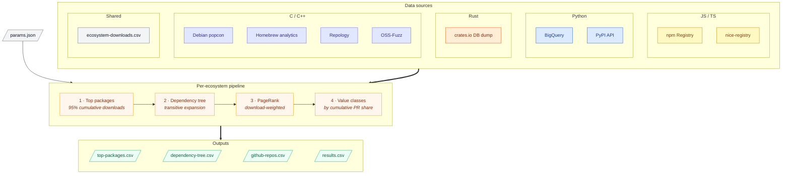

# Value Pipeline

Identifies the most important open-source packages across ecosystems by combining
download volume with dependency graph analysis (PageRank).



## How It Works

1. **Top packages** -- select packages covering 95% of ecosystem-wide cumulative downloads
2. **Dependency tree** -- follow transitive dependencies from top packages
3. **Scoring** -- download-weighted PageRank over the dep graph, then classify A/B/C/D

### Top Package Selection

Packages sorted by avg annual downloads (descending). Walking down the list,
accumulate downloads until the running total reaches 95% of the **ecosystem-wide
total** (from `data/ecosystem-downloads.csv`). Every package above that cutoff is "top".

### PageRank

Directed dependency graph where A->B means "A depends on B". Personalized PageRank
with alpha=0.85, biased toward high-download packages.

### Value Classes

Packages sorted by PageRank descending. Cumulative PageRank share determines class:

| Class | Cumulative Share | Meaning |
|-------|-----------------|---------|
| **A** | 0--50% | Critical infrastructure |
| **B** | 50--75% | Important, widely depended on |
| **C** | 75--90% | Useful but not load-bearing |
| **D** | 90--100% | Long tail |

## Ecosystems

### npm

**Data sources:**
- [npm downloads API](https://api.npmjs.org/downloads/point) -- downloads per package
- [npm registry](https://registry.npmjs.org) -- dependencies
- [nice-registry](https://github.com/nice-registry/all-the-package-repos) -- package-to-repo mapping

**Raw data** (`data/npm/raw/`):
- `downloads.csv` -- package, year, downloads
- `dependencies.csv` -- package, dep_name, dep_version, fetched_at

**Scripts:**

| Script | Purpose |
|--------|---------|
| `src/npm/fetch_npm_data.py` | Iterative crawler (downloads + deps) |
| `src/npm/fetch_npm_stats.py` | Ecosystem-wide annual totals |
| `src/npm/fetch_nice_registry.py` | Package-to-repo mappings |
| `src/npm/process_data.py` | Build outputs |

See [sources/npm.md](sources/npm.md) for details.

### PyPI

**Data sources:**
- [BigQuery PyPI dataset](https://console.cloud.google.com/marketplace/product/gcp-public-data-pypi/pypi) -- downloads (manual export, ~$235)
- [PyPI JSON API](https://pypi.org/pypi/{package}/json) -- dependencies

**Raw data** (`data/pypi/`):
- `bigquery/bq-package-downloads.csv` -- ~849K packages x 5 years
- `raw/package-dependencies.csv` -- package, dependency, type, fetched_at
- `raw/package-github-mapping.csv` -- package-to-GitHub URL

**Scripts:**

| Script | Purpose |
|--------|---------|
| `src/pypi/fetch_pypi_data.py` | Iterative dep crawler |
| `src/pypi/process_data.py` | Build outputs |

See [sources/pypi.md](sources/pypi.md) for details.

### crates.io

**Data sources:**
- [crates.io DB dump](https://static.crates.io/db-dump.tar.gz) -- crate/version mappings + deps
- [crates.io daily archives](https://static.crates.io/archive/version-downloads/) -- per-version download counts

**Raw data** (`data/crates/`):
- `db-dump/` -- crates.csv, versions.csv, default_versions.csv, dependencies.csv
- `version-downloads/YYYY-MM.csv` -- monthly per-version totals

**Scripts:**

| Script | Purpose |
|--------|---------|
| `src/crates/fetch_db_dump.py` | Download + extract DB dump |
| `src/crates/fetch_version_downloads.py` | Download monthly archives |
| `src/crates/process_data.py` | Build outputs (~20s) |

See [sources/crates.md](sources/crates.md) for details.

### Debian

**Data sources:**
- [Debian UDD](https://udd.debian.org) -- C/C++ package list (debtags + section heuristics)
- [Debian popcon](https://popcon.debian.org) -- install counts (via Wayback Machine)
- [Packages.xz](https://deb.debian.org/debian/dists/stable/main/binary-amd64/Packages.xz) -- dependencies + metadata

**Raw data** (`data/debian/raw/`):
- `cpp-packages.csv` -- C/C++ package universe (from UDD debtags)
- `downloads.csv` -- package, year, downloads (from popcon snapshots)
- `dependencies.csv` -- package, dep_name, dep_version, fetched_at
- `package-metadata.csv` -- package, source, homepage, vcs_browser, section
- `aliases.csv` -- t64 transition name mappings

**Scripts:**

| Script | Purpose |
|--------|---------|
| `src/debian/fetch_debian_data.py` | Fetch packages, popcon, deps |
| `src/debian/process_data.py` | Build outputs |

**Limitations:**
- **Popcon is opt-in** -- only ~250K Debian machines participate, so numbers
  are a sample of installed base, not total downloads
- **Sparse Wayback coverage** -- only 11 snapshots available across 2021--2025,
  with some years having only 1 snapshot (2023: Jul 2 only). Currently each
  year picks the snapshot closest to Dec 31, but this is a rough proxy
- **Not comparable to package manager downloads** -- popcon measures "machines
  with package installed", not download events

Available Wayback snapshots for `popcon.debian.org/by_inst.gz` (2021--2025):
```
2021: Sep 28, Oct 22
2022: Sep 04, Sep 21, Sep 29, Dec 25
2023: Jul 02
2024: Jan 06, Dec 31
2025: Sep 15, Nov 17
```

### Homebrew

**Data sources:**
- [Homebrew formula API](https://formulae.brew.sh/api/formula.json) -- formula list + deps
- [Homebrew analytics](https://formulae.brew.sh/api/analytics/install/365d.json) -- 365-day rolling
  install counts (via Wayback Machine)

**Raw data** (`data/homebrew/raw/`):
- `formulas.csv` -- name, desc, homepage, source_url, license, tap, language
- `dependencies.csv` -- formula, dep_name, dep_type, fetched_at
- `downloads.csv` -- formula, year, downloads

**Scripts:**

| Script | Purpose |
|--------|---------|
| `src/homebrew/fetch_homebrew_data.py` | Fetch formulas, analytics |
| `src/homebrew/process_data.py` | Build outputs |

**Limitations:**
- **Opt-in analytics** -- users can disable with `brew analytics off`; numbers
  are a fraction of actual installs
- **Rolling 365-day windows** -- each snapshot represents "installs in the 365
  days ending at snapshot date", not a calendar year. A May 2023 snapshot is
  used as proxy for "2022" but actually covers Jun 2022 -- May 2023
- **Sparse + truncated snapshots** -- Wayback coverage is thin; some captures
  are truncated at exactly 1 MB (only the high-install head is recoverable
  via regex parsing). No usable 2021 snapshot exists
- **Not comparable to npm/PyPI/crates** -- represents macOS install events,
  not cross-platform package downloads

Available Wayback snapshots for `analytics/install/365d.json` (2023--2026):
```
2023: May 09, May 31, Sep 30
2024: May 22, Oct 07
2025: Jan 21, Apr 27, Sep 11, Dec 05
2026: Mar 06
```
No snapshots before 2023. No `install-on-request` snapshots before Sep 2022.

### Other C/C++ sources

- [Repology](https://repology.org) -- cross-ecosystem name mapping
- [OSS-Fuzz](https://github.com/google/oss-fuzz) -- fuzz testing coverage

**Additional raw data:**
- `data/repology/packages.csv` -- project name mappings
- `data/ossfuzz/projects.csv` -- C/C++ fuzz targets

See [sources/cpp.md](sources/cpp.md), [sources/debian.md](sources/debian.md), [sources/homebrew.md](sources/homebrew.md), [sources/repology.md](sources/repology.md) for details.

## Output Files

Each ecosystem produces four files in `data/{ecosystem}/`:

### top-packages.csv

Packages covering 95% of ecosystem downloads.

| Column | Description |
|--------|-------------|
| `package` | Package name |
| `avg_downloads` | Average annual downloads (2021--2025) |
| `avg_downloads_share` | Fraction of ecosystem-wide total downloads |
| `2021`--`2025` | Downloads per year |

### dependency-tree.csv

Transitive dependency edges from top packages.

| Column | Description |
|--------|-------------|
| `package` | Dependent package |
| `dependency` | Dependency package |
| `type` | `declared` (npm/pypi), `normal`/`build`/`dev` (crates) |

### github-repos.csv

Package-to-GitHub-repo mappings for all dep-tree packages.

| Column | Description |
|--------|-------------|
| `package` | Package name |
| `github_repo` | `owner/repo` slug |

### results.csv

All dep-tree packages with downloads, PageRank, and value class.

| Column | Description |
|--------|-------------|
| `package` | Package name |
| `github_repo` | `owner/repo` slug |
| `avg_downloads` | Average annual downloads |
| `2021`--`2025` | Downloads per year |
| `top` | `True` if package is in the 95% cumulative set |
| `pagerank` | Download-weighted PageRank score |
| `value_class` | A/B/C/D (see [Value Classes](#value-classes)) |
