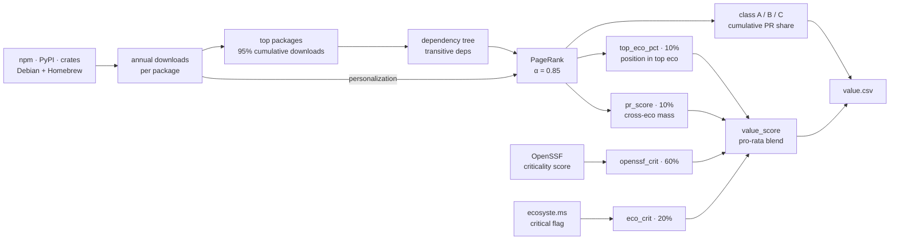

# Value Pipeline

Value ranks open-source projects by how heavily the software ecosystem depends
on them. It starts from download counts in each package registry, walks the
dependency graph outward, and writes one row per repo to
`data/value/value.csv`.

The stage produces two things, and they are computed differently. The **value
class** — A, B or C — comes from a repo's share of dependency mass alone, and
class A is the "core" that Risk and Eligibility go on to score. The
**`value_score`** is a 0–100 blend of four weighted components, and it ranks
repos *within* that core. Dependency mass decides who is in; the blend decides
the order.

Value runs first, and both later stages read their working set from
`value.csv`. A repo that Value never resolves never reaches them. The
[README](../README.md#what-each-score-is-made-of) summarizes all three stages
in one table.

<a id="pipeline-overview"></a>

## What the stage produces

| File | Content |
|---|---|
| `data/value/value.csv` | The unified per-repo table — one row per repo on any host, plus one row per orphan package, so nothing is dropped. Classes A, B and C are all kept. See [Unified output](#unified-output). |
| `data/value/validation.csv` | The audit trail behind every `git_valid` verdict — see [components/validation.md](components/validation.md). |
| `data/value/stats.csv` | The per-ecosystem matrix of downloads per year, which the 95% download cutoff reads. |
| `data/sources/{eco}/*.csv` | The package-level tables each ecosystem builds — see [Ecosystems](#ecosystems). |



**PageRank share alone sets the class.** No criticality source touches the class
cut. OpenSSF and ecosyste.ms feed only `value_score`, and `value_score` never
feeds the class. The two criticality fetches even run *after* the cut, over the
class-A scope it has just decided. A class-A repo can therefore score low.

### Top-repo scope — the "core"

Risk (`src.risk.run_risk_pipeline`) and Eligibility
(`src.eligibility.run_eligibility_pipeline`) read the same set directly from
`value.csv`. A row is a top repo when these filters pass:

| Filter | Required value | Defined in |
|---|---|---|
| `git_valid` | `True` | `load_top_repos` (`skip_invalid`, on by default) |
| `class` | `A` | `settings.json → top_repos.classes` |
| `platform` | `github` or `gitlab` | `settings.json → top_repos.platforms` |

`risk_input.value_classes` records the same class scope. Archived repos stay in
and surface in eligibility as `active=False`.

**This class-A set is the "core"** — the projects the ecosystem actually runs
on. The docs otherwise use the precise terms **class-A** and **top-repo set**,
because those name the exact filter.

<a id="components"></a>

## The four `value_score` components

`value_score` is a **pro-rata weighted blend**. Only the components present for
a repo are summed. That sum is then renormalized by their weight total, so a
repo missing some still lands on the same 0–100 scale. The weights sit in
`settings.json → value_score` and sum to 1.

| Component | Weight | Settings key | Measures | Hosts covered |
|---|---|---|---|---|
| `openssf_crit` | 60% | `criticality_weight` | OpenSSF Criticality Score for the repo | GitHub only |
| `eco_crit` | 20% | `eco_crit_weight` | ecosyste.ms critical-infrastructure flag | GitHub + GitLab |
| `top_eco_pct` | 10% | `centrality_weight` | PageRank **position** in the repo's strongest ecosystem | any host with a PageRank signal |
| `pr_score` | 10% | `pr_score_weight` | Cross-ecosystem dependency **mass** | any host with a PageRank signal |

A row needs at least `min_components` (2) present, or `value_score` stays blank.
`src.value.apply_criticality` stamps the column. The weights are
criticality-dominant on purpose: a foundational-but-quiet micro-dep must not
outrank a genuinely critical project. The two PageRank-family factors split the
0.2 centrality weight between position and mass.

**A missing component costs nothing but its weight.** Take a GitLab class-A
repo: it carries no `openssf_crit`, and ecosyste.ms may state no flag either.
With `top_eco_pct` = 80 and `pr_score` = 60, the blend is
`(0.1 × 80 + 0.1 × 60) / 0.2` = **70**. Two components clear the floor, so the
repo scores.

The [column table](#valuecsv-columns) defines all four columns. Four facts it
does not carry: `openssf_crit` is fetched for exactly the valid class-A GitHub
repos, archived included, and `scripts/pipeline_health.py` gates on that
coverage. A blank `eco_crit` is never a real 0 — the registry often omits the
flag for spack/debian cpp packages, and the blend drops a blank component rather
than scoring it zero. `top_eco_pct` reads the percentile of
[Value Classes](#value-classes). `pr_score` takes four steps:

| Step | Operation |
|---|---|
| 1 | Sum the repo's package PageRank inside one ecosystem. |
| 2 | `ln`-scale that sum, then min-max normalize it over that ecosystem's repos. |
| 3 | Combine the per-ecosystem values as a **p = 2 norm** (`PR_SCORE_P` in `unify_value_data.py`). |
| 4 | Rescale the column so the highest-mass repo = 100. |

The p = 2 norm gives a real second-ecosystem footprint about +41% (√2), gives a
token listing almost nothing, and lets an extra ecosystem never lower the score.

## From downloads to a value class

Both cuts below use **cumulative share**, never a fixed package count. Downloads
and PageRank follow a power law: a small head carries almost all the mass, and a
share cutoff tracks that head as the ecosystem grows.

### Top Package Selection

Sort packages by average annual downloads, descending. Accumulate downloads
down the list until the running total reaches 95% of the ecosystem-wide total
(the `downloads_<year>` rows of `data/value/stats.csv`). Every package above
that cutoff is "top".

### PageRank

Nodes are packages; a directed edge A→B means "A depends on B". Rank flows from
the dependent to its dependency, so a package scores high by being **depended
on**; declaring many dependencies never raises its own score. Personalized
PageRank (alpha = 0.85) sets each node's restart probability to its share of the
ecosystem's average annual downloads. One number therefore carries three
signals: **downloads**, **dependencies** and **dependents**.

### Value Classes

Packages sorted by PageRank descending; cumulative PageRank share sets the class:

| Class | Cumulative Share | Meaning |
|-------|-----------------|---------|
| **A** | 0--75% | Critical infrastructure |
| **B** | 75--95% | Important, widely depended on |
| **C** | 95--100% | Long tail |

> [Current Limitations](#current-limitations) lists the known scope gaps.

### From package class to repo class

`unify` computes a class per ecosystem, then keeps the strongest one:

| Step | Operation |
|---|---|
| 1 | Sum the group's package PageRank inside the ecosystem. |
| 2 | Rank groups by that sum, descending. |
| 3 | Apply the package-level cumulative-share cutoffs (≤75% A, ≤95% B, rest C) → `class_{npm,pypi,crates,cpp}`. |
| 4 | Take the strongest class across ecosystems → `class`. |

Ranking inside an ecosystem avoids comparing PageRank magnitudes across
ecosystems, since each ecosystem's PR mass sums to 1 in its own graph. A
repo-level PageRank was skipped: with no cross-ecosystem deps in our data, that
graph stays four disconnected subgraphs.

### Funnel columns

The preview pipeline sheet → Value holds the per-ecosystem funnel counts and
repo-coverage percentages. Its columns mean:

| Column | What it counts |
|---|---|
| *Top packages* | Packages covering 95% of cumulative downloads. |
| *After dep tree* | `\|top ∪ transitive deps\|` — the universe analyzed for PageRank. |
| *Results* | Every node of that universe; a top package with no edges keeps a row with PageRank 0. cpp is smaller than its dep tree because the `is_cpp` filter drops language-agnostic distro packages. |
| *GH %* | Share with a github.com repo. |
| *Git %* | Share with a repo on any host — also gitlab, bitbucket, sourcehut, codeberg and `custom` (savannah, sourceware, kernel.org, …). |

## Ecosystems

Each language assembles the steps above from its own sources. One page per
ecosystem covers the fetch, the process and the scoring.

| Language | Registry / sources | Page |
|---|---|---|
| JavaScript / TypeScript | npm | [npm](sources/npm.md) |
| Python | PyPI | [pypi](sources/pypi.md) |
| Rust | crates.io | [crates](sources/crates.md) |
| C / C++ | Debian + Homebrew + Repology + OSS-Fuzz | [cpp](sources/cpp.md) |

Every ecosystem writes `top-packages.csv`, `dependency-tree.csv`,
`github-repos.csv` and `results.csv` to `data/sources/{eco}/`. The
cross-ecosystem steps add `git.csv` (the per-platform URL table from
`build_git_urls`), and `check_eol.py` adds `eol.csv`, an Eligibility input.
Each page above carries the schemas, including where cpp differs.

C/C++ has no single registry, so the pipeline unifies it from Debian and
Homebrew, joined via Repology. Its install proxies come from Wayback snapshots
and carry snapshot caveats — see [debian](sources/debian.md) and
[homebrew](sources/homebrew.md). Every other source has its own page under
[`docs/sources/`](sources/); [`docs/data-sources.md`](data-sources.md) is the
source × stage matrix.

## Running it

Run the model only through `scripts/run-pipeline.sh`, which executes the stages
in order — **value → risk → eligibility → preview → health**. Value, Risk and
Eligibility compute every number; `preview` rebuilds `data/preview/` and
`health` audits each stage CSV, and neither changes a score.

```bash
scripts/run-pipeline.sh                              # every stage
scripts/run-pipeline.sh --from-stage value           # value → … → health
scripts/run-pipeline.sh --stage value                # value alone (later stages left stale)
scripts/run-pipeline.sh --stage value --only unify   # one step of it
scripts/run-pipeline.sh --stage value --list         # its steps
scripts/run-pipeline.sh --stage value --offline      # pure-cache run, no network
```

Steps run in this order (`src/value/run_value_pipeline.py`); steps sharing a
`pgroup` run concurrently.

| Step | pgroup | Work |
|---|---|---|
| `repology` · `ossfuzz` | dumps | 30-day whole-file-TTL dumps the ecosystem sub-pipelines read. Repology's `packages.csv` is the cpp distro-version input; OSS-Fuzz's `projects.csv` feeds `build_git_urls` and the risk stage's fuzzed flag. |
| `npm` · `crates` · `pypi` · `cpp` | eco | The four ecosystem sub-pipelines (see the [ecosystem pages](#ecosystems)). |
| `stats` | — | Write the per-ecosystem matrix `data/value/stats.csv`. |
| `git-urls` | — | Classify each package's git URL into `data/sources/{eco}/git.csv`. |
| `eco-fetch` | identity | Pull ecosyste.ms repo candidates. |
| `canonical` | identity | Resolve every `github_repo` to its current `nameWithOwner` + numeric id (90-day per-row TTL). |
| `resolve` | — | Apply both identity sources onto each per-eco `results.csv`. |
| `unify` | — | Group packages by repo into `value.csv`. |
| `validation` | — | Stamp `git_valid`. |
| `openssf-crit` · `eco-crit` | crit | Fetch the two criticality sources for the class-A scope `unify` just decided. |
| `criticality` | — | Stamp `openssf_crit` / `eco_crit` / `value_score`. |

`eco-fetch` and `canonical` run concurrently because each reads the previous
run's `value.csv` and writes its own file.

```bash
uv run python -m src.value.run_value_pipeline --rollup
```

`--rollup` rebuilds `value.csv` from the existing per-eco `results.csv`. It
skips the ecosystem sub-pipelines and the `stats` / `git-urls` steps, so it is
the fast path after an [overrides.csv](#manual-overrides) edit. It is the one
value-stage entry point `scripts/run-pipeline.sh` does not wrap, and it leaves
the later stages stale — follow it with
`scripts/run-pipeline.sh --from-stage risk`.

## Unified output

`data/value/value.csv` is the canonical per-repo table. Three steps of the
rollup chain shape it:

- `resolve` picks each package's repo identity under
  `override > github-canonical > ecosyste.ms > prior registry data`.
- `unify` computes every per-ecosystem and cross-ecosystem aggregate in one
  pass, and writes the per-repo table directly.
- `criticality` sorts the shipped file by `value_score` desc. Unscored rows
  (below the 2-component floor, mostly class B/C) sink to the end in
  `top_eco_pct`-desc order.

### value.csv columns

The identity columns (`repo` … `git_valid`) and the two criticality columns hold
the most recent fetch. Every download-derived column (`ecosystems` … `class`)
covers the 5-year window 2021–2025.

| Column | Description |
|--------|-------------|
| `repo` | Lowercase repo slug on its `platform` — GitHub `owner/repo`, GitLab's arbitrarily-nested `owner/…/repo`, Sourcehut `~user/repo`, custom best-effort path. Empty only for orphans (no upstream repo at all). |
| `platform` | Host class of `git_url`, from `classify()` in `src/value/build_git_urls.py`: `github` / `gitlab` / `bitbucket` / `sourcehut` / `codeberg` / `custom`. `gitlab` means **any** GitLab instance: `classify()` derives its host set from `HOST_NICKNAMES` in `src/sources/gitlab/gitlab_client.py`, plus a `gitlab.*` heuristic for unregistered self-hosted instances. Empty for orphan rows. Risk and eligibility filter on `settings.json → top_repos.platforms` (`github` + `gitlab`). |
| `repo_id` | Repo id namespaced by platform: `gh/<numeric>` (GitHub Repos API id), or `gl/<nickname>-<id>` from the GitLab project API on any GitLab host (bare `gl/<id>` for gitlab.com; nicknames per `HOST_NICKNAMES`). Empty for other platforms (no API id) and for unresolved/404 repos. |
| `git_url` | Canonical **git clone URL** — `https://github.com/<repo>.git` for GitHub repos, so a valid GitHub repo always carries both `repo` and `git_url`. Otherwise the first non-empty value from the per-ecosystem `data/sources/{eco}/git.csv`, canonicalized by `src/value/git_urls.py`. A **non-git** source (tarball / hg / svn) belongs in `canonical_url`, never here. Empty for orphan packages and for projects with no git upstream. |
| `canonical_url` | The project's **canonical upstream** — the thing being mirrored, not the mirror. Two meanings, told apart by whether the row has a repo. (1) *Mirror upstream*, on a GitHub mirror row: `gnutools/glibc` → `https://sourceware.org/git/glibc.git`, `gcc-mirror/gcc` → `https://gcc.gnu.org/git/gcc.git`. It comes from the `canonical_url` column of `data/sources/github/repos.csv` (GitHub's mirror metadata, stamped by `resolve`) or from a repo override carrying a non-GitHub `git_url` (`torvalds/linux` → `https://git.kernel.org/…/linux.git`). (2) *No-git source*, on a row with no `repo`, `repo_id` or `git_url`: where the code actually lives for a project with no git upstream (IJG libjpeg, Info-ZIP unzip, GraphicsMagick, Berkeley DB, R). Set by a `canonical_url`-only row in `overrides.csv`. Empty otherwise. |
| `git_valid` | Strictly `True` / `False`, never blank. `True` iff the repo's upstream is reachable. Host-agnostic: GitHub rows are checked via the Repos API cache, non-GitHub rows via `git ls-remote`, and a `gl/` `repo_id` is proof on its own (the GitLab project API confirmed the project; `ls-remote` can fail on a live GitLab host). `False` covers both *no `git_url` to check* (orphan, or no git upstream) and *a `git_url` that failed the check* (unreachable / 404). Set by `build_validation`; audit trail in [`data/value/validation.csv`](components/validation.md). |
| `ecosystems` | Comma-separated ecosystems where the repo has packages (e.g. `crates,npm`) |
| `packages` | Total package count in the repo |
| `top_eco` | Ecosystem where the repo ranks highest (max PR percentile): `npm` / `pypi` / `crates` / `cpp` |
| `top_eco_pkg` | Highest-PR package in `top_eco` (e.g. `@babel/helper-plugin-utils` for babel/babel) |
| `top_eco_pct` | The repo's PageRank **position** inside `top_eco`: `100 − cumulative-PR percentile`. 0–100, **higher = better**. A `value_score` component (weight `centrality_weight`) — see [the four components](#components). |
| `pr_score` | Cross-ecosystem dependency **mass**, 0–100 (two decimals), **higher = better**. Blank only for groups with no PageRank signal. A `value_score` component (weight `pr_score_weight`) — see [the four components](#components). |
| `class` | Strongest of the per-ecosystem classes (A < B < C) |
| `class_npm`, `class_pypi`, `class_crates`, `class_cpp` | A/B/C from per-ecosystem cumulative PR share; empty if the repo has no package in that ecosystem |
| `openssf_crit` | OpenSSF criticality score ·100 (0–100, two decimals; the source CSV keeps the raw 0–1 value), joined from `data/sources/openssf/criticality.csv`. GitHub-only — see [the four components](#components) for the exact fetch scope. |
| `eco_crit` | ecosyste.ms critical flag: `100` on the critical list, `0` explicitly not on it, blank unknown. Covers GitHub **and** GitLab; joined from `data/sources/ecosystems/criticality.csv`. See [the four components](#components). |
| `value_score` | 0–100 **pro-rata blend** of up to four components — `openssf_crit` (0.6), `eco_crit` (0.2), `top_eco_pct` (0.1), `pr_score` (0.1). Blank unless at least `min_components` (2) are present. Stamped by `src.value.apply_criticality`. See [the four components](#components). |

`unify` groups package rows by `repo_id` / `git_url`, so the package-level rows
stay in `data/sources/{eco}/results.csv`. EOL is deliberately absent: the
per-ecosystem `check_eol.py` writes `data/sources/{eco}/eol.csv`, an advisory
input to the manual `eol` column of `data/eligibility/overrides.csv`, which
`src.eligibility.build_active` consumes (see [eligibility.md](eligibility.md)).

### Manual overrides

`data/value/overrides.csv` is the single hand-maintained list of corrections for
packages whose **upstream registry metadata is wrong**. It corrects bad source
data; it never patches a parsing bug. Rows key on `(package, ecosystem)`, and a
row with a blank `reason` is rejected.

| Column | Meaning |
|---|---|
| `package`, `ecosystem` | The key. |
| `repo` | Force the correct GitHub `owner/repo`. Sets `platform` = `github` and derives the matching `git_url`. |
| `git_url` | Force a corrected non-GitHub **git clone URL**. Absolute: every eco-/registry-derived host is dropped, and `(platform, repo)` are re-derived from it. |
| `canonical_url` | The project's canonical upstream. With a `git_url` it marks that repo as a **mirror**; alone it means the project has **no git upstream** (tarball / hg / svn). |
| `valid` | Pin the git target's validity (`True`/`False`); consumed by `build_validation`, not applied at resolve time. |
| `reason` | Required free-text justification. |

Three encodings matter. Set the fields as this table shows:

| Encoding | `repo` / `git_url` | `canonical_url` | `valid` | Example |
|---|---|---|---|---|
| Repo / URL correction | `repo` for GitHub, else the corrected clone URL | the live upstream, when the row is a mirror | as needed | `torvalds/linux` → `git.kernel.org` |
| Self-hosted project, reached through its mirror | the GitHub/GitLab **mirror** | the upstream it copies | blank | `gnutools/glibc` ← `sourceware.org` |
| No git upstream | **blank** | the real source URL | blank | Info-ZIP unzip, GraphicsMagick (hg) |

The mirror encoding is how a project on a self-hosted git server enters the risk
scope at all, because the [risk stage](risk.md#scope) scores only GitHub and
GitLab. The mirror must be *verified* — identical HEAD sha, full ref set, in
sync now — and the `reason` field records that evidence. A row carrying a
`canonical_url` scores no issue backlog, because the mirror's tracker is not the
project's (see [components/workload.md](components/workload.md)).

With no git upstream, validity is derived: no `git_url` ⇒ nothing to validate ⇒
`git_valid` = `False`. Never map such a package to a fork or a personal mirror
instead — that credits the wrong maintainers.

`resolve` applies overrides to each `results.csv`, `unify` forces the group's
identity, and `build_validation` applies the `valid` pin.

## Current Limitations

Known scope choices and gaps. Add new entries here, so caveats stay out of code
comments and source-doc footnotes.

| Limitation | What it means, and how to fix it |
|---|---|
| **cpp dependency tree is runtime-only** | Build-time tooling (cmake, pkgconf, autoconf, gettext, …), Debian `Recommends`/`Suggests` and Homebrew `build` deps do **not** propagate PageRank — see [cpp](sources/cpp.md) for the two filters that drop them. PageRank therefore reflects who *runs* with whom, not who *builds* whom, and undervalues build infrastructure. Fix: keep the source-side type in the cpp edge schema and add a build-aware PR overlay. |
| **Project identity is GitHub/GitLab-only downstream** | Risk, eligibility, EOL and contributor metrics key off `settings.json → top_repos.platforms`. Every other host keeps a full `(platform, repo, repo_id, git_url)` identity in `value.csv` — codeberg, bitbucket, sourcehut and `custom` (savannah, sourceware, kernel.org) — but stays out of the top-repo scope, and a `custom` row carries no `repo_id` at all. Fix: per-host adapters for the license, EOL and contributor checks. |
| **A self-hosted project needs a verified mirror** | A class-A project on its own git server reaches Risk and Eligibility only through a mirror declared in [`overrides.csv`](#manual-overrides), with the upstream in `canonical_url`: gcc (`gcc-mirror/gcc` ← gcc.gnu.org), glibc (`gnutools/glibc` ← sourceware.org), qt (`qt/qt5` ← code.qt.io), libunistring (`1g4-mirror/libunistring` ← git.savannah.gnu.org). |
| **A GitLab instance must be registered** | A host counts as GitLab only when `HOST_NICKNAMES` (`src/sources/gitlab/gitlab_client.py`) registers it or it matches the `gitlab.*` heuristic; that registry also assigns the `gl/<nickname>-<id>` prefix. Add a new instance there before expecting its repos to be scored. Registered instances are first-class (glib on gitlab.gnome.org, mpfr on gitlab.inria.fr, pixman on gitlab.freedesktop.org). |
| **Some projects have no git upstream at all** | IJG libjpeg, Info-ZIP unzip, GraphicsMagick, Berkeley DB and R publish only tarballs, Mercurial or Subversion. They carry no `repo` / `repo_id` / `git_url`, so `git_valid` is `False` and they sit outside the top-repo scope: **unfundable via a repo**, which is the honest answer. |
| **No package-level quality gate before `results.csv`** | The file admits the whole top-95%-cumulative-download set plus its transitive deps — no license check, no age cutoff, no popularity floor, no archive/EOL gate. Quality filtering happens downstream in Eligibility. Value scoring therefore stays independent of signal quality, but the raw class distribution overstates how many projects we would fund. |
| **Wayback-derived install stats have gaps** | Homebrew and Debian popcon both arrive via Wayback Machine snapshots, which sometimes truncate (1 MB cap) or miss a year. `ecosystem_avg_downloads` in `src/common/params.py` averages only over populated years, so a missing year does not deflate the average. Year-over-year trend lines stay noisy, and a few packages get `avg_downloads` from fewer than 5 years of data. |
